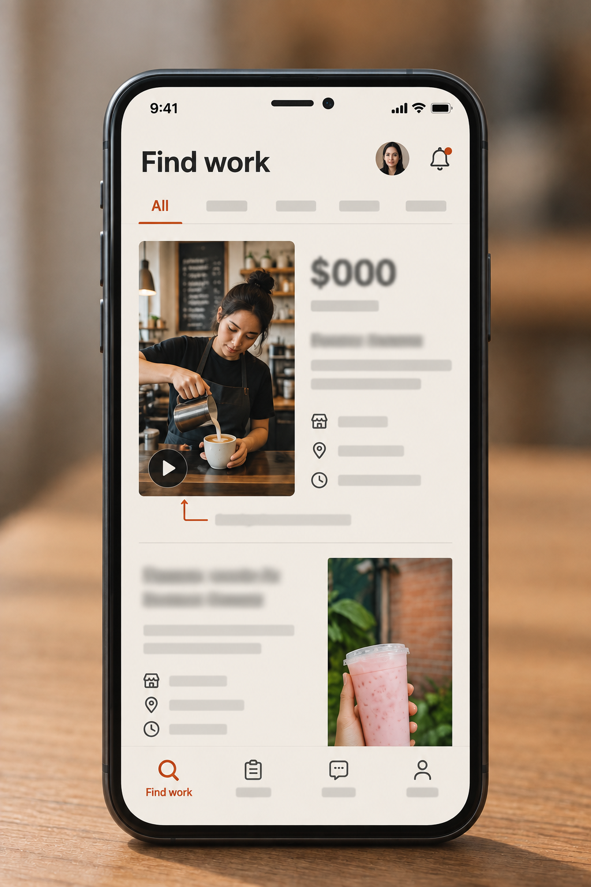
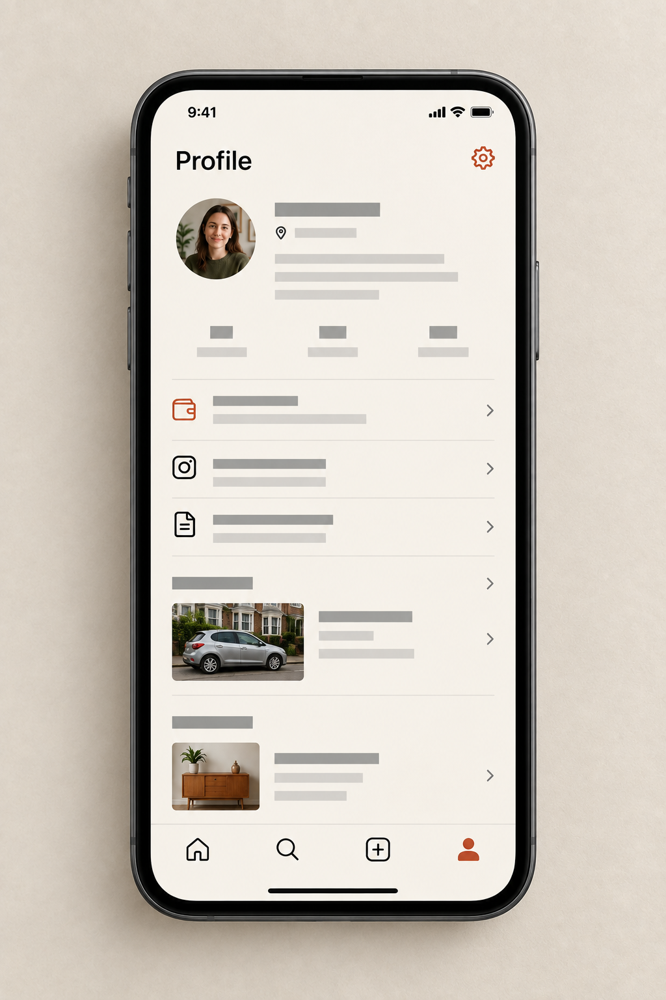
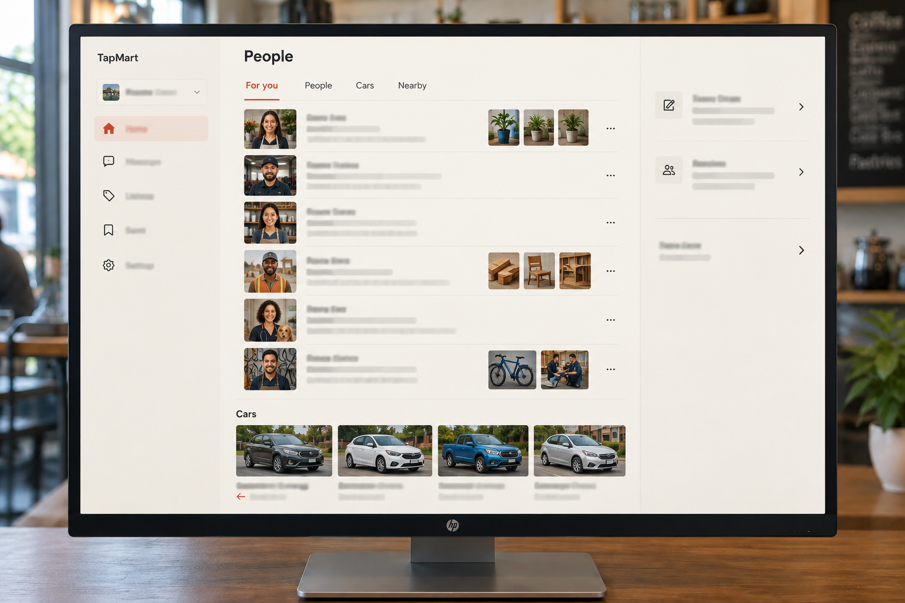
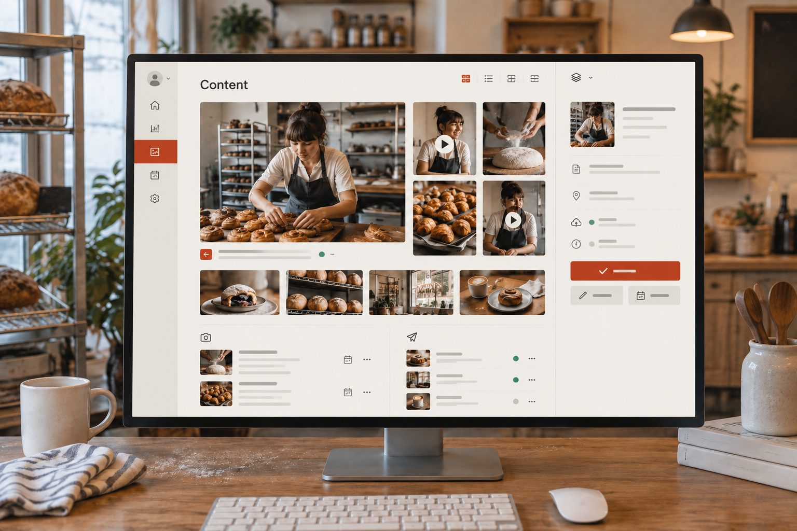
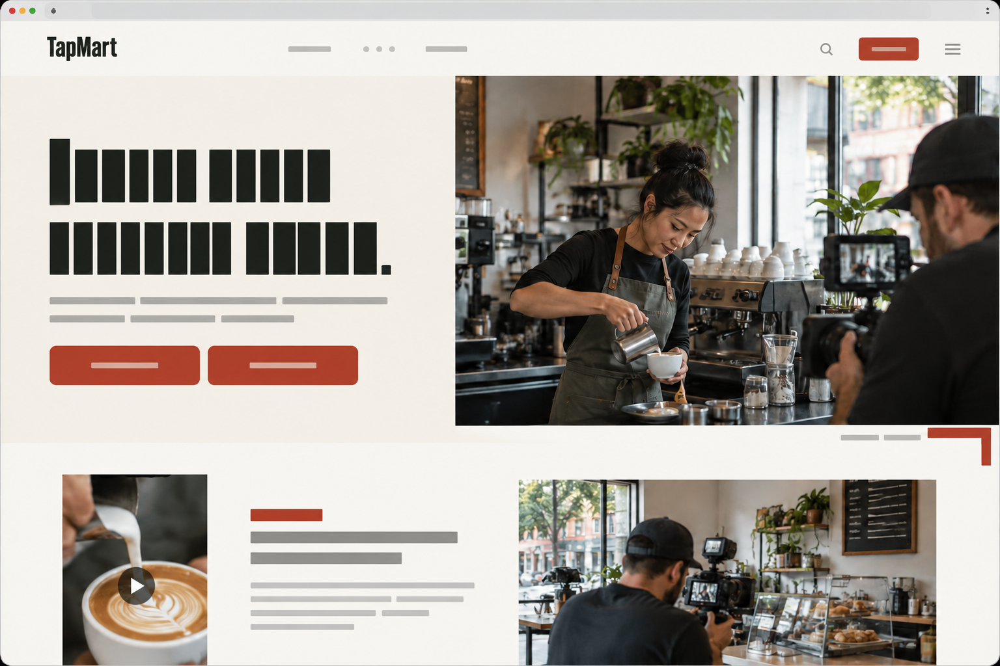

# TapMart master design package

Designed from a blank canvas by gpt-6-astra. Concept images rendered by gpt-image-2.5-sunburst and reviewed by the director. Awaiting the founder's approval; nothing has been implemented.

## Part 1. Product design thesis

- **emotional association.** Useful work around the corner, with a clear agreement and an accountable next step. Associate TapMart with real local businesses, work you can understand, and money whose status you can check.
- **not a creator marketplace.** The people directory is a means to commission specific work, not a status contest among influencers. Lead with relevant work, city and real proof; show followers where they actually affect Story eligibility. A person without a large audience can still recreate a Reel or offer a real vehicle.
- **not a social network.** There is no follow graph, like chase or feed designed to keep people watching. Media answers 'What is the work?' or 'Is this usable?' Every discovery surface leads to an explicit task, and every task has an end.
- **not an ad platform.** Businesses buy defined participation and deliverables, not a pretend reach forecast. Show the work, people, vehicles, funding and review decisions. Do not substitute impressions charts or projected returns for evidence of what is actually running.
- **business feel.** Like having a capable local production counter: find someone suitable, hand over a clear brief, see what is happening, review what comes back. A business new to marketing should never need to understand advertising jargon to commission its first piece of work.
- **feel.** A place where local marketing becomes concrete. You see the thing, understand the agreement, and know the next move. The public site opens the imagination; the application gets out of the way.
- **earning feel.** Straightforward rather than breathless: this is the task, this is the payment basis, these are the conditions, and this is where the work stands. No income fantasy, streaks, bidding race or instant-payout promise. Approval, available earnings and an actually paid payout are distinct moments.
- **recognizable idea.** The red return: a short vermilion right-angle rule where real media meets the useful line beneath it—pay, the next action or the asset's state. It visually says 'this is not just something to look at; here is what happens with it'. Combined with unboxed media and condensed public headlines, it is the single recurring brand idea.
- **not a gig app.** TapMart contains paid tasks, but it must not feel like an endless labor queue. Each piece of work has a named business, visible requirements, an honest payment basis, a bounded commitment and a review trail. Car counteroffers stay because they exist; invented auctions, surge pricing and worker rankings do not.
- **not a saas dashboard.** The default screen is not a wall of metrics. Personal Home shows work; Business Home shows people and cars; Content shows actual service progress and usable assets. Operational complexity appears only at the moment someone needs to act on it.

## Directions explored

### The Night Stage (Rejected as the master direction. Merged its controlled media inspection and public cinematic introduction into The Local Edit.)

A predominantly dark experience using #151714, #F5F1E8 and #D75A32, Barlow Condensed display type and Inter utility text. Large media occupies most of each view; density is low-to-medium, with short caption bands. Phone navigation is a labeled bottom bar; desktop uses a horizontal masthead and wide media stages. Transitions are deliberate, 300–450ms, with an entertainment-like, confident personality.

Strengths:
- Media quality and emotional impact: reference videos and finished creative become immediately legible as the product's material, not attachments.
- Brand recognition: near-black, warm white, large condensed type and a single orange action color produce a strong public presence.
- Interaction quality: an immersive detail view works well for watching a reference or inspecting a video submission.

Weaknesses:
- Clarity and usability: evidence, eligibility and payment conditions compete with the media; first-time users could mistake watching for the main activity.
- Information hierarchy: a ready-to-post Story, a car photograph and a financial decision cannot all justify a cinematic stage.
- Responsiveness: tall portrait video dominates a small phone, while wide desktop stages create empty side areas.
- Consistency and brand meaning: dark immersion pulls toward a social-video product or automotive launch rather than approachable local work.
- Implementability: the concept depends too heavily on excellent footage, loaded video and motion to make ordinary empty and pending states feel intentional.

### The Civic Ledger (Rejected as the master direction. Merged its compact attention queues, transaction precision and literal status labels.)

A light, high-density utility system using #FFFFFF, #193F31 and #E7ECE7, Public Sans headings/body and IBM Plex Mono for amounts. Media appears mostly as small thumbnails next to records. Phone navigation is a text-only bottom strip; desktop uses a directory-like left spine and tightly aligned lists. Motion is limited to 120ms feedback. The personality is civic, dependable and deliberately unshowy.

Strengths:
- Clarity and information hierarchy: commitments, due dates, review queues and real money are easy to compare.
- Usability and implementability: familiar rows, restrained controls and little motion work well on slow devices and with keyboard navigation.
- Consistency: different backend state machines can be exposed precisely without disguising them as a single progress widget.

Weaknesses:
- Visual quality and media quality: shrinking the work into thumbnails makes a Reel harder to understand and a business's delivered photography feel administratively filed away.
- Uniqueness and recognition: the visual system is competent but too interchangeable with booking software, public-service forms and financial tools.
- Emotional fit: it makes small marketing work feel like clerical piecework and subscription shoots feel like file fulfillment.
- Responsiveness: comparison rows that are efficient on desktop wrap into verbose stacks on phones.
- Interaction quality: it helps with review after launch but is less effective at helping someone imagine the work before committing.

### The Local Edit (Chosen as the master direction.)

A warm-light working environment using #F6F2E9 paper, #232722 ink and #BB3B27 vermilion. Barlow Condensed supplies expressive public headlines; Instrument Sans handles the application. Density changes deliberately: media-led discovery, compact work queues and spacious enough evidence review. Reels are playable references, Stories are intact posters and cars are photographed objects. Phones use labeled native-style bottom navigation; desktop uses a quiet text rail and contextual work areas. Motion is short and directional, with a more expressive but non-blocking public introduction. The personality is capable, local and fair.

Strengths:
- Clarity and usability: each opportunity identifies the work, its payment basis and the next decision without requiring a tutorial or video playback.
- Uniqueness and brand recognition: the red return, condensed public typography and real local photography form a repeatable identity without decorative gradients or generic tiles.
- Media quality and visual quality: different aspect ratios and compositions respect video, finished graphic creative and physical vehicles.
- Information hierarchy and consistency: expressive discovery hands off to precise task pages, queues and ledgers within the same typographic and color system.
- Interaction quality: the person stays with one piece of work from discovery to evidence and decision; businesses move directly from a real asset or person to the relevant action.
- Responsiveness and implementability: phone compositions and desktop workbenches share tokens and data but not rigid layouts; core screens remain useful with a poster, plain text and ordinary browser controls.

Weaknesses:
- Media dependency remains: poor user uploads cannot be made good through styling. The system must preserve originals and offer useful textual context rather than applying a cinematic filter.
- Editorial composition can become wasteful. Application section gaps, preview heights and reading widths therefore have explicit limits; large display type is reserved for the public site.
- Two font families and several media compositions require discipline. Application body text stays in one family, and the three earning compositions are specified rather than improvised screen by screen.
- The return mark can become decorative noise. It is used at selected media-to-action junctions and section leads, never beside every row, icon or status.
- Its recognition is a design hypothesis, not measured performance. The defensible advantage is a coherent and buildable system, not an invented claim that it will convert better.

## Recommended direction: The Local Edit

It makes the work tangible before making the software visible. Real media explains the opportunity; an editorial hierarchy makes the commitment and money readable; restrained utility surfaces handle the operational detail. It accommodates a video, a finished Story, a physical vehicle and a monthly content service without pretending they are the same object. Its distinctive red return mark, condensed headlines and warm working surfaces are recognizable without expensive effects. The main implementation work is disciplined composition, not a new rendering platform.

- From The Night Stage: immersive, user-controlled media previews and a cinematic public introduction. Not its dark application shell, theatrical transitions or emphasis on continuous watching.
- From The Civic Ledger: compact attention queues, explicit money breakdowns and literal status language. Not its spreadsheet-led composition or reduction of creative work to thumbnail rows.

## Part 2. Brand and art direction

Use a deliberately light brand and application theme, not automatic light/dark switching. Warm paper is the default on both modes and the public site. Dark #121713 is restricted to full-screen video inspection, light-sensitive media review and the public hero film where the imagery needs it; navigation and money screens stay light. Honor forced-color accessibility modes and user text scaling. Dark media controls require their own high-contrast treatment; do not dim the rest of the product to make a vehicle or video feel more important.

### Colour

- **Paper** `#F6F2E9`: Default application canvas and public editorial background. Warm enough to feel human without simulated paper texture.
- **Ink** `#232722`: Primary text, strong rules, selected navigation and focus on light surfaces.
- **Vermilion** `#BB3B27`: The red return, primary task actions and selective editorial emphasis. Use white action text; hover or pressed shade is #9E3020. Never assign one accent color to each earning category.
- **Sheet** `#FFFFFF`: Forms, dialogs and neutral backing for supplied creative; also high-contrast text on vermilion actions.
- **Layer** `#E9E5DB`: Desktop navigation, contextual work areas and inactive surface separation without enclosing every item.
- **Secondary ink** `#5D635B`: Readable supporting text on Paper or Sheet; never replace essential facts with low-opacity gray.
- **Hairline** `#D7D4CB`: Decorative separators between rows; not an accessible control boundary.
- **Control line** `#757E72`: Input boundaries and necessary non-text distinctions on light surfaces.
- **Confirmed** `#236146`: Approved, available and successful states, always accompanied by literal text. Different money states remain different labels.
- **Waiting** `#785400`: Pending, processing or required attention when warranted, with an explicit state label rather than an amber pill.
- **Problem** `#9E2E32`: Errors, rejection and destructive confirmation, with text and appropriate iconography; not every overdue item becomes a red alert.
- **Media black** `#121713`: Full-screen players and controlled media-inspection stages only.

### Typography

- **Barlow Condensed SemiBold 600, Google Fonts, SIL Open Font License: https://fonts.google.com/specimen/Barlow+Condensed**, Wordmark and public display headlines only; never financial values, long paragraphs or form labels.: It has the directness of local signage and editorial headlines without using a luxury fashion serif or a futuristic display face. Its narrower proportions allow expressive public statements without making the application oversized.
- **Instrument Sans variable 400–700, Google Fonts, SIL Open Font License: https://fonts.google.com/specimen/Instrument+Sans**, All application UI, public body text, controls, metadata and money. Use tabular numerals for amounts, dates in aligned lists and transaction columns. System sans-serif is the loading fallback.: It keeps work instructions, amounts and repeated operational labels readable while retaining more character than a default system-only interface. One application family prevents the three earning types from feeling like unrelated products.

| role | size | weight | tracking | line height |
| --- | --- | --- | --- | --- |
| Public hero | 56 phone / 112 desktop; 44 at 320–359px, 80 at 768–1023px, 96 at 1024–1279px | 600, Barlow Condensed | -0.02em | 0.96 |
| Public section headline | 36 phone / 64 desktop; 48 on tablet | 600, Barlow Condensed | -0.015em | 1.02 |
| Application page title | 28 phone / 32 desktop | 600, Instrument Sans | -0.02em | 34px phone / 40px desktop |
| Work or asset detail title | 24 phone / 32 desktop | 600, Instrument Sans | -0.015em | 30px phone / 38px desktop |
| Application section heading | 22 phone / 24 desktop | 600, Instrument Sans | -0.01em | 28px phone / 30px desktop |
| Opportunity pay and principal summary amount | 28 phone / 32 desktop | 600, Instrument Sans with tabular numerals | -0.02em | 32px phone / 36px desktop |
| Earnings balance and detail pay | 36 phone / 44 desktop | 600, Instrument Sans with tabular numerals | -0.025em | 40px phone / 48px desktop |
| Task instruction and important list title | 18 phone / 18 desktop | 500, Instrument Sans | 0 | 26px |
| Body and form input | 16 phone / 16 desktop | 400; 500 for emphasized facts, Instrument Sans | 0 | 24px |
| Button and primary action | 16 phone / 16 desktop | 600, Instrument Sans | 0 | 20px |
| Metadata, field label, status and caption | 14 phone / 14 desktop | 400; 500 for labels, Instrument Sans | 0 | 20px |
| Navigation label | 14 phone / 16 desktop | 500 inactive; 600 active, Instrument Sans | 0 | 18px phone / 20px desktop |

### spacing

Use a 4px base scale: 4, 8, 12, 16, 24, 32, 48, 64, 96, 128px. Application section gaps are 32px phone and 48px desktop; public section gaps are 64px phone and 96px desktop. Related label/value gaps are 4px; title-to-description 8px; content-to-action 16px. Sheet padding is 16px phone and 24px desktop. Person rows use 64px portraits and 88px minimum height on phone, 80px portraits and 104px minimum height on desktop. Do not use a minimum card height to align unrelated content. Fixed task bars have 12px vertical and 16px horizontal padding plus safe area, with at least 48px-high actions. Reserve the actual bar height in the scroll area so content is not covered.

### grid

Support 320px and wider. Phone below 768px: four columns, 12px gaps, 16px gutters. Tablet 768–1023px: eight columns, 20px gaps, 24px gutters and a 704px maximum reading field. Desktop from 1024px: 224px app rail, 32px main gutters, 12 columns with 24px gaps, maximum main field 1280px centered within the remaining space. Use a single main column until 1280px; then use approximately eight columns for work and four for context, keeping context 288–360px wide. Text reading width is 640px maximum; media can exceed it. Public pages have no app rail: 16/24/48px gutters at phone/tablet/desktop and a 1440px maximum editorial grid, interrupted by full-bleed media. Root pages remain in a meaningful single reading order when columns collapse; no horizontal page scrolling at 320px or enlarged text.

### shapes

The red return consists of a 24×4px horizontal stroke with a 4×12px downstroke at its left edge, sharing the same top edge. At a media-to-caption junction its horizontal edge aligns with the media's bottom; the caption begins 16px below that edge. Public feature scale is exactly 4×: 96×16px and 16×48px. Use it on opportunity leads, a selected content lead and public section leads—not every thumbnail or status. Radius rules: full-bleed media, rules and editorial sections 0px; ordinary media 2px; inputs and business logos 4px; buttons 6px; desktop dialogs 8px; phone sheet top corners 12px, bottom corners 0px. Personal avatars alone are circular. Filters use underlines, not pills. No giant-radius universal card system.

### surfaces

There are four working surfaces: warm paper for the app and most public text sections; unboxed real media; white sheets for editable forms, dialogs and supplied creative when a backing is needed; and a pale layered-paper region for persistent navigation or a contextual work area. Most lists and editorial sections sit directly on the page. Use a bounded object only for an independently selectable item such as a car in a horizontal rail or a resumable draft, not for every fact. Attention is a compact text band with a relevant link, never four KPI cards. Empty states use the same composition as populated states: a precise state heading, one factual sentence and the next available action. No faux thumbnails, fake people or sample analytics fill an empty library.

### depth

Use three perceptual levels: page, selected work/context, temporary overlay. A change of background, scale or position establishes hierarchy before a shadow does. Desktop evidence inspection may sit beside a queue; phone inspection opens as a dedicated detail or full-height sheet. Do not create floating islands throughout the page. The red return connects the visible object to its next decision rather than suggesting another layer.

### borders

Use 1px #D7D4CB separators only where neighboring records need separation; they are decorative, not the sole boundary of an interactive control. Inputs use 1px #757E72 boundaries. Do not outline every media item, section or navigation row. Focus is a 3px solid #232722 outline with 3px offset; use #F6F2E9 on dark media stages. Validation combines an explicit message, an icon where useful and the problem color; a red outline alone is insufficient.

### shadows

No shadows on feed items, directory rows, balances, media thumbnails or the desktop rail. Temporary menus and dialogs use one shadow: x 0px, y 12px, blur 32px, spread 0px, #232722 at 16% opacity. Phone modal scrims use #121713 at 32% opacity. Media controls may use a localized opaque dark backing where needed for contrast; do not use a translucent glass panel or glow.

### photography

Commission real local businesses and participants with consent: an owner at work, a person filming an achievable Reel, products and services in their actual setting, and real parked vehicles. Prefer window light or open shade, neutral white balance and natural skin tones. Use a 35mm-equivalent lens for environmental scenes and 50mm-equivalent for portraits; vehicle capture guidance uses the phone's 1× camera, not an ultra-wide lens. Preserve the business's real colors. Avoid influencer poses, stock handshake scenes, exaggerated luxury, teal-orange grading and heavily blurred backgrounds that remove useful context. Directory portraits use square crops; public environmental photographs favor 3:2; vehicle heroes favor 3:2; delivered subscription files retain their native ratios. Cropping may create a discovery thumbnail, but evidence and instruction views always offer the uncropped original.

### video

App video is user-controlled: show a useful poster, a 48px play target, duration when known and a clear reference or submission label. Only one player runs at once; pause when it leaves the active detail. Supply captions for commissioned speech and a textual equivalent for required visual instructions. Recreate discovery uses a playable portrait reference beside a short brief/pay column; full inspection preserves the original ratio. Story uses the finished 9:16 creative as an intact poster, with follower and live-hour requirements outside the artwork; never add fake Instagram controls. Car uses a landscape photographic stage and placement facts. Thus the three types are not reskinned copies. On phone, discovery video or Story previews are capped at 320px high and contained rather than instructionally cropped; detail can expand to full-screen inspection. The public hero is a 12-second, four-shot film: local owner at work, person filming, actual finished creative, real vehicle context, three seconds each. Show an installed ad only when genuinely installed; otherwise show honest vehicle capture. It is muted, inline, pausable and nonessential. Commission 720p mobile and 1080p desktop files, target no more than 4MB per hero rendition and 180KB for the mobile poster. On reduced motion or data-saving connections use the poster. Existing user uploads use existing media capabilities; this direction does not require a new transcoding backend.

### iconography

Use Lucide, ISC licensed, at 1.75px stroke: 20px in navigation and compact controls, 24px for standalone actions, always within a minimum 44px target. Use icons for familiar actions such as search, messages, notifications, back, upload, play and settings. Use labels for unfamiliar decisions and all money actions. No rounded-square icon containers by default. Verification uses the badge-check icon with accessible text and appears only for genuinely verified creators; connection provenance is a separate label. Earning kinds are recognized chiefly through their media and wording, not three differently colored badges.

### illustration

Use illustration only to explain a physical or procedural fact that photography cannot: the eight capture positions, a placement-zone diagram, file orientation or a compact state explanation. Draw in 2px ink strokes at a 160px reference size, with one vermilion emphasis and no shaded mascot. A placement diagram is labeled as a diagram, never passed off as the person's reconstructed car. Empty content states use a factual shoot timeline or simple camera outline, not imaginary delivered files, floating 3D objects or smiling money characters.

### three d

3D is a truthful vehicle-inspection option, not the identity of TapMart. Show 'View 3D' only when an actual reconstruction model is available; load it on request in a matte neutral stage with orbit, reset and keyboard-accessible controls. Provide the original photo gallery as an equal alternative. Use no neon wireframe, fake scanning particles or simulated reconstruction progress. waiting_provider says 'Waiting for provider' and explains that the photographs are saved; failed and needs_retake show the real next action. Current offered zones and prices remain ordinary accessible controls outside the model. Interactive profile cars, picking zones on the model and realistic artwork application remain later. Do not add public-site decorative 3D merely to advertise an optional capability.

### generated imagery

Do not generate people, vehicles, local-business photographs, campaign evidence, connected-account media or subscription deliverables for presentation as real. Existing brand-kit proposal examples may include generated imagery only with explicit Generated proposal provenance and the existing approval boundary; they never enter Made for you as delivered shoot content. AI-assisted briefs and guides are labeled as drafts with their actual reference or source; provider-free output is labeled Template draft. The chosen public art direction does not need generated backgrounds or synthetic lifestyle imagery. Ready-to-post Story generation remains later.

### motion principles

Application feedback: 120ms. Local view transitions: 180ms. Sheet entry: 240ms with at most 24px translation and opacity; exit: 160ms. Entry easing is cubic-bezier(0.2, 0.8, 0.2, 1); exit is cubic-bezier(0.4, 0, 1, 1). Movement follows spatial causality: a detail opens from its selected item, a sheet rises from the task edge, and Back restores place. Do not animate balance counting, fabricate progress percentages or celebrate approval before the server responds. Public section reveals use one 320ms opacity-and-24px-rise entrance; no scroll hijacking, mandatory pinning or loading introduction. With reduced motion, remove translations and reveals, show static content immediately, disable automatic hero playback and keep all controls functional. Upload progress reflects bytes; unknown-duration work uses a short activity indicator plus a literal state, never a looping pretend timeline.

### device framing

Device frames belong only on the public site when showing an interaction is more useful than showing a photograph. Use one phone per explanatory stage: 390×844px logical viewport, 8px side bezel, 16px top and bottom bezel, 32px outer and 24px viewport radius. Use a neutral desktop-browser frame with a 32px title strip and 8px outer radius. No branded hardware chrome, tilted device pile, floating shadow theater or device-within-device in the app. Capture the implemented product with consented real data; redact private details. Until such captures exist, use real photography and truthful text rather than invented balances, connections or reviews.

### logo

Create a new typographic wordmark rather than refining an unseen asset. Set TapMart in Barlow Condensed SemiBold 600 at a 32px reference size, 32px line box and -0.02em tracking. Place the 24×12px red return 8px to its left, aligned to the bottom of the line box. Use Ink on Paper and Paper on Media black; keep the return vermilion. Minimum clear space is 16px at this reference size. The return alone can identify a favicon or loading shell, but the public header uses the full wordmark. The app's mobile header prioritizes current identity rather than repeating the logo.

### why it fits

TapMart deals in real things—videos, finished creative, vehicles, shoots and money—so its identity should come from how clearly those things are presented. Paper and Ink make terms and evidence readable; Vermilion identifies the point of action; real photography provides locality without decorative maps or city clichés. Condensed public headlines create recognition while the application remains comfortable at 16px. Reels, Stories and cars share the same language but retain different media forms. Compact rows serve decisions and ledgers; editorial sections serve discovery; actual assets serve content. All normal text must meet 4.5:1 contrast, large text and necessary non-text controls 3:1, with manual checks on media-backed controls. No essential text is below 14px, no information depends on color or motion alone, and the whole system remains useful before video, 3D or optional integrations load.

## Part 3. Information architecture

### Audit

- This is an inventory-level structural audit, not an assessment of an unseen interface. Preserve the useful four-destination Personal model and five-destination Business model. The principal problem to solve is duplicated access and overlapping meanings, not the number of underlying tables.
- A new person should not have to finish Instagram connection, creator verification, vehicle registration and a portfolio before discovering work. Keep progressive eligibility: Recreate needs neither Instagram nor a vehicle; Story checks Instagram and followers; Car checks a vehicle. Creator verification is its own qualification for assigned subscription shoots.
- Activity, notifications, messages and opportunity detail all refer to the same work. Activity becomes the place to resume it; alerts and conversations deep-link to that work page. Do not create separate mini-apps for requests, submissions, revisions and car proofs.
- Campaigns, invites, applications, submissions, offers and bookings have related but different state machines. Group them around the relevant work for comprehension, but retain their record types and actions. Do not replace them with one invented universal progress percentage or change backend architecture.
- Content, Calendar and Social currently expose overlapping post and account information. Establish Content as the primary home for files, shoots and publishing; make Calendar a view of the same posts and Social an account overview, not additional independent planning systems.
- A shoot, its delivery, a deliverable and a calendar post can be in different states simultaneously. Preserve that distinction. A completed shoot can still be processing, an approved file can have a failed post, and a scheduled post is not evidence that publication occurred.
- Wallet, Plan, Billing and Earnings describe different money. Keep personal earnings separate from business campaign credit, and keep subscription billing separate from campaign funding. The interface must not create an 'all money' total that crosses identities or payment models.
- Profile and Settings duplicate access to Saved, Instagram, Vehicles, verification and payouts. Give each capability one primary home, preserve useful shortcuts, and keep infrequent account settings one level deeper. Do not introduce more permanent navigation destinations.
- Preserve genuine local discovery: freshness, pay, city relevance, real people and actual cars. Tens of results do not require complex search taxonomies, an interactive map, a follower leaderboard or invented performance recommendations.
- Optional integrations and later features are architectural facts, not opportunities for aspirational UI. Preserve manual Instagram handling where supported, provider-waiting vehicle states, template-generated assistance and manual publishing. Do not display later team management, multi-location tools, digital-car zone picking, realistic ad previews or generated Story production as working controls.

### User journey

- 01 — First login. After account creation and any required email confirmation, onboarding is name → 'How do you want to use TapMart?' → profile basics. The earn choice lands at /home. Collect the existing required basics and allow the existing optional fields to remain optional. Do not add an Instagram, vehicle, verification or payout-method setup wall. Returning people resume through Home, with a real outstanding task linked at the top.
- 02 — Home: understand earning. Top to bottom: identity and utilities; page title; a single compact 'Continue your work' or unanswered-request link when applicable; For you / Nearby / Top pay text filters; a Kind control; the mixed opportunity feed. The feed retains the real ranking inputs and all three kinds. Every opportunity exposes pay basis, business, title, task type, spots and deadline without requiring playback. Nearby requests the person's city only when missing. Decision: which piece of work fits me?
- 03 — Opportunity detail. Top to bottom: direct-request Accept / Decline block when applicable; type-appropriate media; amount and its payment unit; title and business; 'What you do'; requirements and eligibility; spots and deadline; primary action. A compact payment explanation exposes the existing gross, fee and net semantics without turning the screen into a ledger. Recreate pay is for an approved video; Story pay depends on the required live period and approval; Car pay is monthly on approved proofs. Save remains a secondary action.
- 04 — Resolve only relevant eligibility. Recreate proceeds without an Instagram or vehicle detour. Story shows the actual connected or manual Instagram state and follower requirement; 'Connect Instagram' or the supported manual path returns to this opportunity. Car shows existing vehicles and 'Add a vehicle', then returns with that vehicle selected. Scan and 3D reconstruction are not mandatory substitutes for adding a vehicle. Decisions are based on server eligibility, not optimistic client assumptions.
- 05 — Commit honestly. Use the existing acceptance behavior: an applied application says 'Waiting for acceptance'; only an accepted application exposes accepted-work actions. Do not turn an application into confirmed work in the interface. A direct Reel or Story invite presents Accept and Decline and continues through the normal flow. A car offer opens the offered zones, duration, monthly pay and permitted response or counteroffer actions. An accepted offer becomes the existing booking, not a newly invented campaign type.
- 06 — Do the work on the same detail page. Accepted Recreate work presents the playable reference, numbered timed guide, must-keep rules, allowed changes, avoid list and final checklist, then upload. Accepted Story work presents the unaltered downloadable creative, posting instructions and required live hours, then the configured verification or manual confirmation path. Car work presents the selected vehicle, zones, artwork, actual booking state and the next required installation, periodic or odometer proof. Decision: what exactly must I do next?
- 07 — Submit. Show file requirements before opening the picker and actual upload progress while transferring. Preserve server validation errors and allow the supported correction path. A video is Submitted or In review only after the server confirms it. A Story is not called API-verified when the manual path was used. A car proof is attached to its actual proof period and type. Do not display fabricated progress or treat upload completion as approval.
- 08 — Track in Activity. Default to To do, followed by In review, History and Saved. To do places unanswered requests and offers first, then revisions and proof requirements, then other accepted work. In review distinguishes applications waiting for acceptance from submitted work and counteroffers waiting for a response. History retains completed, rejected, declined, withdrawn, cancelled and expired records with literal labels. Every row shows the business, work, amount basis, exact current state and next action or waiting party.
- 09 — Respond to a decision. A revision notification opens the existing submission and business note, with the supported resubmission action. Approval opens the approved work and its actual earnings record. Rejection remains an explicit decision, with a reason only when supplied. Approved and paid submission states do not by themselves assert that a bank payout has happened. The conversation remains available for that request, offer or booking.
- 10 — See the money. /earnings presents available balance and 'Request payout' first; pending and lifetime totals second; transaction history third; payout requests fourth. These are server balances and ledger states, not a sum of prospective opportunity pay. Each transaction exposes amount, platform fee, net and its linked work where available. A completed monthly car proof pays only its approved period, not the entire booking in advance.
- 11 — Request payout. Explain the real configured minimum next to the action. Below the minimum, show the actual threshold and why the action is unavailable. Above it, use the existing request flow and show requested → approved → paid or rejected from the server. Do not promise instant withdrawal, invent an arrival date or add an unsupported payout-method or identity-verification flow.
- 12 — Paid and ready for more. Only a paid payout request receives 'Payout paid', with its actual amount and date. A contextual link returns to Home; Activity retains the completed work; Profile reflects real earned and completed statistics and any business review. Instagram, vehicles, portfolio and verification remain available in Profile when the person wants to qualify for more appropriate work, not as compulsory completion scores.

### Business journey

- 01 — First login and identity. Complete the shared name → intent → profile-basics onboarding. Choosing business continues into business setup; put name, category and city first, with the remaining profile fields available in Business. Existing members choose a business in the identity switcher. Decision: which business am I working for? Arrive at /business with its name and logo visible. Do not make a subscription purchase an additional onboarding requirement for capabilities that the existing backend permits.
- 02 — Home: find someone. Top to bottom: global identity header; 'Find people and cars' heading and business-city control; a compact attention strip only when real actions exist; For you / People / Cars / Nearby filters; people; available cars. For you shows up to four person rows on phone and six on desktop before 'See all people', followed by a landscape car rail. The attention strip exposes at most two actionable summaries, linking directly to campaign review or content approval. Decision: find a person, find a car, or create an open campaign. Home remains a marketplace, not an analytics dashboard.
- 03 — Person or car detail: assess fit. A person page presents portrait, name and city; actual verification and connected Instagram facts; completed work and rating when present; work samples; reviews; 'Request a Reel' and 'Request a Story'. A car page presents real photographs, confirmed vehicle details and city; offered zones and their asking prices; an actual 3D view only when available; then 'Send offer'. Decision: is this person or vehicle suitable? Missing social information is omitted or explicitly unavailable, never filled with plausible numbers.
- 04 — Direct route. A person request collects the appropriate Reel or Story brief and pay, then uses the existing direct-request flow. A car offer collects offered zones, duration and monthly pay. Show the recipient and the full commitment before sending. The existing request or offer opens its conversation. Acceptance follows the normal work lifecycle; an accepted car offer becomes a booking. Do not publish a private request into the open marketplace or introduce bidding for Reel and Story work.
- 05 — Open campaign route: Create. At /business/create show exactly three large, media-led choices in this order: Recreate a Reel, Instagram Story ad, Car advertising. Each has one sentence describing the actual work. A Growth trend enters the Recreate flow with its existing generated brief; it is not a fourth campaign type. Decision: what should someone do for this business?
- 06 — Configure the work. Recreate: paste reference → inspect reference and drafted brief → edit title, steps, must keep, can change, required elements, duration, pay, spots and deadline. Story: upload the finished 9:16 image or video → set pay, spots, follower minimum and live hours, defaulting to the real 24-hour default. Car: select zones → duration in days → color and body-type preferences → artwork and optional campaign visual → monthly pay, spots and deadline. All three retain the common brief, requirements and campaign fields. Show only the fields relevant to the selected kind.
- 07 — Review and fund. Present the actual reference or artwork, the precise task, eligibility, timing, spots and the existing funding calculation. Separate payment to participants, platform fee and total campaign funding according to the server's amount semantics. Car pay remains monthly; do not invent a total by dividing days by 30. Show this business's wallet balance and any funding shortfall. Stripe top-up opens within this flow and returns to the preserved setup. State 'Campaign funding is separate from your content subscription.' Decision: fund and publish, return to edit, or retain an existing draft.
- 08 — Campaign is running. Show success only after the server confirms publication and its actual campaign state. Open the campaign detail, not a celebratory dashboard. Top to bottom: kind and status; media and brief summary; funding facts; applications or invitations; work awaiting review; remaining work; management actions. Pause and close remain available where permitted. Campaigns uses All / Review / History, with a status filter and a distinct Drafts section in All. Closed work still awaiting a decision is not presented as completed.
- 09 — Review work and pay. The Review view combines actionable applications, submitted videos, Story verification decisions and car proofs, retaining their source labels. Open one item: evidence first; relevant requirement checklist; conversation and revision history; decision controls. Accept an application separately from approving a submission. Campaign approval says 'Approve and pay' with the actual amount; revision requires a note where the existing flow requires one; rejection is explicit. Only the server-confirmed approval and earnings records establish payment. Installation approval does not imply that future car months have been paid. After completed work, retain the business review and rating action.
- 10 — Enter the separate content service. Content is useful even when empty: a not-subscribed business sees what a real shoot supplies, the two configured plans and a clear plan CTA, not a library of invented assets. Essential provides one monthly shoot, 10 photos and 3 videos; Growth provides two, 20 photos and 6 videos. Prices and trialing, active, past_due or cancelled status come from settings and billing. The purchase summary explicitly excludes campaign budgets. Decision: subscribe, manage the existing plan, or continue using other available business capabilities.
- 11 — Follow the shoot. Content Overview shows the next real step first. Planned slot without a date: 'Your shoot is being scheduled'. Scheduled slot: actual date, time, location, planned counts and assigned verified creator when assigned. Done with no delivery progress: 'Shoot completed'. Processing: 'Your content is processing'. Delivered: 'Ready to review'. Cancelled shoots remain visible in shoot history. Show each monthly slot separately; one completed shoot must not imply that the second Growth shoot is complete. Do not invent a self-booking scheduler or delivery ETA.
- 12 — Review delivered content. The library contains only actual deliverables, grouped by shoot. Open an asset to see the image or video, caption, shoot provenance and current status; then Approve, Request an edit with a note, Skip, or Schedule as supported by the existing flow. 'Approve content' is visually and verbally distinct from campaign 'Approve and pay'. Edit notes do not become a fabricated production-progress status. Decision: use this asset, ask for a change, skip it or place it on the calendar.
- 13 — Schedule and publish. Schedule selects the real date, time, Instagram platform and Reel, photo or Story format. Show the actual scheduling timezone. Calendar records retain idea, draft, needs_approval, approved, scheduled, published and failed independently of the file's status. Scheduling does not promise automatic publishing. Until an account actually posts, use the existing manual 'Mark published' path and identify the result as manually marked. Failed posts remain visible with their real error and supported next action, not silently moved to Published.
- 14 — Decide what to post next. Content Overview ends with recommendations and ideas from existing sources, plus a Growth trends entry when entitled. A ready asset can lead directly to scheduling; an idea is labeled Idea, not delivered content; a trend leads to a Recreate draft. Brand-kit approval, account connections and health fixes are contextual links into their existing screens. Business holds profile, connections, health, campaign wallet, subscription and billing. Decision: use what is ready, improve a real missing input, or launch the next campaign.

### Removed complexity

- No extra permanent tabs for messages, notifications, search, saved items, vehicles, shoots, trends, wallet or calendar.
- No mandatory all-purpose profile-completion funnel before someone can understand or accept eligible work.
- No separate application, invitation, revision and proof applications: they are contextual records reached through Activity or Campaigns.
- No duplicate content libraries, calendars, connection managers or payout screens; preserve legacy access through links or route aliases.
- No mixed personal/business inbox context, combined cross-business balance, or ambiguous switch that leaves the previous business's data on screen.
- No subscription-versus-wallet ambiguity, invented escrow language, assumed 30-day car billing arithmetic or optimistic payment confirmation.
- No fabricated universal lifecycle, completion percentage, production ETA or successful-publication state.
- No mandatory scan, 3D reconstruction or creator verification for work that does not require it.
- No follower leaderboard, map-first discovery, charts without a real decision, completion-score gamification or engagement features borrowed from social networks.
- No nonfunctional later-feature tabs, synthetic empty-state inventory or campaign categories beyond the three existing kinds.

### Preserved capabilities

- Account and authentication — Retain one personal profile with email, password, username, display name, photo, bio and city; sign in, sign up, password reset and email confirmation; the existing onboarding order; user and admin roles. Profile → Settings holds account actions and Log out. The existing /admin destination remains an admin-only link and is otherwise out of scope.
- Membership and active identity — Retain business_members, any number of business memberships and the session's active business. The global identity switcher and Settings → Use TapMart as expose Personal, each actual business and Add business. Switching changes the whole application context; it does not create another personal account, merge wallets or add a new permission model.
- Personal Home and discovery — /home retains open campaigns, freshness/pay/city ranking, mixed kinds, For you, Nearby, Top pay and kind filtering. /o/[id] remains the canonical work detail. Media, business, title, pay, spots, deadline, requirements and save/unsave remain. Empty results offer relevant filter or city correction, not fictional opportunities.
- Common campaign model — Keep business, title, brief, requirements, pay in cents, spots, deadline and all draft, open, paused, closed, completed and cancelled states. Kind-specific presentations read the same campaign model. Campaign state is separate from a participant's application, submission or booking state.
- Applications and video submissions — Keep applied, accepted, declined and withdrawn application states, and submitted, under_review, revision_requested, approved, rejected and paid submission states. Work detail owns the actual actions; Activity and Campaigns provide filtered entry points. A status label never grants an action that the server does not permit.
- Recreate Reel — Preserve reference_media_url and reference_url, duration range, numbered creator-guide steps with timing, rules, avoid list and checklist, video upload, review, revision and approval-linked earnings. Business Create retains reference-paste drafting and editing of title, steps, must keep, can change, required elements, pay, spots and deadline. Reference links remain usable when an inline preview is unavailable.
- Instagram Story ad — Preserve a finished 9:16 image or video, follower minimum, configured live hours with the 24-hour default, Instagram eligibility, posting and the actual API-verification or manual-confirmation path, followed by approval and earnings. Business Create retains creative upload, pay, spots, follower minimum and live hours. Automated Story creative generation remains later.
- Car campaigns, offers and bookings — Preserve a vehicle requirement; zones; duration in days; color and body-type preferences; artwork; optional campaign visual; monthly pay; campaign applications with a selected vehicle; and direct offers. car_offers retain sent, countered, accepted, declined, cancelled and expired. Accepted offers become bookings with creative_pending, installation_pending, active, proof_required, completed, cancelled and disputed. Installation, periodic and odometer proofs stay on booking detail; monthly earnings follow approved proofs.
- Direct requests — Preserve campaign_invites with sent, accepted, declined, cancelled and expired states for one named recipient and either Reel or Story work. Personal Activity → To do and Business Campaigns expose them; request detail retains Accept / Decline and its automatically opened conversation. No generic new invitation category is introduced.
- Personal Activity — /activity remains the complete work index, including accepted and in-progress work, submitted work, revisions, completed work, unanswered direct requests and offers, and saved opportunities. To do / In review / History / Saved are views of existing records, not replacement backend statuses.
- Personal money — /earnings retains available, pending and lifetime balances; earnings states pending, available, requested, paid and rejected; fee disclosure; linked transactions; payout minimum from admin settings; and payout-request states requested, approved, paid and rejected. Profile payout summaries and Settings → Payouts deep-link here instead of creating another money surface.
- Personal profile and public identity — /me keeps photo, name, username, city, bio, verified mark, earned/completed/rating statistics, Instagram state, vehicles, recent campaigns and payout state. Edit profile, verification, portfolio, public profile and reviews remain accessible. /u/[username] retains public work, portfolio and reviews. No absent rating, follower count or earnings number is replaced with a decorative default.
- Creator verification — Keep unverified, pending, verified and rejected. Verification lives in Profile, with the mark shown only when verified. Rejection explanations appear only when supplied. Verification is not confused with Instagram connection, and ordinary campaign earning is not newly restricted to verified creators.
- Personal Instagram — /me/instagram keeps disconnected, pending, connected and error; API connection when configured; the supported manual handle/follower path and verified_by provenance; actual handle, follower count and recent media; and disconnect. Manual records are labeled as manual, not API-connected. The server remains authoritative for Story eligibility. Personal Instagram and the business's Instagram account are distinct connections.
- Vehicle records and offered inventory — /me/vehicles, /new and /[id] retain make, model, year, color, body type, city, photos, offered zones and asking price per zone. Preserve all nine zones: driver door, passenger door, rear doors, rear window, rear panel, hood, full side, partial wrap and full wrap. Vehicle detail separates the vehicle's asking prices from a particular campaign or negotiated booking price.
- Vehicle capture and reconstruction — /me/vehicles/scan retains guided capture of eight angles, detail photographs and optional video; queued, validating, needs_retake, recognizing, reconstructing, waiting_provider, complete and failed; and confirmation of recognized make, model and year. Show an actual provider-generated 3D model only when present. Waiting for provider and failure are persistent honest states, not endless fake loading. Interactive digital-car profiles, 3D zone selection and realistic applied-artwork previews remain later.
- Assigned creator shoots — Profile → Shoots preserves /me/shoots for verified creators, booked assignments, planned photo/video counts and deliverable upload. A real upcoming assignment can also appear as a contextual Activity item. This is an assigned subscription-service workspace, never a fourth opportunity kind on Home.
- Conversations — /messages and /messages/[id] retain personal/business conversations opened by requests, offers or bookings; text, system messages and real presence. The associated work appears in a compact conversation header. Do not add unsolicited chat buttons that bypass the existing conversation-opening logic.
- Notifications — /alerts retains direct requests, car offers, bookings, submission decisions, payouts and shoot updates, plus per-kind preferences in Settings. Deep links open the actual record in the correct identity. Unread and action counts appear only when supplied by real data.
- Search and public entities — /search preserves people, businesses and campaigns within existing permissions and available data. Cars are discovered through the Business Home Cars filter rather than inventing a new global-search entity. /u/[username] and /b/[slug] remain shareable public pages.
- Business people marketplace — /business and /business/people/[username] retain actual nearby users, photo, name, city, verification, connected Instagram handle/followers, completed work, rating, work and reviews, plus specific Story and Reel request actions. Missing Instagram connections do not produce synthetic reach information.
- Business car marketplace — The Home Cars filter and /business/cars/[id] retain vehicle photos or real 3D, make, model, year, color, city, offered zones, asking prices, zone selection for an offer, duration and monthly pay. Ordinary controls select zones; future interactive digital-car selection is not implied.
- Business Create — /business/create keeps exactly three entries, leading to the existing /create/recreate, /create/story and /create/car flows. Existing draft persistence and wallet-funded publication remain. A setup that has not actually saved never says 'Saved'.
- Campaign management — /business/campaigns and /business/campaigns/[id] retain campaigns, direct requests, applications, invitations, review queues, car bookings and proofs; approve-and-pay, request revision, reject, application acceptance, pause and close; completed records and business reviews of people. All / Review / History reorganizes discovery without removing any original Active, Review or Completed capability.
- Content navigation and honest availability — /business/content becomes the primary service workspace with Overview, Library, Calendar and Shoots as local views. Retain not subscribed, being scheduled, booked/upcoming, shoot completed, processing and delivered/ready experiences. Dates, planned counts, assigned creators and files appear only when real. Brand kit remains directly reachable from Content.
- Shoot service records — Content → Shoots retains the all-shoots list and shoot detail, monthly planned slots, planned/scheduled/done/cancelled shoot states, and none/processing/delivered delivery states. Each shoot retains planned photos/videos, assigned verified creator, date and start time. No new self-service booking or production stage is invented.
- Delivered assets and publishing — Content → Library retains photo/video kind, URL, thumbnail, caption, uploader, shoot date, edit note and new, approved, rejected, scheduled and published states, with Approve, Request edit, Skip and Schedule actions. Calendar retains platform, format, scheduled/published times and idea, draft, needs_approval, approved, scheduled, published and failed. File and post records remain independent. Manual marking of publication stays explicit until real publishing occurs.
- Business profile — /business/profile, labeled Business in navigation, retains cover, logo, name, category, city, description, website, hours, services, actual connected accounts, plan, next shoot, active campaigns, actual scheduled content and public-page link. /business/edit remains the edit destination. Operational facts link to their canonical detail rather than duplicating controls.
- Campaign wallet — /wallet and /wallet/add remain in the active business context, reached from Business → Campaign wallet and campaign funding. Preserve Stripe top-ups, credit balance and ledger rows for campaign payments, refunds, corrections and platform fees. Show recorded refunds, not promised future refunds. A top-up is not a subscription payment.
- Plans and billing — /business/plan and /business/billing remain separate from the wallet. Essential keeps one monthly shoot, 10 photos, 3 videos, brand kit, content calendar, ideas, business health, the three campaign types and campaign dashboard capability. Growth keeps two shoots, 20 photos, 6 videos, category trends, trend briefs and priority support. Prices come from settings; trialing, active, past_due and cancelled remain. Team, multiple locations and deeper analytics are later and are not sold as available features.
- Brand kit — /business/brand is reached from Content and Business. Preserve research sources Instagram, Google, website, logo and uploaded imagery, with used, not connected, missing and failed status. Preserve logo, palette, display/body typography, tone, photo style, content style, guidelines, image examples and proposals with up to three improvements. Drafts and proposals stay visibly unapproved; approval is required before changing the business's kit.
- Business connections and health — Business → Connections retains /business/settings/connections and /google, actual Instagram-business and Google Business Profile OAuth, disconnected/pending/connected/error states and honest unavailable integration states. /business/health retains stored Google health runs, completeness, hours, photos, posts and reviews checks, with the existing fixes. Do not treat a personal Instagram connection as a business publishing connection.
- Ideas, trends and overview routes — Content → Ideas retains existing recommendations and templates with source labels. Growth-only /business/trends retains category Reels, generated briefs and conversion into Recreate campaigns. /business/calendar opens the same Calendar view used within Content. /business/social remains an account-and-post overview reached from Connections. /business/health remains the canonical health detail. Existing URLs are retained or redirected to these same views without duplicating records.
- Business settings — Business → Settings retains account, notifications, security, business details, connections, brand kit, plan and billing, public page, identity switching and Log out. Existing membership and permission checks apply. Team has no functioning or disabled navigation entry until it exists.
- Public website and legal — tapmart.live retains a public homepage, /earn, business acquisition, sign up, sign in, reset and confirmation flows, plus Terms, Privacy, Creator terms and Rules. Add the public /for-business page so that the public business pitch never collides with authenticated /business. Existing public profile URLs remain valid.
- Provider and assistance truthfulness — Preserve optional Instagram, Google, Stripe, recognition, catalog and reconstruction integration behavior. Label brief, guide, brand-kit and recommendation assistance by its actual source; use 'Template draft' when that is what generated it. No synthetic people, followers, connected accounts, testimonials, earnings, analytics or delivered content appear as live product data.

## Part 4. Navigation

- **mobile business.** Below 1024px, use a fixed bottom bar with Home, Content, Create, Campaigns, Business in that order. Icons are 20px with 14px labels; bar height is 64px plus the device safe area. At 320px, minimum track widths are 48/64/56/80/72px; distribute additional width equally, so Campaigns never needs tiny type or truncation. Create is a normal third destination with a plus icon, not a floating orb. Root headers are 64px plus the top safe area: active-business identity on the left, Search, Messages and Notifications as three 44px targets on the right. Business is the public business profile and operational links, not an unlabeled settings screen. Its ordered links are Edit business, Public page, Connections, Business health, Brand kit, Campaign wallet, Plan and billing, Settings. Content's Overview / Library / Calendar / Shoots and Campaigns' All / Review / History are local navigation, not more bottom tabs. Focused setup, review, upload and booking detail replace the bottom bar with their relevant task action area and a Back control.
- **desktop business.** At 1024px and above, use a 224px left rail: wordmark; active-business selector; Home, Content, Create, Campaigns, Business; then Search, Messages and Notifications. Settings stays inside Business. The rail is a quiet layered-paper surface with text and 20px icons, not a stack of navigation cards. From 1280px, Home uses the main field for people and cars and a 288–360px contextual column for actual attention items and a restrained Create shortcut; no statistics dashboard replaces the marketplace. Content pairs a media library or calendar with the selected item's inspection panel. Campaigns pairs a compact queue with evidence and review controls. Between 1024px and 1279px, context moves into the main flow rather than crushing columns. Create routes keep the rail but remove unrelated right-side content; the form and live brief summary receive the space.
- **principle.** Permanent navigation names the five or four places people need to remember; local views organize the records inside them; utilities stay visibly accessible without becoming destinations of equal weight. Selected navigation uses ink text, a 24px-wide 3px vermilion indicator and an accessible current-page state—not color alone. All targets are at least 44×44px; primary task controls are at least 48px high. No hover-only action, icon-only unfamiliar command or hidden swipe requirement. DOM and keyboard order match visual reading order. Use semantic navigation, headings, lists, forms and dialogs; reserve tab semantics for actual same-page panels. Provide a skip-to-content link, visible 3px focus outlines, Escape to close overlays, focus containment and return, descriptive media alternatives and restrained live announcements for genuine state changes. Sticky bars and the onscreen keyboard must never obscure focused controls or the last item.
- **mobile user.** Below 1024px, use a fixed bottom bar: Home, Activity, Earnings, Profile. Four equal targets, 20px icons, 14px labels, 64px height plus safe area. The active destination is identified by text weight and the vermilion indicator, not a filled tile. Root header: 64px plus top safe area, with the Personal identity trigger on the left and Search, Messages, Notifications on the right, each 44px. Do not also place a logo and greeting in this header. Page title begins below it. At 320px, the identity area is 144px, the utility group 132px and the separating gap 12px within 16px side gutters. Detail headers use Back, a flexible compact identity trigger and More; More contains utilities and contextual secondary actions. Work details use a sticky task action area instead of the root bottom bar; Back restores the previous list position and filters. Activity's To do / In review / History / Saved remain local views. Profile leads to Instagram, Vehicles, Verification, Portfolio, Public profile and reviews, assigned Shoots when relevant, and Settings.
- **mode switching.** Keep the identity trigger available in every app context, including detail. It shows a 28px round personal photo or 28px square business logo, a 14px mode label ('Personal' or 'Business'), a 16px name and a chevron. Long names truncate visually but have a full accessible label. On phone it opens a bottom sheet; on desktop a 320px-wide anchored menu. Order: Personal, a Businesses heading, actual businesses in alphabetical order, Add business; the current identity has a check and text. Rows are at least 56px high, with the list scrolling after five business rows. Choosing Personal goes to /home; choosing a business sets the existing active-business session and goes to /business. Clear the old identity's rendered data while loading; retain filter preferences only within their own identity. Do not cross-populate earnings, wallet, followers, notifications or connected accounts. Unsaved edits prompt 'Keep editing' or 'Discard and switch'; existing saved drafts stay associated with their original business. Settings retains the same Use TapMart as entry. A deep link requiring another identity explicitly asks to switch to that named identity before opening it; it never silently performs a financial-context switch. Add business uses the existing setup flow without creating another personal account.
- **public site.** Public routes: /, /earn and /for-business, plus existing legal and authentication routes. Desktop header is 80px high with the wordmark, Earn, For businesses, How it works linking to the homepage section, Sign in and Get started. On /earn the primary CTA is Start earning; on /for-business it is Set up my business. Phone header is 64px with wordmark, Sign in and a labeled Menu control; Menu opens a sheet containing Earn, For businesses, How it works and Get started. Do not squeeze all links into a horizontal scroller. Homepage order: 'Local marketing. Real people.' hero with equally visible earn/business choices; the three earning types in Reel, Story, Car order; the business proposition showing campaign work versus monthly content service; the choose → do → review-and-pay explanation with honest conditions; any consented real examples that exist; final two-audience CTA; legal footer. /earn expands tasks, eligibility, approval, fees and payout conditions. /for-business expands people/cars, campaign launch, real shoots, content review and the two plans, explicitly excluding campaign spend. Pass the chosen intent into onboarding as a preselection, not a second account type. Public /u/[username] and /b/[slug] use a reduced header with the wordmark, Sign in and the relevant entry CTA. No app sidebar or bottom navigation appears on public pages.
- **desktop user.** At 1024px and above, use the same 224px rail: wordmark; Personal identity selector; Home, Activity, Earnings, Profile; then Search, Messages and Notifications. Keep Settings under Profile. Main content starts 32px from the rail boundary. At 1280px and above, Home pairs a media-led opportunity column with a 288–360px contextual area for filters and the person's actual next task; it does not introduce a second feed or fabricated earnings projection. Activity uses a list-and-detail workbench when width permits, with a direct route still available for every item. Earnings uses readable balance and transaction sections, not a stretched phone or finance-chart dashboard. Opportunity detail places the media and guide beside a sticky commitment/action summary. At 1024–1279px use one main column and inline summaries. Preserve browser Back, shareable URLs, keyboard navigation and list position.

## Part 5. Component language

### Action control

Primary and secondary buttons are at least 48px high, with 16px horizontal padding, 6px radius and Instrument Sans 600 at 16/20px. Primary is #BB3B27 with #FFFFFF text; hover/pressed is #9E3020. Secondary uses Paper or Sheet, Ink text and a 1px Control line boundary. Text and icon actions retain 44×44px targets. Familiar icons are Lucide, 20px or 24px, 1.75px stroke. Do not reduce type for long money labels: allow a taller button or place the exact amount immediately above it. Submitting retains the label and adds a 16px activity indicator; disable duplicate submission until the response. An unavailable action has adjacent reason text, not unexplained low opacity. Focus is a 3px Ink outline with 3px offset; use Paper on dark stages.

Used for:
- Primary and secondary actions
- Familiar utility controls
- Destructive decisions

Never reused for:
- Status labels
- Category badges
- Entire discovery objects

Variants:
- Primary vermilion
- Secondary outlined
- Text action
- Icon utility
- Destructive confirmation
- Submitting
- Unavailable with explanation

### Identity selector

Trigger contains a 28px circular personal photo or 28px business logo with 4px corners, a 14/20px mode label, 16/20px name and chevron. Minimum height 44px; truncate only the visible name and expose the complete accessible name. Desktop menu is 320px wide. Phone uses the standard sheet. List order is Personal, Businesses heading, actual businesses alphabetically, Add business. Rows are 56px minimum, with check plus Current for the selected identity; scroll after five business rows. Switching clears the previous identity's rendered data before loading the new root. Money and connection records never remain visible across the transition. Unsaved changes offer Keep editing or Discard and switch. Cross-identity record links name the destination identity before asking to switch.

Used for:
- Global active identity
- Personal/business switching
- Cross-identity deep-link confirmation

Never reused for:
- A public person profile heading
- A business marketing logo lockup
- A combined personal/business balance

Variants:
- Personal
- Active business
- Phone sheet
- Desktop anchored menu
- Switching
- Unsaved-work interruption

### Application navigation shell

Below 1024px, root header is 64px plus top safe area and scrolls with the page; bottom navigation is fixed at 64px plus bottom safe area. Personal order: Home, Activity, Earnings, Profile. Business order: Home, Content, Create, Campaigns, Business. Icons are 20px; labels 14/18px. At 320px the business tracks are 48/64/56/80/72px, with extra width distributed equally. Selected destination uses 600 weight, a 24×3px vermilion indicator and current-page semantics. Root header contains identity plus Search, Messages and Notifications, each 44px. From 1024px, replace it with the fixed 224px Layer rail. Focused details use a sticky 64px Back/identity/More header and a task bar instead of bottom navigation. Reserve each fixed area's actual height in the scroll content.

Used for:
- Personal application shell
- Business application shell
- Root utilities
- Focused detail navigation

Never reused for:
- Public website navigation
- Local content views
- A task's approval or upload controls

Variants:
- Four-destination personal phone
- Five-destination business phone
- 224px desktop rail
- Focused task header and action area

### Local view and filter controls

Use text directly on Paper, 14/20px on phone and 16/20px desktop, inside 44px minimum targets. Active text is Ink 600 with a 24×3px vermilion underline. Route changes use links; actual same-page panels use tab semantics; discovery ordering uses a labeled single-choice group. Kind opens a sheet/menu with All kinds, Recreate Reel, Instagram Story ad, Car advertising. City opens the existing city-edit field, not a map or GPS permission request. At 320px, Home's Kind control moves to a second line; do not shrink labels. Content's Overview, Library, Calendar and Shoots fit in four tracks with minimum widths 84/64/80/60px. At enlarged text, local navigation may wrap into two rows instead of clipping.

Used for:
- Discovery ordering
- Kind selection
- Activity and Campaigns views
- Content local views

Never reused for:
- Backend status labels
- Permanent destinations
- Color-coded earning categories

Variants:
- Underlined route links
- Same-page view tabs
- Single-choice discovery filters
- Kind menu
- City control

### Attention line

A plain text band with 12px vertical spacing, 16px body text and one 44px action per summary. Optional 3px left rule uses Waiting or Problem only when meaningful. Expose at most two distinct summaries on Business Home and one on User Home. Each names the source, such as Reel submission or Car proof, and links to the exact record or filtered queue. Counts come from actual data. No unread count is inferred from locally visible rows. Do not render an empty band when nothing needs attention. It is not sticky and has no icon tile, shadow or congratulatory copy.

Used for:
- Resume work
- Unanswered requests
- Campaign review attention
- Content or connection problems requiring action

Never reused for:
- Metrics
- Marketing upsells
- A universal work-progress tracker

Variants:
- Single next task
- Two actionable summaries
- Problem with supported action
- No attention items

### Recreate opportunity spread

Unboxed article with media left and commitment text right. At 320–359px, preview is 120×213px; from 360px phone, 144×256px; tablet and desktop use up to 180×320px. Preserve the source ratio inside that stage. A 48px play target and Reference label identify it as instruction, not a social post. Text order: Recreate Reel, 28/32px pay, 14/20px payment basis, 18/26px title, business, spots, absolute deadline. Text may exceed the media height; never crop essential terms to align rows. Footer contains View work and a separate 44px Save toggle. Play, save and navigation are separate controls. A 24×12px red return sits at the media-to-caption junction. If only a link exists, replace the player with Open reference and a compact reference-source line; never invent a poster.

Used for:
- Recreate Reel discovery
- Recreate opportunity lead

Never reused for:
- Instagram Story opportunities
- Car opportunities
- Delivered subscription videos
- Submitted evidence

Variants:
- Playable portrait reference
- External reference only
- Reference unavailable
- Saved

### Story poster and commitment

A finished, uncropped 9:16 poster sits on the right; a compact typographic commitment sits on the left. Phone poster width is 112px at 320–359px and 144px from 360px, producing 199px or 256px height. Desktop poster is 180×320px. Keep TapMart labels outside the creative. Left-side order: Instagram Story ad, pay and basis, task title/business, required live hours, minimum followers, spots and deadline. Connection or eligibility messages use the actual returned state, not client inference. A video creative gets one 48px play control; an image does not receive a fake play icon. View work and Save are separate footer controls. Do not overlay an Instagram avatar, reply field, progress bars or invented reach. Below 360px with enlarged text, stack poster before commitment instead of compressing the text column.

Used for:
- Instagram Story ad discovery
- Story opportunity lead

Never reused for:
- Recreate references
- Generic photo opportunities
- Social posts with likes or replies
- Subscription deliverables

Variants:
- Finished image
- Finished video
- Instagram action required
- Follower requirement unmet
- Saved

### Car opportunity landscape

Landscape media precedes a horizontal commitment caption, rather than a portrait split. Phone stage is available width at 3:2, capped at 240px high; desktop is at most 480×320px within the opportunity column. Use the real campaign visual when supplied. Otherwise show actual artwork beside a clearly labeled placement diagram; do not borrow an available driver's vehicle or simulate installation. Under the stage: 28/32px monthly pay and 'per month', title and business, offered campaign zones, duration in days, vehicle requirements, spots and deadline. Long zone lists become '[actual count] placements' plus a detail link, not a pill cluster. View work opens eligibility and vehicle selection. Campaign monthly pay must never be replaced by a vehicle's asking price or a calculated daily equivalent.

Used for:
- Open car-advertising campaigns
- Car campaign opportunity lead

Never reused for:
- Vehicle inventory
- A negotiated booking
- Recreate or Story work
- A generated applied-ad preview

Variants:
- Real campaign visual
- Artwork with placement diagram
- Vehicle required
- Saved

### Person discovery row

Phone uses a 64×64px square portrait and 88px minimum row height; desktop uses 80×80px and 104px minimum. Use 12px vertical padding and 16px media-to-text gap. Name is 18/26px, city and facts 14/20px. Additional factual lines increase row height, typically to 112px; no forced clipping. Show verification only when verified, rating only when a rating exists, and completed count only when supplied. Instagram handle/followers appear only when permitted by the actual connection record; manual provenance is explicit if that record is exposed. At 1440px and above, an actual 96×64px work sample may occupy the row's final media column. The primary action is the person's detail link, not two compressed request buttons. Missing portraits use initials on Layer, never generated faces.

Used for:
- Business people discovery
- Person search results

Never reused for:
- Vehicle listings
- Opportunity cards
- Follower leaderboards
- A public profile hero

Variants:
- Essential identity
- Connected Instagram facts
- Verified creator
- Actual work sample
- Missing portrait

### Vehicle discovery object

An independently selectable vehicle may read as a bounded object, but receives no shadow or rounded card container. Its 3:2 photograph has 2px corners; caption sits directly below. Phone rail width is available content width minus 40px, bounded to 248–344px, with 12px gaps. Desktop rail objects are 320px wide with 24px gaps. Caption order: make/model/year at 18/26px, color and city, offered-zone count, one named zone's recorded asking price, View car. Label it Asking price; append a time basis only if the source supplies it. Never derive a monthly minimum from incomplete zone data. View 3D appears only for an actual model and opens inspection on request. Missing media shows vehicle facts and a 160px placement diagram labeled Diagram, not a synthetic vehicle.

Used for:
- Business car marketplace
- Available-car rail
- Car discovery results

Never reused for:
- Open car campaigns
- Personal owned-vehicle management
- Bookings or proof requirements

Variants:
- Photographic rail object
- Expanded landscape listing
- Actual 3D available
- Missing photographs

### Person identity and record strip

Phone identity uses an 80px circular portrait, 24/30px name, 16/24px username and 14/20px city. Desktop portrait is 112px and name 32/38px. Bio is 16/24px with Read more after three displayed lines; the full text remains available. Verification is a small badge-check with text, never a profile-completion symbol. Statistics are unboxed label/value pairs with 24/30px values and 14/20px labels, 24px between pairs. Preserve supplied earned, completed and rating semantics; do not calculate ratings or substitute absent values. Owner earnings and payout information are private. Public rendering follows existing disclosure rules and never inherits a private financial strip simply because the component shares identity anatomy.

Used for:
- Private User Profile identity
- Public person identity
- Person detail heading

Never reused for:
- Business identity
- A directory row
- A financial account summary

Variants:
- Private owner view
- Public view
- Verified
- No review history
- No portrait

### Business identity masthead

Real cover image is 3:1, capped at 180px on phone and 280px desktop, with uncropped viewing available. Place the 64px phone or 80px desktop logo below the cover, not floating across it. Logo corners are 4px. Name is 24/30px phone or 32/38px desktop; category and city follow at 14/20px. Description, website, hours and services form plain sections. Missing cover collapses completely; a missing logo uses business initials on Layer. Owner-only operational links follow the public identity: connections, health, brand kit, campaign wallet, plan/billing and Settings. Actual plan, shoot, campaign and post facts link to their canonical records. Do not create one marketing dashboard from those facts.

Used for:
- Business profile
- Public business page
- Business setup confirmation

Never reused for:
- Personal identity
- A subscription plan summary
- A campaign wallet
- An opportunity business byline

Variants:
- Owner view
- Public view
- No cover
- No logo

### Source-aware work row

Minimum height 88px, 12px vertical padding, optional 48px source thumbnail, 16px gap, 18/26px work title, 14/20px business/source/status and 16/24px amount with basis. A second line states the next action or waiting party. Rows may grow; no status truncation. Show the record's actual lifecycle: an applied application is Waiting for acceptance, not In progress; a submitted file is not approved; a counteroffer is not a booking. To do ordering is unanswered requests/offers, revisions/proofs, then other accepted work. In review separates acceptance waiting from evidence review. History retains literal declined, rejected, cancelled, withdrawn and expired states. Assigned subscription shoots remain source-labeled and never become a fourth earning type.

Used for:
- Personal Activity
- Recent work on Profile
- Requests and offers
- Review and proof queues

Never reused for:
- Discovery opportunities
- Content deliverables
- Transactions
- A universal lifecycle percentage

Variants:
- Application
- Direct Reel or Story request
- Video submission
- Story verification
- Car offer
- Car booking or proof
- Assigned shoot shortcut

### Campaign state summary

Campaign kind and literal state sit above a 24/30px title; media summary, actual funding facts and actionable counts follow. State is 14/20px text, optionally with a small meaningful icon, never a pill. The list uses compact 96px-minimum records; a resumable draft alone may use a bounded Sheet object with 16px padding and 4px corners. Direct requests retain sent/accepted/declined/cancelled/expired and a named recipient rather than borrowing open-campaign state. Review counts link to applications, submissions, Story decisions or car proofs separately. Closed with pending review stays actionable and is not relabeled Completed. Pause, close and draft controls are rendered only when permitted by the existing flow.

Used for:
- Campaign list
- Campaign detail
- Drafts
- Direct-request management

Never reused for:
- Participant submission state
- Subscription state
- Shoot delivery state
- Financial settlement state

Variants:
- Draft
- Open
- Paused
- Closed
- Completed
- Cancelled
- Direct request with its own state

### Shoot slot and delivery record

A plain record, 96px minimum, with a 22/28px state heading, actual date/time/timezone when present, business location, planned photo/video counts and assigned verified creator when assigned. Creator portrait is 40px and secondary to the slot. Shoot state and delivery state occupy separate labeled lines whenever both matter. Planned reads Your shoot is being scheduled; scheduled reads the real date/time; done plus delivery none reads Shoot completed; processing reads Your content is processing; delivered links to the real assets. Growth's two monthly slots are always independent rows. No missing date becomes a guessed appointment and no done slot implies all monthly work is complete. Cancelled slots stay in history.

Used for:
- Content Overview
- Shoot list and detail
- Assigned creator shoot workspace

Never reused for:
- An asset status
- A calendar post status
- A campaign timeline
- A fabricated delivery progress meter

Variants:
- Planned without date
- Scheduled
- Done with no delivery progress
- Processing
- Delivered
- Cancelled

### Content deliverable

Media is the object; no surrounding card shell. Overview lead preserves the native ratio within a 320px phone or 480px desktop height cap. Library uses 4:3 contact-sheet frames containing the uncropped original, with 2px corners and Layer backing only in unused space. Below: 16/24px asset label, 14/20px literal file state and shoot provenance. Video has a known duration and play control; photo does not. Inspection includes original media, caption, uploader, shoot date, edit note and separately linked post records. Requesting an edit displays the actual note, not a new production stage. Display Skipped only when the stored action/provenance establishes a skip; otherwise retain Rejected. A selected asset has a 3px Ink focus/selection boundary outside its preview, not a colored status frame.

Used for:
- Made for you
- Content Library
- Delivered asset inspection

Never reused for:
- A reference Reel
- A ready-to-post campaign Story
- Generated brand-kit proposals
- Calendar ideas
- User submission evidence

Variants:
- Photo
- Video
- New
- Approved
- Rejected or explicitly skipped
- Scheduled
- Published
- Edit note present

### Calendar post record

Phone agenda rows are 80px minimum with a 48×64px contained preview when a real file exists, time, Instagram format, title and literal post state. Ideas use text and a source label, not an invented photo. Desktop month cells are at least 96px wide and 112px high, showing date plus at most two concise post links and a real remaining-count link. The detail shows scheduling timezone, platform, format and actual scheduled/published times. File status and post status are separate lines. A manually marked publication explicitly says Manually marked published; a scheduled time alone never produces Published. Failed includes the real error and only the existing supported correction action. Calendar drag-to-reschedule is not introduced.

Used for:
- Calendar
- Upcoming posts
- Social account-and-post overview

Never reused for:
- A file's approval status
- Shoot scheduling
- A campaign deadline
- Proof that Instagram actually published

Variants:
- Idea
- Draft
- Needs approval
- Approved
- Scheduled
- Published
- Failed
- Manually marked published

### Transaction and payout record

Use plain aligned rows: 72px minimum phone, 64px desktop, 16/24px main text and tabular amount, 14/20px source/date/state. On phone, amount is on the first line's right where it fits; otherwise it moves below without shrinking. Expand or open detail for server amount, fee, net, linked work and recorded dates. Preserve personal earning pending/available/requested/paid/rejected separately from payout requested/approved/paid/rejected. Business ledger remains inside the named active business. Amount signs and debit/credit direction follow the ledger, not decorative color. A recorded refund is shown as such; closing a campaign does not create a promised refund row.

Used for:
- Earnings ledger
- Payout request history
- Business wallet ledger

Never reused for:
- Opportunity pay
- Campaign budgets
- Subscription invoices
- Prospective income

Variants:
- Personal earning
- Payout request
- Business top-up
- Campaign payment
- Refund
- Correction
- Platform fee

### Money summary and commitment

Primary balance uses Instrument Sans 600, tabular numerals, 36/40px phone or 44/48px desktop. Its label explicitly says Available earnings or Campaign wallet. Pending/lifetime or ledger links are secondary unboxed facts. All currencies use the source currency and locale formatting; no assumed dollar symbol or decimal reinterpretation. Funding detail lists participant payments, platform fee and total according to server semantics, followed by available campaign credit and the actual shortfall. Car monthly pay stays monthly; never multiply or divide days to invent total funding. The content-subscription exclusion is visible at funding and plan purchase. Payout action shows the configured minimum and the real reason when unavailable; no arrival estimate is invented.

Used for:
- Personal Earnings summary
- Business campaign wallet
- Campaign review and funding

Never reused for:
- A combined personal/business money total
- A subscription allowance
- A forecast or animated counter

Variants:
- Available personal balance
- Campaign credit balance
- Campaign funding calculation
- Payout threshold
- Funding shortfall

### Media viewer

Preserve the original ratio and provide Fit and Original-size/zoom inspection where the existing file permits it. Full-screen stage is #121713; controls use opaque high-contrast backing, 44px targets and a 48px main play target. Include Back/Close, media label, play/pause, mute, seek and full-screen controls as relevant. One video plays at a time. Known duration is factual; no duration placeholder. Commissioned speech has captions; required visual instructions have text equivalents. Thumbnails are 64px phone or 80px desktop with 8px gaps and explicit selected state. If inline reference playback fails, show Open reference; if the asset itself fails, state Media unavailable and retain useful text and permitted retry. Media loading never hides the money or task.

Used for:
- Reference playback
- Submission inspection
- Story creative inspection
- Content asset inspection
- Vehicle photo gallery

Never reused for:
- A social feed player
- An automatic approval mechanism
- A background video behind money controls

Variants:
- Inline image
- Inline video
- Full-screen image
- Full-screen video
- Gallery
- Unavailable source

### Task guide and evidence requirements

Share typography and section spacing, not the same presentation. Recreate uses numbered 18/26px steps with actual timing, then Must keep, Can change, Avoid and final checklist. Story places the unaltered downloadable creative above required live hours and the actual API or manual verification path. Car names the selected vehicle, booking state, zones and the exact installation/periodic/odometer proof period before the picker. Requirements are visible before submission. A checklist is a reading aid unless the backend actually stores completion; do not persist fictitious work progress. Application acceptance and the permission to submit remain server-controlled. Long guidance uses collapsible secondary sections, but the next required step is expanded.

Used for:
- Accepted Recreate guide
- Story posting requirements
- Car installation, periodic and odometer proofs
- Requirement inspection during review

Never reused for:
- A generic universal progress stepper
- A Story posting instruction
- A shoot-delivery timeline

Variants:
- Timed Recreate steps
- Story creative download and live-period instructions
- Car proof-period requirement
- Evidence checklist

### Campaign evidence and pay decision

Evidence is primary, requirements second, conversation/revision history third, decision controls last. Desktop uses a 320–360px decision column beside media; phone uses a sticky action bar and a dedicated review route. Primary label is Approve and pay, with the actual payable amount visible immediately beside or above it. Show only the payout effect supplied for this evidence; installation approval must not suggest that future car months are paid. Revision uses the required note field where the existing flow requires it; rejection is explicitly destructive. Disable duplicate decisions while submitting and update only after the server confirms. Application acceptance uses a separate Accept application control without this payment treatment.

Used for:
- Campaign video review
- Story verification decision
- Car proof approval

Never reused for:
- Content deliverable approval
- Brand-kit approval
- Application acceptance
- A bank payout confirmation

Variants:
- Approve and pay
- Request revision
- Reject
- Decision submitting
- Decision recorded

### Content inspection and decision

Selected original media sits beside a 344px desktop inspector or above the phone's metadata and task bar. Inspector order: asset state, shoot/uploader provenance, editable or supplied caption according to existing permissions, edit note, linked post state, actions. Primary action priority is Approve content when that action is permitted for a new item, otherwise Schedule when permitted for usable content, otherwise View post when a linked post exists. Other server-permitted actions remain visible as secondary controls. Request an edit opens a note form; it does not show a made-up production-progress state. Schedule opens date, time, scheduling timezone, Instagram platform and Reel/photo/Story format. No money value or payment celebration appears in this component.

Used for:
- Reviewing delivered shoot photos and videos

Never reused for:
- Campaign approve-and-pay
- Payout approval
- Brand-kit publication

Variants:
- Approve content
- Request an edit
- Skip
- Schedule
- View linked post

### Owned vehicle and truthful reconstruction

Profile row uses a 112×75px real photo, 18/26px make/model and 14/20px city/status, with 112px minimum row height. Detail exposes year, color, body type, nine offered zones and recorded asking prices. The eight-angle capture guide uses a 160px line diagram plus named capture positions; detail photos and optional video are separate. Pipeline labels retain queued, validating, needs_retake, recognizing, reconstructing, waiting_provider, complete and failed. Recognition suggestions require confirmation. View 3D exists only with a real model and loads on request in a matte Layer stage. Photo gallery remains an equal alternative. Ordinary zone controls remain outside the model; no interactive digital-car profile or realistic ad preview is implied.

Used for:
- Personal vehicle management
- Vehicle scan status
- On-request actual 3D inspection

Never reused for:
- Vehicle marketplace listings
- Decorative 3D on Profile
- Interactive ad-zone picking
- Simulated artwork application

Variants:
- Owned-vehicle row
- Eight-angle capture
- Recognition confirmation
- Pipeline status
- Actual model available
- Provider unavailable

### Settings and capability row

Minimum 64px height, 12px vertical padding, 16/24px label, optional 14/20px factual subline and trailing chevron or real control. Use a familiar 20px icon only if it helps scanning; never put every icon in a rounded square. Whole destination rows have one accessible link; toggles have their own programmatic label and 44px target. Instagram disconnected/pending/connected/error is distinct from creator unverified/pending/verified/rejected. Manual Instagram information says Manual, not API connected. One canonical destination owns each capability; Settings shortcuts deep-link rather than creating duplicate managers. Unavailable integrations explain availability rather than rendering a fake connected account or permanently disabled mystery button.

Used for:
- Profile capabilities
- Business operational links
- Settings
- Connection status entry points

Never reused for:
- Person discovery
- Opportunity comparison
- Campaign state
- A subscription sales card

Variants:
- Destination
- Toggle
- Connection with provenance
- Verification status
- Destructive account action

### Task form

Reading width is 640px maximum. Inputs are at least 48px high, Sheet background, 1px #757E72 boundary, 4px radius, 16/24px entered text and visible 14/20px labels. Use 8px label-to-input, 8px helper/error spacing, 24px field gaps and 32px group gaps. Textareas start at 120px. Currency, monthly basis, day duration and counts have explicit labels; placeholders never replace labels. Show only kind-relevant fields while retaining the common campaign model. Validation appears inline and in a linked summary after submission. Keep entered data after supported failures. Date/time scheduling displays the actual timezone. Saved appears only after existing draft persistence confirms; unsaved setup never claims autosave.

Used for:
- Profile and business editing
- Campaign setup
- Car offers
- Scheduling
- Revision notes
- Payout requests

Never reused for:
- A campaign-type picker made from identical tiles
- Read-only status timelines
- Future unsupported setup tools

Variants:
- Single-step edit
- Kind-specific campaign setup
- Review and fund
- Direct request
- Car offer or counteroffer
- Date/time scheduling

### Upload and file transfer

Before selection, show accepted types, configured size/duration limits and required orientation from actual validation rules. Primary picker is a 48px button; desktop also permits drop into a 160px-minimum bounded Sheet area with Control line boundary. Selected files become 72px rows with a 48px preview, name, size and actual byte progress. Do not invent backend limits or resumability. Transfer completion changes to Checking file while server validation is pending, without a percentage. Submitted appears only after record creation is confirmed. Per-file errors retain their original text and supported correction action. Capture/proof context names the required angle, period or evidence type before opening the camera or picker.

Used for:
- Recreate submission upload
- Story creative upload
- Vehicle photos and proof files
- Assigned-shoot deliverable upload
- Brand reference uploads

Never reused for:
- Approval
- Provider reconstruction progress
- A delivered-content empty state
- A fake background upload

Variants:
- Picker
- Desktop drop target
- Transferring
- Server validation
- Uploaded and accepted
- Error or supported retry

### Sheet and anchored menu

Phone sheet is Sheet white with 12px top corners, 0px bottom corners, 16px padding and a #121713 32% scrim. Content determines height up to 90dvh; overflow scrolls within the sheet. Optional handle is 32×4px and decorative. A labeled 44px Close control is always available; dragging is never required. Desktop menus have 8px corners, 24px padding where form content requires it and the single specified 0/12/32px Ink-at-16% shadow. Trap focus only in modal sheets, provide an accessible heading, close on Escape and return focus to the trigger. Dirty forms ask before dismissal. The onscreen keyboard must keep the focused field and primary action reachable.

Used for:
- Identity switching
- Kind and city selection
- Short contextual forms
- Phone action menus

Never reused for:
- A long work guide
- A full media-review workspace
- Permanent navigation

Variants:
- Phone bottom sheet
- Full-height short-task sheet
- Desktop menu
- Desktop contextual panel

### Decision modal

Desktop width is 480px maximum; phone width is viewport minus 32px, with 8px radius and 24px desktop/16px phone padding. Title is 22/28px, explanatory text 16/24px and controls 48px minimum. State the exact object and consequence, including the actual amount for a financial effect. Do not say Are you sure without context. Cancel or Keep editing is a full secondary action; irreversible confirmation uses Problem styling only in the confirming control. Focus begins at the heading or safest action, never automatically at a destructive button. Submission remains within the dialog until the server responds; an error preserves context and does not close the decision.

Used for:
- Destructive confirmation
- Unsaved changes
- Cross-identity financial context
- Payment-effect confirmation when required

Never reused for:
- Routine navigation
- A success celebration
- An entire campaign form
- A substitute for inline validation

Variants:
- Destructive
- Discard changes
- Switch identity
- Financial effect
- Blocking provider error with a supported next step

### Work conversation

Header contains a compact 56px linked work summary naming the person/business and source request, offer or booking. Phone conversation is a dedicated route; desktop may place a 320px thread beside its work detail. Text uses 16/24px and timestamps 14/20px. Messages align in simple readable groups with modest 6px backing corners only where speaker separation requires it. System messages are centered plain text with the actual state event, not chat bubbles. Composer is at least 48px with a labeled Send action and visible sending/error state. Presence appears only from real presence data. Do not add a generic Message button to discovery that bypasses the existing conversation-opening logic.

Used for:
- Existing request conversations
- Car offer and booking conversations

Never reused for:
- A public social inbox
- Unsolicited business-to-person messaging
- Notifications
- Campaign evidence

Variants:
- Personal
- Business
- Text message
- System state event
- Actual presence

### Notification record

Minimum 80px row with 16/24px event text, 14/20px identity/source and recorded time, plus a 44px linked target. A 4px dot and 600 text distinguish actual unread state; color alone does not. Each notification opens its canonical record and requests a named identity switch when necessary. Counts are shown only when supplied. Preferences remain per kind in Settings. Reading an alert does not mark work approved, paid or complete, and an unavailable target has an honest explanatory state rather than redirecting silently to Home.

Used for:
- Notifications list
- Actual unread utility counts

Never reused for:
- An independent work lifecycle
- A promotional notification stream
- Conversation messages

Variants:
- Request
- Offer or booking
- Submission decision
- Payout
- Shoot update
- Read or unread

### Content-service plan comparison

Use two aligned editorial plan sections, stacked on phone and side by side on desktop, divided by one rule rather than raised pricing cards. Heading is 24/30px, configured price 28/32px and inclusions 16/24px. Essential states 1 monthly shoot, 10 photos, 3 videos. Growth states 2 monthly shoots, 20 photos, 6 videos, with category trends, trend briefs and priority support. Shared existing features are listed once beneath the comparison. Prices and billing status come from settings and billing; a missing price says Pricing unavailable with a retry route, not a fabricated amount. Always include 'Campaign spending is separate.' Existing assets remain reachable when billing is past due or cancelled, subject to actual permissions.

Used for:
- Not-subscribed Content
- Plan selection
- Subscription billing summary

Never reused for:
- Campaign funding
- Wallet credit
- A plan that includes advertising spend
- Future team or analytics features

Variants:
- Essential
- Growth
- Trialing
- Active
- Past due
- Cancelled

### Provenance and approval boundary

A 14/20px source line sits immediately below the relevant draft, recommendation or media; a details link opens the real source list. Brand-kit research rows show source name, used/not connected/missing/failed and the supported next action. Proposals expose at most the existing three improvements and remain visibly Draft until approved. Generated proposal imagery is labeled in the image caption, not hidden in a tooltip. Approval does not silently modify other assets. Manual Instagram provenance is explicit and separate from creator verification. Do not decorate everything with AI badges; describe the actual source, including Template draft when no provider generated the result.

Used for:
- Brief and guide sources
- Ideas and recommendations
- Brand-kit research
- Generated proposal examples
- Connection provenance

Never reused for:
- Verified creator status
- A delivered shoot asset
- Evidence of a connected account
- Automatic approval

Variants:
- Reference-based draft
- Template draft
- Generated proposal
- Used source
- Not connected
- Missing
- Failed
- Unapproved brand-kit proposal

### Honest empty composition

Use the populated screen's section position and background. Provide a 22/28px factual heading, one 16/24px explanatory sentence of at most 160 characters, and one 48px action only when it is useful and supported. Optional factual diagram is at most 160px, drawn with 2px Ink strokes and one vermilion emphasis. No ghost photos, sample people, fake balances or blurred pretend files. No matches offers Clear filters or Set city as relevant; no delivered files explains the actual shoot/delivery state; no scheduled posts can offer Schedule content only when usable content exists. Empty is not an error and is not a reason to hide the remaining navigation.

Used for:
- No matching opportunities
- No vehicles
- No profile history
- Not-subscribed Content
- No delivered files
- No scheduled posts

Never reused for:
- Loading
- Provider errors
- A universal illustrated blank card
- Synthetic marketplace or content inventory

Variants:
- No results
- First use
- Service pending
- No history
- No upcoming records

### Loading and failure presentation

Reserve the actual component dimensions using static Layer blocks, with no shimmer and no fake text, amounts or faces. Initial query sections expose one restrained Loading announcement; after 8 seconds display Still loading and keep navigation usable. A failed section shows its real error and Retry without erasing successfully loaded sections. Fetching money never shows zero as a placeholder. Unknown-duration server work uses a 16px activity indicator and literal request state, not a percentage. Waiting for provider is persistent plain status, not a spinner. During identity switching, clear all old identity data and show only the new identity's shell until its records arrive.

Used for:
- Initial queries
- Media fetch
- Identity switching
- Saving or submitting

Never reused for:
- An empty response
- Waiting for provider
- Unknown-duration production
- A completed upload awaiting approval

Variants:
- Reserved layout skeleton
- Known byte progress
- Unknown-duration request
- Partial section failure
- Persistent provider state

### Server-confirmed success

Use a 20px check where useful, Confirmed #236146 and a literal 16/24px message. Replace the relevant persistent state in place after the server response; an optional 5-second polite toast supplements but never substitutes for that record. 'Submitted', 'Approved', 'Available earnings', 'Payout requested' and 'Payout paid' remain different phrases. Only an actual paid payout includes Payout paid with its real amount and date. Campaign publication opens the campaign detail with its actual state. No counting balances, particles, large success illustration or automatic navigation away from evidence before the person can inspect the result.

Used for:
- Confirmed submission
- Confirmed approval
- Published campaign
- Requested payout
- Paid payout
- Saved settings

Never reused for:
- An optimistic client prediction
- A bank payout when only work was approved
- A confetti animation
- A redirect to a promotional dashboard

Variants:
- Inline saved confirmation
- Submission recorded
- Approval recorded
- Campaign published
- Payout requested
- Payout paid

## Part 6. Media system

- Authority: product photography, people, followers, vehicles, media, money and connections are real returned records or absent. Never fill a live screen with plausible examples. Approval-only mockup renders are the narrow exception for visualizing the proposed design; their synthetic scenes and unresolved text must never become marketplace inventory, customer evidence, public case studies or delivered assets.
- Photography: commission consented local owners, participants and creators in actual working places. Prefer window light or open shade, neutral white balance, natural skin tones and useful environmental context. Use 35mm-equivalent environmental photography and 50mm-equivalent portraits. Do not apply a global cinematic filter to user uploads or force the business's colors into TapMart's palette.
- Person imagery: discovery uses square 64px phone/80px desktop crops; owner identity uses circular 80px/112px crops. Preserve the full portrait in detail. Missing imagery uses initials on Layer. No generated faces, stock avatars presented as users or decorative verification marks.
- Recreate references: use the actual video poster or reference media. Discovery stages are portrait and capped at 320px high, with a 48px play control and visible task/pay without playback. If the source is landscape, contain it rather than crop out instructions. External-only references receive an Open reference link; do not synthesize a thumbnail.
- Story creative: preserve the finished 9:16 image or video intact, including the business's own typography and color. All TapMart pay, follower requirements, live hours, statuses and controls sit outside the artwork. Do not add fake Instagram chrome. Downloads retain the original file; no compositing, recoloring or watermarking.
- Car media: campaign artwork, a campaign visual, an offered vehicle and installed-ad evidence are different sources. Never substitute one for another. Vehicle heroes favor 3:2 photographs; car campaign discovery may use its actual visual or artwork plus a labeled placement diagram. An installed advertisement is shown only when the photograph actually documents it.
- Vehicle capture: guide the phone's 1× camera through the existing eight angles, detail photographs and optional video. Give angle-specific instructions and actual retake reasons. Recognition suggestions remain unconfirmed until the person confirms make, model and year. Saved photographs remain accessible when reconstruction is waiting or fails.
- Subscription deliverables: only real files uploaded for actual shoots enter Made for you or Library. Overview and inspection preserve native ratios. Contact-sheet thumbnails use 4:3 frames with contained originals, never a forced crop that misrepresents the deliverable. Caption, uploader, shoot date and edit note remain attached to the source asset.
- Video playback in the app: never autoplay discovery or library video. Start on explicit activation, allow audio control, play only one item at a time and pause when leaving its active detail. Show known duration only. Commissioned spoken video receives captions; required visual actions have equivalent written instructions. User-uploaded files retain the existing media capability rather than requiring a new transcoding service.
- Media inspection: full-screen image/video stages use #121713 with opaque high-contrast controls. Evidence is fit-to-view by default, with an uncropped/original inspection option. Money, eligibility and approval controls do not sit over moving pictures. A viewer failure leaves the brief and supported external-reference or retry action accessible.
- Thumbnails: use actual supplied thumbnails or an existing poster. Generate no misleading cover composition. Load 2× the displayed dimensions when an existing rendition is available; do not upscale a poor source beyond its useful resolution merely to fill a stage. Blur from a low-quality upload remains visible rather than being cosmetically replaced.
- Backgrounds and full bleed: Paper is the default canvas, Layer is structural context, Sheet supports editing, and unboxed media supplies visual energy. Full bleed belongs to public storytelling or deliberate media inspection, not behind operational lists, forms or money. Do not use generated textures, gradients, decorative bokeh or wallpaper photographs in the application.
- Generated proposals: existing brand-kit proposal images may be generated only with Generated proposal provenance and the existing approval boundary. Template-generated briefs say Template draft. Ideas and trend briefs retain their actual source. Generated Story production remains unavailable; no working Generate Story control is introduced.
- 3D: render only an actual provider model, loaded on request through View 3D. Use a matte #E9E5DB stage, no simulated reflections, neon wireframes or scan particles. Photographs are an equal alternative. Offered-zone selectors and asking prices remain ordinary controls outside the stage; digital-car profile interaction and applied-artwork previews remain later.
- Illustration: use 2px Ink strokes at a 160px reference size for capture positions, placement diagrams and file orientation. Allow one vermilion emphasis. Label diagrams explicitly. Do not use smiling money characters, abstract 3D mascots or imaginary asset stacks to decorate empty states.
- Public hero film: commission a 12-second sequence of four 3-second shots—owner at work, person filming, actual finished creative, real vehicle context. Use genuine installed advertising only if available; otherwise show capture or an unaltered parked vehicle. Produce 720p mobile and 1080p desktop renditions, each targeting no more than 4MB, and a mobile poster no larger than 180KB.
- Public media behavior: the hero may play muted and inline once after its poster appears and only when motion/data preferences allow. A visible 44px Pause control remains available; after the sequence, hold the final frame with Replay. Reduced motion and data-saving connections receive the poster and an explicit Play film option. Narrative understanding must not depend on seeing the film.
- Device mockups on the shipped website: use them only to explain an actual product interaction. One neutral phone per stage, 390×844 logical viewport, 8px side and 16px top/bottom bezels, 32px outer and 24px viewport radius. Desktop browser framing uses a 32px title strip and 8px outer radius. Capture implemented screens with consented real data and redact private information. Until captures exist, use commissioned photography and factual text, not fabricated balances or reviews.
- Loading and performance: prioritize the first visible image/poster; lazy-load media below the first two viewport heights. Do not preload videos or 3D models in the app. Preserve intrinsic dimensions to prevent layout shift. Public commissioned images use AVIF/WebP with ordinary fallback; uploaded content uses formats and derivatives already supported by the product.
- Media alternatives: meaningful photographs have task-relevant descriptions rather than filenames. Repeated decorative thumbnails inside an already named link use empty alternatives. Controls identify Reference, Submission, Creative, Vehicle photo or Delivered asset so a screen-reader user understands the source. Respect consent, existing access permissions and original orientation; do not expose private evidence in public examples.

## Part 7. Motion and interaction

- Global timing: feedback 120ms; local view changes 180ms; sheet entry 240ms; sheet exit 160ms; public section reveal 320ms. Entry easing is cubic-bezier(0.2, 0.8, 0.2, 1); exit is cubic-bezier(0.4, 0, 1, 1). Motion explains a state or spatial relationship, never elapsed backend work.
- Button trigger: pointer hover, press or keyboard activation. Transition background/border color over 120ms with entry easing; do not scale money controls or move their labels. Focus outline appears immediately. This confirms interactivity without shifting layout.
- Save trigger: server-confirmed save/unsave. Change the bookmark icon and accessible pressed state with a 120ms color/opacity transition. During the request keep the previous state and prevent duplicate mutation. Failure retains the prior state and shows an inline error. No burst or floating bookmark animation.
- Root navigation trigger: selecting a permanent destination. Retain the shell and replace main content with a 180ms opacity transition, entry easing. Update current-page semantics immediately upon route commitment. Never slide the whole desktop rail or imitate a swipe carousel between unrelated destinations.
- Detail navigation trigger: View work, a person, a vehicle or an asset. Use a 180ms content fade, with no more than 8px directional translation if motion is enabled. Do not enlarge a thumbnail into a cinematic transition. Browser Back restores source filters and scroll position before revealing the list. Focus moves to the detail heading.
- Local view trigger: selecting a filter or Content/Activity/Campaigns view. Move the 24px underline over 120ms and update results over 180ms using entry easing. Keep the old results clearly marked as updating until replaced; do not show them as belonging to a new identity or filter. Announce the completed result state once, not every row.
- Sheet trigger: opening a contextual selection or short form. Enter with opacity and at most 24px upward translation over 240ms, entry easing; exit over 160ms, exit easing. Focus moves into the sheet after opening. Escape, Close and the supported outside dismissal are equivalent; dirty forms interrupt dismissal with the explicit decision.
- Sheet dragging trigger: a pointer drag on the optional handle. Follow the pointer directly with no easing; dismiss only after 80px downward travel and release, otherwise return over 160ms with entry easing. Do not enable drag dismissal on dirty forms without confirmation. Close remains available for keyboard and assistive technology.
- Modal trigger: destructive, discard or financial-context confirmation. Fade scrim and dialog over 160ms with entry easing, without scale bounce. On dismissal fade over 120ms. The transition explains temporary focus, not importance through theatrical movement.
- Media trigger: explicit Play. Poster changes to the real player after playback begins; use at most a 120ms opacity transition. Show buffering as the player's actual activity state, never a simulated countdown. Pause immediately on leaving the active detail or starting another video. Mute and caption changes respond immediately.
- Gallery trigger: selecting a photo thumbnail or previous/next control. Crossfade images over 180ms with entry easing after the next image is available; preserve the stage dimensions. Optional swiping follows the pointer directly and settles over 180ms. Previous/next buttons and keyboard controls provide the same action.
- Media-rail dragging trigger: touch or trackpad horizontal movement. Use native scrolling and proximity snapping, with no custom inertia or autoplay. Desktop previous/next controls move one full object plus its gap over 180ms, entry easing; reduced motion moves immediately. The partial next object indicates more content without a bouncing hint.
- 3D trigger: explicit View 3D with a real model. Show literal loading state until the model is ready, then fade in over 180ms. Orbit follows input directly, no automatic spin or inertial continuation. Keyboard controls rotate 15 degrees horizontally or 10 degrees vertically per activation; vertical orbit is limited to ±75 degrees. Reset returns to the model's fitted three-quarter view over 180ms, or instantly with reduced motion. Zone selection stays outside the stage.
- Upload trigger: selected valid files begin transfer. Progress follows actual bytes with at most an 80ms linear interpolation between received updates; never interpolate beyond the last reported value. At transfer completion show server checking without a percentage. A confirmed stored submission changes state over 120ms. Unknown-duration validation and reconstruction do not animate along a fictional timeline.
- Approval trigger: the server confirms a decision. Replace the evidence status and action area with a 120ms opacity change; retain the evidence and history. A small Confirmed check may appear without scale animation. Campaign approval and content approval use different literal messages. No success before confirmation.
- Money trigger: a refreshed server balance, ledger entry or payout state. Replace values immediately with no counting animation; optionally fade the affected row over 120ms. Highlight the new recorded row with Layer backing for 1600ms, then remove it over 120ms. Announce the literal state once. Approval does not trigger Payout paid.
- Desktop hover trigger: pointer enters a row or thumbnail. Use 120ms color or underline feedback; reveal no essential facts or exclusive actions. Do not lift objects, add shadows, autoplay portraits or make a hidden request button the only action. Keyboard focus receives an equivalent visible treatment.
- Public scroll trigger: a section first reaches 15% visibility. Reveal once over 320ms using opacity and a maximum 24px rise with entry easing. Content is visible by default if enhancement fails. There is no scroll hijacking, mandatory pinning, horizontal chapter control or second entrance on scrolling back.
- Public hero trigger: hero poster is visible, media is ready and motion/data preferences permit. Play the four-shot, 12-second muted film once; 3-second shot lengths are editorial timing, not interface loading. Pause responds immediately. Hold the final frame and offer Replay. Reduced motion and data saving require explicit playback.
- Loading trigger: a query or mutation is actually pending. Layout skeletons are static; no shimmer. A small unknown-duration activity indicator rotates linearly over 900ms only while that request is pending, accompanied by a literal label. Persistent waiting_provider and production states use static labels, not endless spinners. After 8 seconds of an ordinary request, show Still loading without inventing an ETA.
- Reduced motion: remove translations, shared-element movement, automatic hero playback, animated scrolling, indicator rotation and section reveals. Present static states immediately; color/opacity feedback may use at most 100ms. Preserve every action, loading label, progress value and keyboard path. User text scaling and forced-color modes must not trigger alternate animated layouts.

## Part 8. The four master screens

### User Home

**Three seconds.** This is paid local marketing work. I can see what I would do, the payment basis and a path back to anything already waiting on me.

**Mobile.** Below 768px, use 16px side gutters. Top-to-bottom: 64px root identity/utility header plus safe area; 24px gap; Find work at 28/34px; 16px gap; optional 48px-minimum resume line; 16px gap when that line exists; filter row 44px; 16px gap; first opportunity. At 360px and above, the filter row contains minimum tracks 76/76/80px for For you/Nearby/Top pay, a 12px separation and an 80px Kind control. At 320–359px, Kind occupies a second 44px row with 8px separation. Opportunities use their three specified compositions, 24px separation and a Hairline only when adjacent text regions would otherwise merge. Media and commitment text determine height; no equal-height cards. All facts remain readable without playback. The fixed 64px-plus-safe-area four-destination bar stays visible; reserve its full height plus 24px after the final result.

**Desktop.** From 1024px use the fixed 224px rail and 32px main gutters. At 1024–1279px, keep one main reading column, maximum 704px, with title, resume line and filters above the feed. From 1280px, main field is at most 1280px and splits into one opportunity column plus a 288–360px context column with 24px gap. At 1440px viewport, the available field is 1152px: 808px opportunity column, 24px gap, 320px context. Page title aligns with the first opportunity; context contains the actual resume item followed by ordering, kind and city controls, not another feed or earnings projection. Recreate uses media-left/commitment-right, Story uses commitment-left/poster-right, and car campaigns use landscape media with a lower caption. Maintain source ranking order. Context is sticky 24px from the viewport top only if its full height fits; otherwise it scrolls normally.

**information hierarchy**

- Active Personal identity and utilities
- Find work
- One actual work-resumption or unanswered-request line, when present
- For you / Nearby / Top pay and Kind
- For each opportunity: earning kind, pay with basis, concrete task, business, eligibility-relevant facts, spots and deadline
- View work and Save
- Persistent Activity and Earnings access through navigation

**primary actions**

- View work
- Continue the exact outstanding task when one exists

**secondary actions**

- Save or unsave an opportunity
- Play or open a reference
- Change discovery ordering, kind or city
- Search, Messages and Notifications
- Switch identity

**media**

- Recreate preview: 120×213px at 320–359px; 144×256px from 360px; up to 180×320px tablet/desktop. Actual reference is contained, with a visible 48px play control.
- Story preview: complete 9:16 creative on the right, 112×199px at 320–359px or 144×256px on wider phones; 180×320px desktop. Eligibility and live hours remain outside the artwork.
- Car opportunity: actual campaign visual at 3:2, full available phone width with a 240px height cap, or at most 480×320px desktop. Artwork plus a labeled diagram replaces absent campaign photography.
- Business bylines may use a 24px logo with 4px corners when it exists. Omit the image when absent rather than adding a logo placeholder to every item.
- No hero banner, greeting photograph, decorative video background or device frame appears in the logged-in Home.

**interaction**

- For you, Nearby and Top pay operate on the existing ranking/filter behavior. Do not convert monthly car pay into per-task pay to manufacture a comparable ranking.
- Kind offers exactly All kinds, Recreate Reel, Instagram Story ad and Car advertising. Preserve the selected filter and list position when returning from a detail.
- Nearby uses the person's stored city. If missing, selecting Nearby opens Set your city with the existing field; saving returns to Nearby results. Do not request GPS access or invent a map.
- Play starts only the selected reference or video creative. View work opens /o/[id]; Save is a separate toggle. No playback is required to read the task, pay or deadline.
- The resume line selects one actual item using Activity priority: unanswered request/offer first, revision or required proof next, then other accepted work. It opens that exact record.
- Discovery is not an acceptance surface. Eligibility, applications, direct-request acceptance and car selection happen on the canonical detail. An applied application must not become confirmed work.
- Only open campaigns appear in discovery. If a record becomes unavailable before entry, detail shows its actual state and preserves Back instead of silently accepting it.
- Tens of results form one finite list. Use the existing pagination only if the source already provides it; do not introduce an engagement-oriented infinite feed.

**motion**

- Filters update with 180ms content transition and 120ms underline movement.
- Reference playback is explicit; pause on leaving the active context.
- Save changes only after server confirmation with 120ms icon feedback.
- Detail opens with a restrained 180ms transition; Back restores list position.
- No auto-scrolling, feed reveal cascade, reward animation or animated pay counter.

**removed**

- Inventory-level exclusions, not claims about an unseen design: no separate promotion dashboard, chart, greeting banner or profile-completion funnel is added.
- Instagram connection, vehicle setup, verification and payout setup are not entrance gates to browsing.
- Full instructions, applications, submissions and financial breakdowns do not live inside feed items.
- Saved, vehicles, shoots, messages and alerts do not become additional permanent tabs.
- Assigned subscription shoots do not appear as a fourth opportunity kind.
- No synthetic opportunities or earnings projections are used to fill an empty feed.

**hidden deeper**

- Full creator guide, must-keep rules, allowed changes, avoid list and final checklist
- Gross/fee/net explanation according to server amount semantics
- Instagram connection/manual path and actual follower eligibility
- Vehicle selection, registration and offered-zone details
- Application, direct-request, submission, Story verification and car-proof actions
- Conversation and complete review history

**empty and loading**

- Initial load: keep the header, title and filter controls visible; reserve the first spread's dimensions with static Layer shapes and announce Loading work. Do not show sample pay.
- No open campaigns: heading 'No work available right now.' Sentence 'New opportunities will appear here when businesses publish them.' Keep Activity, Earnings and Profile available; do not invent a notification signup capability.
- No filter matches: heading 'No matching work.' Offer Clear filters. If Nearby lacks a city, offer Set city instead of claiming there are no nearby campaigns.
- No outstanding work: omit the resume band and its spacing completely.
- Missing reference: retain all opportunity facts and an Open reference link when available. A failed image never becomes an unrelated stock photograph.
- A failed query shows its real error and Retry. Previously loaded results may remain only if clearly identified as not refreshed and belonging to the same identity/filter.
- Switching identity clears all personal opportunities and attention data before the business shell appears.

**responsive**

- 320–359px stacks Kind below ordering and uses the smaller portrait previews.
- 360–767px uses the wider portrait previews and one filter row when labels fit.
- 768–1023px uses 24px gutters and a maximum 704px single reading field; bottom navigation remains.
- 1024–1279px introduces the rail but keeps context inline.
- From 1280px introduce the bounded context column; never render two opportunity feeds.
- At 200% text zoom, allow article text to stack below media and local controls to wrap. No horizontal page scrolling.

**accessibility**

- Use a semantic opportunity list with article headings and separate links/buttons; never nest Play or Save inside a card-wide link.
- Every opportunity's accessible name includes task kind, title and payment basis. Do not announce a monthly amount as a one-time earning.
- Maintain 44px targets and 48px playback/primary controls; text columns stack rather than compress below usable width at enlarged text.
- Date labels show an unambiguous localized date. Detail exposes exact time/timezone when the source includes them; do not rely solely on 'soon'.
- Use one polite announcement after a completed filter update, not announcements for each loading thumbnail.
- Focus returns to the originating opportunity after Back and remains visible above fixed navigation.
- Media captions, task descriptions and external-reference alternatives keep the page useful without video.

### User Profile

**Three seconds.** This is my working identity: my real record, earnings status, Instagram, vehicles and the controls that help me qualify for relevant work.

**Mobile.** Use the root 64px-plus-safe-area header and fixed four-item bottom bar. Below the header: 24px gap; Profile title at 28/34px with a 44px Edit profile text action aligned right, wrapping beneath at enlarged text; 24px gap; 80px portrait beside name/username/city; 16px gap to an optional 16/24px bio; 24px gap to the unboxed record strip. Statistics have a minimum 96px track and 12px gaps: three columns fit from 344px viewport, otherwise use two columns and wrap the third. Follow with 16px gap and a 64px-minimum earnings/payout row. After 32px, show the capability group in this order: Instagram, Creator verification, Portfolio, Public profile and reviews, each at least 64px high. After 32px, Vehicles heading at 22/28px with Add vehicle in a 44px target, then up to two 112px-minimum owned-vehicle rows and See all when needed. After 32px, Recent work with at most three source-aware rows and View Activity. After 32px, Shoots for verified creators, with an actual upcoming assignment or honest empty line. Settings is the final 64px row. Reserve bottom-bar height plus 24px.

**Desktop.** Use the 224px rail. At 1024–1279px, a single 704px field keeps identity, record strip, earnings and capability groups in reading order. From 1280px, place the identity and record strip across the top of the main field, with the 112px portrait and bio left and actual statistics aligned to the right without cards. A full-width compact earnings/payout row follows. Below, a 288px left control column contains Instagram, creator verification, Portfolio and Public profile and reviews; a 24px gap separates a right work column containing Vehicles, Recent work and assigned Shoots. This is also the DOM order: identity, record strip, earnings, control group, work group, then the full-width Settings row. At 1440px the right work column is 840px wide within the 1152px field. Settings remains after both columns rather than jumping keyboard focus back into the left column. No sticky portrait tower or giant unused cover area.

**information hierarchy**

- Personal identity and Edit profile
- Actual earned/completed/rating record, with absent facts omitted
- Earnings or actual current payout state
- Instagram and separate creator verification
- Portfolio and public profile/reviews
- Owned vehicles
- Recent work
- Assigned Shoots for verified creators
- Settings

**primary actions**

- Edit profile
- Add vehicle within the Vehicles section
- Connect Instagram when disconnected
- Resume an actual assigned shoot when present

**secondary actions**

- Open Earnings or payout detail
- Manage Instagram
- View verification
- Manage portfolio
- Open public profile and reviews
- View all vehicles
- Resume recent work or an assigned shoot
- Open Settings

**media**

- Owner portrait is 80px circular on phone and 112px desktop, using the real source and a full-image editing/inspection path.
- Owned vehicles use 112×75px landscape photographs in 112px-minimum rows; show at most two rows on the root profile before See all vehicles.
- Desktop vehicle rows can expand photographs to 168×112px when the workspace is at least 600px wide, but never become a full-bleed automotive hero.
- Portfolio is a compact link on phone; desktop may show up to three actual 96px-high work thumbnails alongside that link if the assets already exist. No stock or generated samples.
- Recent work uses optional 48px source thumbnails. Assigned shoots use a 40px business logo or creator/business identity image only when relevant.
- Do not load 3D on the profile. View 3D is inside vehicle detail and only exists for a real model.

**interaction**

- Edit profile opens /me edit fields with existing validation; optional bio and photo remain optional.
- The earnings row deep-links to /earnings. If a payout request is current, name its actual state; it is not evidence that the bank has paid.
- Instagram opens /me/instagram. Show API-connected versus manual provenance accurately and retain the supported return path from Story eligibility.
- Creator verification is a separate row and qualification. Its explanatory line is 'For assigned content shoots.' Ordinary Recreate work is not newly restricted.
- Vehicles opens the existing list/detail. Add vehicle is always ordinary registration first; guided scan is optional, not a prerequisite.
- A vehicle's pending scan status links to its actual capture/reconstruction record; waiting_provider does not run an endless animation.
- Portfolio and Public profile and reviews open their canonical destinations. The public preview follows existing privacy rules, not the owner's private statistics layout.
- Recent work rows open their canonical Activity records. Shoots appears for verified creators and opens /me/shoots; an actual assignment can be resumed directly.
- Settings remains the final account-level destination, including notifications, security, identity switching, payouts shortcut, logout and admin link only for admins.

**motion**

- No entrance animation on portrait, statistics or profile values.
- Capability navigation uses 180ms transitions and restores focus on return.
- Profile save confirmation appears only after the server responds, using 120ms inline feedback.
- Vehicle status changes use literal text replacement; provider waiting is static.
- Portfolio thumbnails do not autoplay video on hover.

**removed**

- Inventory-level exclusion: no invented profile-completion score, follower leaderboard, social follow graph or earnings chart.
- Payout management is not duplicated here; the profile exposes a truthful summary linking to Earnings.
- Instagram, vehicles and verification each have one canonical manager rather than repeated editable controls in Profile and Settings.
- A vehicle does not become a permanent interactive 3D profile centerpiece.
- Private earnings and payout details are not automatically copied to the public profile.
- No missing rating, follower count or completed statistic receives a decorative default.

**hidden deeper**

- Email, password, notification preferences, logout and admin-only access
- Full Instagram media, follower provenance and disconnect controls
- Verification submission and supplied rejection reasons
- Vehicle specifications, all nine offered zones and per-zone asking prices
- Eight-angle capture, reconstruction status, recognition confirmation and actual 3D
- Portfolio editing, full campaign history and full reviews
- Payout threshold, ledger breakdowns and payout requests

**empty and loading**

- No photo: initials on Layer; no generated portrait.
- No bio: omit the bio region and its gap. Edit profile remains visible.
- Statistics display returned zero when it is genuinely zero; unavailable fields are omitted rather than replaced with zero. No rating produces no decorative stars.
- No payout request: show the actual available-earnings summary if loaded, otherwise a simple Earnings link. Never display Payout paid by default.
- Instagram disconnected: 'Not connected' with Connect Instagram. Manual information says Manual. Pending and error use literal labels and the supported action.
- No vehicles: 'No vehicles added.' Sentence 'Add a vehicle to apply for car advertising.' Action Add vehicle. No fictional car preview.
- No recent work: 'Your completed and recent work will appear here.' Link Find work; do not show sample campaign history.
- Verified with no assigned shoots: 'No assigned shoots.' Keep the Shoots destination available without inventing a booking.
- Section loading is independent. A failed Instagram or vehicle query does not erase the person's identity or show false disconnection.

**responsive**

- Below 344px, the statistics strip wraps rather than shrinking financial values.
- Phone groups stack in the specified order; no horizontal capability carousel.
- Tablet retains bottom navigation and a maximum 704px reading field.
- At 1024px the rail replaces the bottom bar without introducing two narrow columns.
- From 1280px, controls and work form two deliberately different regions; Settings follows both.
- At text zoom, the identity becomes portrait above text and desktop columns collapse when their minimum widths no longer fit.

**accessibility**

- Identity uses a real heading; the verification mark has explicit verified-creator text and is not confused with Instagram connection.
- Statistics are a labeled definition list. Missing values do not produce empty announced labels or fake zero values.
- Private and public profile links identify their destination; opening Public profile makes the privacy boundary understandable.
- Every row is at least 44px actionable, with actual control labels rather than unlabeled chevrons.
- Long names, handles, currency values and translated labels wrap without ellipsis where needed for a decision.
- Vehicle images have concise make/model context; scan status is readable without motion or color.
- DOM order matches the defined desktop groups and their phone stacking, including Settings last.

### Business Home

**Three seconds.** I can find real people and real cars for this business, see any work needing my decision, and launch one of the three campaign types.

**Mobile.** Use 16px gutters, the 64px identity/utility header and fixed 64px-plus-safe-area five-destination navigation. After the header: 24px gap; Find people and cars at 28/34px, allowed to occupy two lines; 8px gap; city control in a 44px target; 12px gap; optional attention band with one or two 48px-minimum summaries; 16px gap; four 44px filter tracks with minimum widths 76/72/64/76px for For you/People/Cars/Nearby. After 24px, People heading at 22/28px and four rows. Each row has 64px portrait, 16px gap, 88px minimum height, growing to accommodate real metadata. See all people is a 44px text link after the fourth row when more exist. After 32px, Available cars heading and the landscape rail, 12px gaps and visible next-object edge. Each car caption names vehicle, city, zone availability and a labeled asking price. See all cars follows when relevant. There is no separate giant Create banner because Create is already in navigation. Cars-only view uses full-width stacked 3:2 objects rather than a rail. Reserve bottom-bar height plus 24px.

**Desktop.** The 224px rail contains the active business and five destinations. From 1024–1279px, the main field is one column with title, city, attention, filters, people and cars. From 1280px, use a main marketplace plus 288–360px context column, 24px gap; at 1440px this is 808px marketplace and 320px context within the 1152px field. Heading and city align above the marketplace; filter line is below. Six person rows create a compact directory, not a portrait-card grid. Cars form a lower landscape rail. The right column contains up to two actual attention summaries and one Create a campaign text/button shortcut, with no spend chart, reach estimate or subscription metrics. In People, the list uses the main field. In Cars, sequential 360×240px photo-and-facts listings replace the rail. At widths where the right column would crowd vehicle facts, attention returns above the listings rather than narrowing the photo below 320px.

**information hierarchy**

- Active business identity
- Find people and cars
- Business city
- At most two actual attention summaries
- For you / People / Cars / Nearby
- People: name, city, real qualifications and work
- Cars: real vehicle, available zones and recorded asking prices
- Create a campaign

**primary actions**

- View person
- View car
- Create a campaign
- Resolve an actual attention item

**secondary actions**

- See all people
- See all cars
- Change city or discovery view
- Open an actual review or approval queue
- Search, Messages and Notifications
- Switch business identity

**media**

- Phone people rows use 64px square portraits; desktop uses 80px. These are the principal marketplace media.
- At 1440px and above, an actual 96×64px work sample may appear at the end of a person row; omit when absent rather than creating a blank tile.
- For you car rail uses 3:2 images, phone object width content width minus 40px bounded to 248–344px, and 320px desktop objects. A partial next item communicates horizontal continuation.
- Cars-only desktop view uses sequential landscape listings: 360×240px photo at left, vehicle/zone/asking-price facts at right. It is not a wall of interchangeable cards.
- No banner video, generated local skyline, interactive map, decorative 3D or dashboard illustration appears on Home.
- Business identity uses the actual 28px logo in the selector, not a large repeated cover image.

**interaction**

- For you shows up to four people on phone and six on desktop, followed by available cars. See all people selects People without changing the active business.
- People shows the actual people list. Cars shows vehicle discovery only. Nearby applies the business's real city to the same people/car composition.
- City control edits the existing relevant business-city field through its supported flow; do not add multi-location tools or GPS-based discovery.
- Opening a person reveals work, actual Instagram facts and reviews before Request a Reel or Request a Story. Those requests use the existing named-recipient flow and conversation.
- Opening a vehicle shows photographs, zones and asking prices before Send offer. Offer duration and monthly pay are distinct from per-zone asking prices.
- View 3D is on-request and present only for an actual model. It never enables future zone-picking or realistic wrap-preview behavior.
- Attention summaries open Campaigns review or Content approval directly. At most two are shown, with campaign decisions first when both sources have actions.
- Create is the normal permanent third business destination and may have one restrained contextual shortcut. It opens exactly Recreate a Reel, Instagram Story ad and Car advertising.
- Changing active business clears the old business's people relevance, attention items, credit and connection context before loading the new marketplace.

**motion**

- Filter changes use 180ms content transitions.
- Person rows use 120ms underline/background feedback, with no lift or portrait autoplay.
- Car rails use native scrolling and optional 180ms controlled movement by one object.
- Actual 3D loads only after explicit activation and does not auto-rotate.
- Attention counts update only from real data, with no bouncing badge or urgency animation.

**removed**

- Inventory-level exclusion: the root remains a marketplace, not an analytics dashboard or subscription overview.
- Request forms and car offer negotiation move into person/car detail instead of overloading each discovery row.
- No follower leaderboard, forecast reach, performance recommendation score or star value without real data.
- No permanent tabs for cars, messages, wallet, trends or health.
- Subscription purchase is not inserted as a gate to capabilities that existing permissions allow.
- No decorative vehicle configurator or future interactive ad preview.

**hidden deeper**

- Person's complete portfolio, reviews and Instagram provenance
- Reel and Story direct-request brief, pay and recipient confirmation
- Vehicle's complete photographs, nine-zone inventory and asking-price details
- Offer zones, duration, monthly pay and supported counteroffer conversation
- Campaign applications, submissions, Story verification and car proofs
- Campaign wallet, subscription billing, health, brand kit and connections

**empty and loading**

- No people: 'No people to show here yet.' Offer the existing city/filter correction and Create a campaign; do not invent recruitment or invitation systems.
- No cars: 'No cars available here right now.' Keep people and Create available. Do not display illustrative cars as inventory.
- People available but no cars: render people normally and a compact car empty line, not a full empty marketplace.
- No attention: remove the band. Desktop may retain only the small Create shortcut; do not manufacture a busy right column.
- Missing portrait uses initials; missing Instagram, rating or work count is omitted unless the backend supplies an explicit unavailable state.
- Loading uses static row geometry and vehicle stages, without fake identities, followers or prices.
- A failed people query does not suppress successfully loaded cars, and vice versa. Show local Retry.
- No business city: the city control says Set city and Nearby explains the missing input instead of showing invented proximity.

**responsive**

- Phone For you shows at most four person rows before the car section; desktop shows at most six.
- Tablet uses 24px gutters and a 704px main field, with bottom navigation retained.
- 1024–1279px introduces the rail but keeps attention in the main reading order.
- From 1280px the contextual column is separate only while marketplace content retains usable width.
- From 1440px optional genuine work samples can join person rows; they are omitted below that width.
- At enlarged text, car facts stack below photographs and local filters wrap. No horizontal page overflow or compressed financial labels.

**accessibility**

- Person rows are list items with a single named detail link. Portraits do not become unlabeled separate targets.
- Follower facts, creator verification and business reviews have distinct labels; color and icon shape never substitute for their meanings.
- Car asking price is labeled with its actual source basis and is not announced as a negotiated monthly offer.
- Rails have keyboard-accessible previous/next controls and a full list destination; horizontal dragging is optional.
- The four local filters fit at 320px without shrinking below 14px and wrap under enlarged text.
- Counts and attention updates use restrained announcements after loading, not a live stream of every marketplace change.
- Focus, reading order and identity switching obey the shared shell rules; no hover-only request controls.

### Business Content

**Three seconds.** I can tell what my content service is doing, which real files need review, what is ready to schedule and whether any post needs attention. This is separate from campaign spending.

**Mobile.** Use 16px gutters, the 64px business header and fixed five-item bottom navigation. After the header: 24px gap; Content at 28/34px with a 44px Brand kit link, wrapping below if needed; 8px gap; actual plan/status at 14/20px with Manage link; 16px gap; four 44px local-view tracks. The local-view strip becomes sticky at the top when the root header scrolls away, using Paper and one bottom Hairline, not glass. After 24px, show any actual attention line, then the next-step lead. Ready lead: 'Ready to review', actual count when supplied, 16px gap, one contained native-ratio asset capped at 320px height, provenance/state below, then 48px Review content. Pending-service lead: the plain shoot state with real counts/date/creator, no empty media frame. After 32px, This month's shoots with each independent slot; omit duplicate expanded details for the slot already used as the lead but keep its compact row and identity. After 32px, Made for you with actual additional assets and View library; omit when there are none. After 32px, Upcoming posts agenda and View calendar; an honest empty line replaces absent posts. After 32px, actual Ideas/recommendations and entitled Trends link. Not-subscribed first use replaces the lead with the factual two-plan comparison, not a second page shell. Asset review replaces bottom navigation with a task bar, and Back restores view/selection/scroll. Reserve the fixed bar's full height plus 24px.

**Desktop.** Use the 224px business rail and 32px main gutters. Header contains Content, actual plan/status line and Brand kit link; the four local views sit below. At 1024–1279px use one primary column, with selected assets opening a dedicated inspection route. From 1280px, Overview and Library use a main media field plus a 344px inspector with 24px gap. At 1440px, the main field is 784px within the 1152px total. Overview places the real next-step lead first, current-month shoot rows next, additional actual assets next, then upcoming posts and ideas. Inspector contains selected asset caption, provenance, separate file/post status and actions; when no asset is selected it contains only relevant real shoot/service facts, not empty form controls. Library groups the contact sheet by shoot and opens selection without losing the group position. Calendar uses an agenda below 1280px and a month grid from 1280px. Detail refinement to Part A: Calendar's simultaneous 344px inspector starts at 1440px, not 1280px, so seven day columns retain at least 96px each; at 1280–1439px selecting a post opens a sheet/detail. Shoots uses plain dated records with a selected detail area when width permits.

**information hierarchy**

- Active business, Content and actual subscription status
- Overview / Library / Calendar / Shoots and Brand kit access
- Actual billing or failed-post attention, when present
- The next real review or shoot step
- Each current-month shoot slot independently
- Actual delivered assets grouped by shoot
- Upcoming posts with their own states and scheduling timezone
- Existing ideas/recommendations and entitled Growth trends
- Plan/billing and contextual connection or health links

**primary actions**

- Review content when real new deliverables need a decision
- Schedule an approved or otherwise server-permitted asset
- View shoot when that is the next service step
- View plans when not subscribed
- Resolve an actual failed-post or billing action

**secondary actions**

- Request an edit with a note
- Skip content when supported
- Open full media inspection
- View Library, Calendar or all Shoots
- Open Brand kit
- Manage plan and billing
- Open an actual connection or failed-post fix
- Use an existing idea or Growth trend

**media**

- Ready Overview lead shows one actual asset at native ratio, contained within available width and a 320px phone/480px desktop height cap. Use a known video poster and explicit play control when appropriate.
- Below the lead, Made for you shows up to four additional actual assets on phone and six on desktop before View library. Preview frames are 4:3 with contained originals, not cropped false representations.
- Phone Library uses two columns with 12px gaps and at least 138px-wide preview frames at 320px; enlarged text may switch to one column. Desktop contact sheet uses 2–3 columns with 16px gaps, each preview at least 176px wide.
- Desktop inspector is 344px wide with 24px internal padding. The selected media remains in the main stage on Overview; Library inspection may show a 296px-wide contained preview in the inspector before opening full inspection.
- Upcoming-post thumbnails are 48×64px contained originals. Ideas have no thumbnail unless their actual source supplies one.
- Upcoming or processing states use a factual shoot record and at most a 160px line diagram. They never use blurred sample deliverables or promotional device imagery.

**interaction**

- Overview, Library, Calendar and Shoots are views of the same existing records. Legacy Calendar routes open this Calendar view rather than a duplicate planning system.
- Overview's next-step lead is deterministic: first actual new deliverables needing review; otherwise the earliest remaining current-month shoot slot, using scheduled date then stored slot order; otherwise the latest delivered shoot; otherwise No upcoming shoot. Billing or failed-post problems occupy a separate attention line above the lead.
- When content is ready, Review content opens the actual asset. Desktop selects it into the inspector; phone opens a dedicated asset route with Back and a task bar.
- Approve content is distinct from campaign Approve and pay. Request an edit requires the existing note; Skip retains its actual stored result. Do not add a new production state for the edit note.
- Schedule uses the existing date, time, timezone, Instagram platform and Reel/photo/Story fields. Only server-permitted actions are available; visual action priority never overrides backend permissions.
- File and calendar post state remain separate. A scheduled post is not called published. Mark published is explicitly manual until a real account posts; failed posts retain the actual error and supported next action.
- Each current-month shoot slot opens its own detail with actual planned counts, assigned verified creator, date/time and delivery state. Do not add a self-service booking calendar or a promised delivery ETA.
- Ideas retain their source and Idea label. Growth trends lead into the Recreate flow with the existing brief, never into a fourth campaign category or a fake deliverable.
- Brand kit opens its existing approval workspace. Connection and health fixes link to their canonical screens rather than becoming additional Content tabs.
- Past-due or cancelled billing is displayed honestly without automatically hiding existing assets or inventing permissions. Plan and billing remains separate from campaign wallet spending.

**motion**

- Local views use 180ms transitions; selected assets crossfade only after media is available.
- Video is user controlled and never autoplayed in Library.
- Approve content updates only after confirmation, with 120ms state feedback and no money animation.
- Upload progress uses actual bytes; shoot processing and provider waiting remain literal static states.
- Calendar does not animate an asset into Published or offer unsupported drag-to-reschedule.
- The sticky local strip changes position through ordinary scrolling, without hide/reveal choreography.

**removed**

- Inventory-level exclusion: no fictional library, placeholder shoot delivery, invented appointment or delivery ETA.
- Calendar, Social and Content do not maintain independent copies of post records.
- Campaign budgets, wallet balances and approve-and-pay decisions do not appear as content-service controls.
- No universal progress bar merges shoot, delivery, asset and post state.
- No automatic-publishing promise is inferred from scheduling.
- No team, multi-location or deeper-analytics navigation is added before those capabilities exist.
- No generated proposal or Idea is placed inside delivered Made for you content.

**hidden deeper**

- Full shoot assignment, location, planned counts and delivery history
- Asset caption, uploader, edit note, original media and linked calendar records
- Date/time/format scheduling and explicit manual Mark published
- Real failed-post error details and supported correction
- Complete plan inclusions, configured prices and billing records
- Brand-kit research sources, proposals and approval
- Account connections, business health and Social overview
- Growth trend details and generated/template brief provenance

**empty and loading**

- Not subscribed with no retained assets: show 'Real content, made for your business.', the two factual plan comparisons and View plans. Keep Overview/Library/Calendar/Shoots understandable; empty views explain the missing service rather than showing invented files.
- Not subscribed or cancelled with retained assets: keep those actual assets visible according to permissions and place the plan prompt above them. Subscription state must not erase history.
- Planned shoot without date: 'Your shoot is being scheduled.' Show real planned counts and each slot separately. No scheduling button or guessed appointment.
- Scheduled shoot: real date, time, timezone, business location and assigned creator when assigned. No creator portrait or name is invented while assignment is pending.
- Done with delivery none: 'Shoot completed.' Processing: 'Your content is processing.' Neither state displays fake thumbnails or a percentage.
- Delivered: show actual files. If delivery says delivered but files cannot load, say 'Delivery recorded. Files could not be loaded.' and offer Retry; do not silently reinterpret it as processing.
- Approved files with no posts: 'No posts scheduled.' Offer Schedule content when permitted; do not create sample calendar entries.
- No ideas or recommendations: omit the section. Growth entitlement without returned trends shows a concise unavailable/empty state in Trends, not fabricated category content.
- Loading is per section. A failed calendar query does not erase the delivered library; an unavailable plan price never becomes zero.
- Cancelled shoots remain in Shoots history. Two Growth slots retain independent states even when one has delivered files.

**responsive**

- 320px supports four local-view tracks at 84/64/80/60px and a two-column 138px-minimum contact sheet; enlarged text wraps navigation and uses one asset column.
- 768–1023px uses a 704px reading field and retains bottom navigation; no squeezed permanent inspector.
- 1024–1279px uses the rail with one main content column and dedicated inspection.
- From 1280px Overview/Library can support a 344px inspector; Calendar keeps its inspector separate until 1440px.
- Calendar offers agenda on phone/tablet and month grid where day cells meet their minimum; agenda remains selectable on desktop.
- The service-state lead is content-sized in every state. No fixed media-height blank area remains when there are no files.

**accessibility**

- Local views have appropriate link or tab semantics; the sticky strip must not cover focused headings or controls.
- Announce Shoot state, Delivery state, Content state and Post state with their distinct labels rather than one ambiguous status.
- Native-ratio inspection, captions and keyboard playback keep media review possible without gesture-only interaction.
- All review actions are at least 48px. Request an edit and destructive Skip remain named, not icon-only.
- Calendar offers an agenda alternative at every width, with semantic dates and the actual scheduling timezone. Do not require drag-and-drop.
- Selected thumbnails use a non-color-only boundary and accessible selected state; keyboard movement follows reading order.
- The inspector has a named region and a focusable heading. Opening a phone detail moves focus to that heading; closing restores the selected asset.
- Approval success is persistent text and a restrained announcement, not only a toast or green color.
- At enlarged text, contact sheets become one column and two-column workspaces collapse before controls or state labels are compressed.

## Part 9. Public homepage

**Message.** Local marketing. Real people.

### 01 — The local introduction

Explain the two-sided product before asking for an account.

Composition: Desktop: Paper text field on the left, film on the right, with the 96×48px public red return at the film-to-caption boundary. Headline occupies at most three lines within a 560px text field; the two 48px audience choices sit 24px below. Phone: title, 24px gap, audience choices, 24px gap, 3:2 media. Do not place text over a busy face or task. The hero is expressive without becoming a full-screen loading introduction.

Media: Four commissioned 3-second shots: owner at work, person filming an achievable Reel, a genuinely finished merchant Story creative, real vehicle context. No fake installed ad, income display or fabricated application screen.

Motion: Poster displays immediately. Eligible users receive the muted 12-second film once; show Pause throughout and Replay at the end. No text entrance is required to reveal the message or CTAs. Reduced motion and data saving use the poster.

Copy: Local marketing. Real people.
Start earning
For businesses

### 02 — Recreate

Make Recreate understandable as producing one's own video, not reposting the reference.

Composition: Desktop: text occupies four columns and a media comparison occupies eight. A 216×384px portrait reference sits beside a 3:2 environmental photograph of the filming process; both remain unboxed. Phone: heading and two short lines, then a 144×256px reference beside a complementary filming crop, with 16px gap; at enlarged text the copy stays above both. The source reference is labeled separately from the participant's action.

Media: A permissioned reference and a commissioned photograph of a real person making an achievable version. If no usable reference exists, show the commissioned filming photograph alone and retain the factual explanation; do not manufacture a campaign.

Motion: One 320ms opacity/24px-rise reveal when the section first enters view. Reference video starts only on explicit Play. No synchronized autoplay comparison is required.

Copy: Recreate.
Film your version of a business’s Reel.
Follow the brief. Submit your video.

### 03 — Post

Explain that the Story creative is already supplied and the person posts it subject to eligibility and live-time conditions.

Composition: Reverse the desktop balance: a complete 9:16 creative, 270×480px maximum, on the left and a short text field on the right. Preserve the merchant's colors; do not force the creative into TapMart branding. On phone center the intact poster at 180×320px below the heading, with the condition line outside it. No fake social chrome or decorative phone frame is necessary.

Media: Actual permissioned merchant creative or a clearly identified commissioned demonstration asset. It is not presented as an available paid campaign, and it is never altered to add fake follower or view data.

Motion: Same one-time 320ms section reveal. A supplied video creative has an explicit play control; an image is static.

Copy: Post.
Share the supplied Story.
Instagram eligibility and the required live time apply.

### 04 — Drive

Explain the physical commitment and monthly proof-based earning model without turning TapMart into a car brand.

Composition: Use a broad 3:2 vehicle photograph, capped at 480px wide on desktop and 240px high on phone, beside concise placement/duration explanation. If placement needs explanation, add one small labeled line diagram beneath the caption, not a rotating model. Keep the entire section no taller than the Recreate section at the same breakpoint.

Media: A real ordinary vehicle in local context. An installed advertisement is shown only with documented permission and genuine installation. Otherwise show the vehicle and a clearly labeled placement diagram, not a realistic synthetic wrap.

Motion: One 320ms reveal; no automatic vehicle rotation, parallax drive-by or simulated installation animation.

Copy: Drive.
Carry an ad on your real car.
Monthly pay follows approved proofs.

### 05 — The business counter

Show businesses what they can commission and distinguish campaigns from the separate monthly content service.

Composition: Two editorial columns on desktop, separated by one vertical rule and 48px spacing, not pricing cards. Campaigns pairs a small people/vehicle media sequence with its description. Monthly content pairs a shoot photograph with a small contact sheet of actual delivered work. On phone stack Campaigns before Monthly content with a 32px gap. The two plan-output lines sit beneath the content description; the spending exclusion is a full-width 16/24px line before the CTA.

Media: Consented real people and vehicle photographs, a real shoot environment and permissioned deliverable examples. If no real deliverable examples can be published, use the shoot environment alone. No fake business dashboard, reach forecast or fabricated customer library.

Motion: Each column receives the standard one-time reveal. Any implemented-product demonstration is user controlled; no carousel continuously replaces the offer.

Copy: Put your business out there.
Campaigns
Choose people or cars. Fund the work.
Monthly content
Real shoots. Photos and videos to review and schedule.
Essential: 1 shoot, 10 photos, 3 videos each month.
Growth: 2 shoots, 20 photos, 6 videos each month.
Campaign spending is separate from your content subscription.
Explore business

### 06 — Choose, do, review and pay

Finish the earning explanation with the real decision, approval, fee and payout boundaries.

Composition: Three numbered editorial steps, with 32px numerals and 22px step titles, run horizontally on desktop and vertically on phone. Use a single thin rule to connect reading order; no progress percentage or gamified completion track. A truthful product capture may sit beside the final step at desktop width, never covering the conditions. The payout explanation remains visible text, not tooltip content.

Media: Prefer a consented, redacted capture of implemented work and Earnings when available. Otherwise use the plain typographic sequence with real work photography. Never insert made-up amounts or a synthetic paid payout.

Motion: Steps appear together with one 320ms reveal. If an actual product capture demonstrates a state change, require Play and show only recorded states. Do not animate a balance increasing or turn approval into an instant bank payout.

Copy: Get paid.
Choose work.
Check the task, pay and conditions.
Do the work.
Follow the brief and submit what is required.
Review and payment.
Approval creates earnings. Request a payout from your available balance.
Fees and the payout minimum apply. Payout requests are reviewed.
See how earning works

### 07 — Real examples, conditional

Provide evidence only when real, permissioned examples exist.

Composition: A maximum of three editorial examples, not a logo wall or testimonial carousel. Each has one media item and a 14/20px factual caption naming the real work and business when permission allows. Desktop uses varied 3:2 and portrait media in one aligned row; phone stacks them. Omit this entire section, including its spacing and heading, if no publishable examples exist.

Media: Only consented completed work, real shoots or documented vehicle installations. No synthetic testimonials, anonymous star ratings, unverifiable results or invented earnings claims.

Motion: Standard one-time 320ms reveal; video examples play only on request.

Copy: Made around here.

### 08 — Two clear next steps

Let the visitor choose the relevant next route after understanding the product.

Composition: Paper section with 36px phone/64px desktop condensed heading and two equal 48px audience buttons beneath. Use one public-scale red return at the section lead. Keep the region content-sized, with 64px phone/96px desktop vertical padding; no enormous empty finale.

Media: None. Typography and the two choices are sufficient.

Motion: No special animation beyond the standard optional reveal. Buttons use 120ms color feedback.

Copy: Your next local move.
Start earning
For businesses

### 09 — Footer

Provide account, audience and legal access without distracting from the main decision.

Composition: One compact Ink-on-Paper footer with a top Hairline rule, 32px phone/48px desktop padding and 44px link targets. Desktop groups product/account links separately from legal links. Phone uses two readable columns or a single column at enlarged text. Copyright uses the actual current year.

Media: The new typographic wordmark only; no partner logos or decorative illustration.

Motion: None.

Copy: TapMart
Earn
For businesses
Sign in
Terms
Privacy
Creator terms
Rules

### explains recreate post drive get paid

Three materially different visuals do the explaining: a reference beside a person filming their own version; an intact supplied 9:16 Story; and a real vehicle with physical placement context. Their headings are Recreate, Post and Drive. Get paid is the shared outcome section, not a fourth earning category: choose the work, meet its conditions, submit or verify, receive the business's decision, then use actual available earnings and the reviewed payout flow. The business section shows the reciprocal choices—commission campaign participation or purchase separate real monthly shoots—without implying that subscription fees fund participant pay.

### business side

The business proposition is two separate purchases within one identity: campaign work from people or cars, funded through the campaign wallet; and a monthly content service providing real shoots and delivered assets for review and scheduling. The homepage gives both equal conceptual clarity without becoming a pricing dashboard. Essential and Growth shoot/output counts are factual; configured prices and the full existing inclusions live on /for-business and the plan flow. State 'Campaign spending is separate from your content subscription.' Scheduling is not advertised as guaranteed automatic posting; manual marking remains explicit wherever the actual product interaction is shown.

### cta strategy

Hero presents Start earning and For businesses with equal size and visual prominence; use two Ink-outlined buttons so neither audience is visually secondary. Start earning opens /earn; For businesses opens /for-business. The header's Get started is vermilion and enters shared signup without forcing intent. /earn uses Start earning into signup with earn preselected; /for-business uses Set up my business with business preselected. The homepage repeats audience choices only after the explanation and at the final decision. Product examples and local section links remain quiet text actions. Sign in stays available in the header. Pass intent as onboarding preselection, not a separate account model. Never use unsupported urgency, income claims or a subscription purchase as the universal entrance to Business mode.

### desktop vs phone

Public pages have no application rail or bottom bar. Desktop header is 80px with the new wordmark, Earn, For businesses, How it works, Sign in and Get started. Phone header is 64px with wordmark, Sign in and Menu; Menu opens the standard sheet. Use 16px phone, 24px tablet and 48px desktop gutters, with a 1440px editorial maximum. At 1280px and above the hero is a 5/7-column text/film split, approximately 640px high; text height governs if enlarged. Phone stacks headline, two audience choices and a 3:2 film/poster capped at 280px high. At 320–359px the two 48px audience buttons stack; from 360px they can occupy equal columns. Public headlines use Barlow Condensed 600: hero 44px at 320–359, 56px phone, 80px tablet, 96px at 1024–1279 and 112px from 1280; section headings 36/48/64px. Body remains Instrument Sans 16/24px, with 14/20px captions. Desktop earning sections alternate text/media alignment; phone preserves Recreate, Post, Drive in one vertical reading order. No mandatory horizontal scroll or pinned sequence.

### performance and accessibility

Render the headline, audience links and hero poster without waiting for video or JavaScript enhancement. Target initial transfer below 600KB on the phone homepage before optional film, fonts included; target LCP at or below 2.5 seconds, CLS below 0.1 and INP below 200ms under representative mobile testing. These are implementation targets, not claimed measurements. Self-host licensed WOFF2 subsets of Instrument Sans and Barlow Condensed; preload only the face needed above the fold and use a system fallback without blocking text. Hero rendition is at most 4MB; mobile poster at most 180KB. Lazy-load lower media and avoid public 3D dependencies. Every section remains readable without motion. Honor reduced motion, data saving, forced colors and 200% text zoom; reflow to one column where needed. Normal text contrast is at least 4.5:1, large text and necessary controls at least 3:1. All controls have 44px targets, visible focus and keyboard operation. Provide captions for commissioned speech, descriptive alternatives, a skip link, semantic headings and a Pause control for moving media. No scroll hijacking, auto-advancing testimonial carousel, hover-only explanation or essential copy baked into imagery.

## Part 10. Concept images

### User Home

**Director review: EDIT.** The image presents a convincing upright phone photograph with a warm-paper interface, a coffee-video opportunity and a contrasting right-aligned drink image. The overall composition is close, but readable dummy earnings, skeleton placeholders and missing workflow details prevent approval.

purpose 5 · brand 8 · professional 6 · not AI looking 6 · premium 6

- First opportunity, upper right: '$000' is recognizably readable dummy financial information, directly violating the brief and undermining the payment-first concept.
- Across filters, opportunity details, captions and navigation: solid gray skeleton bars replace typography, while isolated text areas look digitally smeared rather than naturally optically unresolved. The interface reads as an unfinished wireframe instead of an approval-ready product visualization.
- Header: the compact identity-and-utilities hierarchy and narrow work-resumption line are missing. The readable 'All' filter also violates the instruction that only 'Find work' may be legible.
- Lower-right Story region: the asset reads as a generic beverage photograph rather than a deliberately composed merchant creative. Its treatment does not clearly establish the requested intact 9:16 artwork.
- First media region: the poster is wider than the specified 144×256 proportions and has rounded corners instead of square edges. The vermilion connector is an upward arrow rather than the restrained right-angle return.
- Outer canvas: the delivered image is 2:3 rather than the requested 4:5.

Rounds: 1 generate (gpt-image-2.5-sunburst), 2 edit (gpt-image-2.5-sunburst). Director approved: no.

### User Profile

**Director review: EDIT.** A convincing graphite-phone photograph presents a warm-paper profile with a believable portrait, compact settings rows, a secondary vehicle image and four-item navigation. The hierarchy closely follows the brief, but pervasive placeholder bars make it look unfinished, and the canvas is 2:3 rather than the requested 4:5.

purpose 6 · brand 8 · professional 6 · not AI looking 8 · premium 6

- Throughout the screen, solid gray loading-placeholder bars replace the identity, statistics, settings and entry typography, directly violating the brief and making the interface read as a skeleton screen rather than a finished product concept.
- Overall canvas: the image is 2:3, not the required 4:5.
- Vehicles section: the photograph is approximately 140×83 logical pixels rather than the specified modest 112×75 thumbnail, giving the vehicle more space than intended.
- Top status bar: '9:41' is readable despite the instruction that only 'Profile' may be legible.

Rounds: 1 generate (gpt-image-2.5-sunburst), 2 edit (gpt-image-2.5-sunburst). Director approved: no.

### Business Home

**Director review: EDIT.** A nearly front-on café monitor presents a warm, people-first TapMart layout with six portrait rows, a secondary vehicle rail, and a restrained context column. The composition is close to the brief, but placeholder-like text, repetitive imagery, and missed UI proportions prevent business-ready approval.

purpose 7 · brand 7 · professional 7 · not AI looking 6 · premium 6

- Across the display, secondary text looks like deliberately blurred gray placeholder bands rather than photographically unresolved typesetting; meanwhile 'For you', 'Cars', and 'Nearby' remain readable despite the explicit legibility restriction.
- The main header has no city control, removing an important local-marketplace cue from Business Home.
- In the vehicle rail, the second and fourth white cars are near-duplicates, and all four images use very similar stock-style staging rather than convincing varied local inventory.
- The people portraits are visibly rectangular rather than square, and the first and third apron portraits look too similar to establish six distinct, credible people.
- The vehicle photographs are substantially wider than the requested 3:2 format, flattening the distinction between carefully designed vehicle objects and generic thumbnail strips.
- The left rail and context column are oversized relative to the requested logical proportions, and the TapMart wordmark is ordinary bold lettering rather than the specified condensed treatment.
- The delivered image is 3:2 rather than the requested 16:9, with unnecessary visual space devoted to the monitor stand and counter.

Rounds: 1 generate (gpt-image-2.5-sunburst), 2 edit (gpt-image-2.5-sunburst). Director approved: no.

### Business Content

**Director review: EDIT.** A convincing bakery desktop scene presents an editorial Content workspace with strong shoot photography, mixed-format previews, and an adjacent approval area. The composition is close to the brief, but skeleton-style copy, incorrect navigation proportions, and the wrong output ratio prevent approval.

purpose 7 · brand 7 · professional 7 · not AI looking 8 · premium 7

- Throughout the interface, secondary copy is represented by solid rounded gray bars rather than naturally unresolved typography, making the workspace look like a loading-state wireframe.
- Left navigation: the rail occupies roughly 8% of the screen width rather than the specified 224px of a 1440px viewport; the generic user avatar also fails to establish the requested compact business identity.
- Right inspector: placeholder bars and isolated icons do not convincingly establish a populated caption, shoot provenance, and accountable approval controls. Separate status rows are present, but their file-versus-post roles remain visually underdeveloped.
- Header: there is no recognizable quiet Brand kit link position; the isolated stacked icon reads more like an unexplained utility control.
- Overall geometry: the delivered image is 3:2 instead of 16:9, and the displayed interface does not follow the requested 1440×1000 viewport proportions.

Rounds: 1 generate (gpt-image-2.5-sunburst), 2 edit (gpt-image-2.5-sunburst). Director approved: no.

### Public Homepage

**Director review: EDIT.** This is a warm, split-layout TapMart homepage featuring café filmmaking, two prominent audience actions and an editorial section preview. Its composition and palette closely match the brief, but placeholder-block typography and the incorrect aspect ratio prevent approval.

purpose 7 · brand 8 · professional 6 · not AI looking 8 · premium 6

- Left hero: the headline consists of solid rectangular slabs rather than optically unresolved condensed letterforms, making the primary brand expression look like a loading skeleton.
- Header, supporting copy, buttons and lower editorial column: repeated flat placeholder bars make the page read as a wireframe rather than a professionally art-directed UI concept.
- Overall canvas: the image is 1536×1024, approximately 3:2, rather than the requested 16:9; this exposes substantially more of the lower section than the intended first-fold composition.

Rounds: 1 generate (gpt-image-2.5-sunburst), 2 edit (gpt-image-2.5-sunburst). Director approved: no.

## Part 11. Application to the whole product

- **Activity.** At /activity, order content: title; To do / In review / History / Saved; any filter correction; source-aware work list. To do orders unanswered requests/offers, revisions/proofs, then other accepted work. Within each priority, use the actual due date first when present, then latest recorded update. Each row shows title, business, source, exact state, amount basis and the next action or waiting party. Group genuinely related records into one work entry without hiding their separate states. From 1280px use a 320px list, 24px gap and selected detail; otherwise open the existing detail route. Back restores view and position. Distinct: This is a resumption queue, not another discovery feed. Media is optional at 48px, there is no opportunity hero, and History retains rejected, declined, withdrawn, cancelled and expired work explicitly.
- **Earnings.** At /earnings, order: Available earnings at 36/40px phone or 44/48px desktop; Request payout with the configured eligibility explanation; Pending and Lifetime as unboxed facts; Transactions; Payout requests. The two histories remain separate. Use 72px-minimum phone rows and aligned desktop ledger columns for source, date, state and amount. A row opens amount, fee, net and linked work where supplied. At desktop width the balance occupies the top reading field rather than a full-width colored banner. Missing balances remain unavailable, not zero. Distinct: This is a readable ledger with one money action. It contains no media rail, income projection, animated balance or chart, and never includes the active business's wallet.
- **Payout request and payout detail.** Open a focused form or confirmation using the existing payout request fields. Order: available amount; configured minimum; request amount only if the existing flow permits choosing it; exact request consequence; Request payout. Below threshold, show the real reason and no misleading active submission control. After confirmation, open the persistent request record with its actual requested, approved, paid or rejected state and recorded dates. A paid record alone says Payout paid. Preserve rejection text when supplied; never infer an arrival date. Distinct: A short accountable financial decision, not a withdrawal dashboard or new payout-method setup flow.
- **Recreate opportunity and accepted-work detail.** At /o/[id] for Recreate, order: direct-request block if applicable; actual reference contained within a phone stage capped at 320px or 40dvh, whichever is smaller; pay and basis; title/business; What you do; eligibility; spots/deadline; application action. The sticky pre-commitment area repeats a compact amount and its basis above Apply when that handler creates an applied application. Accepted work replaces the commitment emphasis with numbered timed steps, Must keep, Can change, Avoid, final checklist and Submit video. From 1280px put media/guide beside a 320px commitment region with a 24px gap. Distinct: The video becomes an instruction source, not feed entertainment. Full-screen inspection is optional; playback never gates reading or application.
- **Instagram Story opportunity and accepted-work detail.** For a Story opportunity, show the complete supplied 9:16 creative, contained within the same phone detail height cap, then pay/basis, title/business, required live hours, follower minimum, actual Instagram eligibility, spots and deadline. The action resolves only the missing relevant eligibility or invokes the existing application behavior. Accepted work expands Download creative, posting instructions, required live period and the real API/manual verification path. On desktop place an intact poster up to 270×480px beside a maximum 640px instruction field. All TapMart text remains outside the artwork. Distinct: This is a finished poster and posting agreement, not a filming guide. There is no fake Instagram chrome, reach forecast or instruction to recreate the supplied ad.
- **Car campaign opportunity and vehicle application.** For a Car opportunity, order: campaign visual or actual artwork plus labeled placement diagram; monthly pay; title/business; zones; duration in days; body/color requirements; vehicle eligibility; spots/deadline; selected-vehicle application. Use a 3:2 landscape stage, capped at 240px on phone. Vehicle selection is a labeled list of the person's actual vehicles with Add vehicle and a return path. Show asking prices only inside vehicle detail, never as the campaign's pay. An applied record says Waiting for acceptance. Do not make scan or reconstruction mandatory. Distinct: The decision is physical fit and an explicit monthly commitment. It uses landscape media and vehicle selection rather than a portrait player or Story poster.
- **Direct Reel and Story request detail.** A direct Reel or Story request begins with the named business, requested task, actual pay basis and Accept request / Decline. Media and complete requirements follow immediately; no reply deadline is invented if none is supplied. The request's conversation is linked below its terms. Confirm acceptance only after the existing invitation action succeeds, then expose the normal supported work flow. Decline names the request and returns to its literal declined state. Cancelled or expired requests retain terms and history but not response controls. Distinct: A request addresses one person; it is not an open opportunity application and is never relabeled as a fourth category.
- **Car offers and counteroffers.** Car offer detail orders: business and selected vehicle; actual offer state; zones; duration; monthly offer; conversation; server-permitted response controls. A counteroffer form uses only the existing negotiable fields and shows current versus proposed terms in two plain labeled sections, not a bidding chart. Its confirmation names the recipient and complete commitment. A sent counteroffer remains Waiting for response. Only confirmed acceptance opens the existing booking. Retain declined, cancelled and expired offers in history. Distinct: Negotiated terms, asking prices and booking state are separated. There is no auction language, bid ranking or automatic acceptance on sending a counteroffer.
- **Car booking, installation and periodic proof detail.** Booking detail leads with the actual creative_pending, installation_pending, active, proof_required, completed, cancelled or disputed state and the next supported action. Then show vehicle, zones, duration, monthly commitment, artwork and conversation. Proof history is a dated list grouped by actual proof type and period. Installation, periodic and odometer uploads each name their required evidence before opening the picker. A proof's approval effect is explicit; do not project future earnings. Disputed bookings display the real status and existing supported actions, not an invented dispute-resolution wizard. Distinct: A physical-work record replaces the promotional car composition. The timeline contains recorded events and proof periods, never a universal completion percentage.
- **Recreate submission and revision.** Recreate submission orders: work title and accepted state; reference shortcut; final requirements including the configured file limits; picker; selected file with actual byte progress; reviewable file; Submit video. Keep primary form width at 640px maximum. Submission becomes Submitted or In review only after the corresponding server record confirms it. Revision opens the previous evidence and the business's note before a replacement picker; retain the existing revision history and supported resubmission behavior. Upload completion is not approval. On desktop, the brief may sit beside the transfer area without introducing a second unrelated panel. Distinct: The upload is a focused task with visible evidence, not a drop zone embedded in every opportunity or a fake background production process.
- **Story posting and verification submission.** Story submission begins with the unaltered download and actual live-hour requirement, then the configured verification route. API verification shows only returned verification facts and errors. The manual path is labeled Manual confirmation and requests only the existing evidence or confirmation fields. Do not add a screenshot requirement unless the current flow requires one. A timer appears only if the stored start time and required interval establish it; it never asserts that the Story is still live or verified. Final review and earnings remain separate states. Distinct: This is posting and verification, not video production. There is no generic file-upload requirement added to make the three earning types uniform.
- **Edit personal profile.** Profile editing uses a 640px maximum Sheet form: photo; display name; username; city; bio; existing account fields in their supported editable or read-only form; Save changes. Use 24px field gaps and persistent labels. Photo selection offers the existing crop behavior, not face generation or beauty filters. Keep optional fields optional. Save confirmation is inline after the response; errors preserve entered data. Leaving dirty edits uses Keep editing or Discard changes. Distinct: Editing removes statistics, work history and media decoration. It is a short form, not a profile-completion campaign.
- **Creator verification.** Verification begins with the actual unverified, pending, verified or rejected state and the sentence 'For assigned content shoots.' Below it show only the existing requirements and submission fields. Pending names the waiting state without a review ETA. Rejected shows a reason only when supplied and the permitted correction path. Verified displays the real mark and access to assigned Shoots. Do not imply that verification establishes Instagram followers or unlocks ordinary Recreate work. Distinct: This is a specific qualification with a small state lead, not a trust score, profile percentage or celebration screen.
- **Portfolio, public person profile and reviews.** Portfolio management leads with actual work, then the existing add/edit controls. Preserve original media ratios in a contact sheet; selected work opens full inspection and its available metadata. Public /u/[username] orders identity, city/bio, genuinely public qualifications and statistics, portfolio, completed public work and reviews. Private earnings, payout records and owner controls do not leak through shared components. Reviews show the supplied rating, business and text without default stars. Missing history collapses to a factual line. Distinct: Portfolio work is the visual proof, while public identity is intentionally stripped of private operational details and influencer-style follow controls.
- **Personal Instagram.** At /me/instagram, order: current state and provenance; actual handle/followers; Connect or supported correction; real recent media when available; Disconnect. An available API connection and a supported manual path are clearly named alternatives, not identical success states. Manual handle/follower fields remain editable only as the current flow permits, and eligibility is server-authoritative. Disconnect uses a consequence-specific confirmation and returns to the actual disconnected state. Returning from an opportunity restores that opportunity. Distinct: A connection record, not a social feed. Recent media is corroborating context and never creates a separate engagement destination.
- **Owned vehicle list and detail.** The vehicle list uses 112×75px photographs and 112px-minimum owned-vehicle rows, followed by Add vehicle. Detail orders real photo gallery, make/model/year, color/body type/city, offered zones and asking prices, edit controls, then scan/model availability. All nine zones remain available. Asking prices use the source's actual time basis; omit a monthly suffix when none exists. A real 3D model is an optional inspection action below the photographic facts, not the page's default hero. Distinct: This is practical owned inventory, not the business marketplace or a showroom. It does not occupy the entire personal identity with automotive media.
- **Add or edit vehicle and offered zones.** Vehicle registration order: make, model, year, color, body type, city; photos; offered zones with their individual asking-price inputs; review; existing save action. Each zone is a plain labeled selection row; selecting it reveals its price field directly beneath. Use Driver door, Passenger door, Rear doors, Rear window, Rear panel, Hood, Full side, Partial wrap and Full wrap. Scan is an optional secondary entry, with a clear return to ordinary registration. Recognized values remain suggestions until confirmed. Distinct: A vehicle can be registered through ordinary fields and photos. There is no mandatory configurator, interactive zone painting or unsupported digital-car creation flow.
- **Eight-angle vehicle capture.** Guided capture uses a single active angle at a time: Front, Front passenger-side three-quarter, Passenger side, Rear passenger-side three-quarter, Rear, Rear driver-side three-quarter, Driver side, Front driver-side three-quarter. Match these labels to the existing capture slots without renaming stored identifiers. Show a 160px line diagram, the current angle name, brief framing instruction and 48px Take photo action. A compact eight-item review list allows revisiting captures. Detail photos and optional video follow separately. Use the phone's 1× camera; do not add compulsory location access. Distinct: This is a guided camera task, not a scanning spectacle. The completed-photo count describes captured files, not reconstruction progress.
- **Vehicle recognition, reconstruction and actual 3D.** Scan status shows the exact queued, validating, needs_retake, recognizing, reconstructing, waiting_provider, complete or failed state. Below it: saved captures; actual retake reasons or recognition suggestions; permitted next action. Waiting for provider states that photographs are saved and remains static. Recognition confirmation presents suggested make/model/year as editable fields before confirmation. View 3D appears only with a real model. Its matte Layer stage has orbit, zoom if supported, reset and equivalent keyboard controls; photographs remain an equal alternative. Distinct: Impressive inspection is earned by a real returned model. No particles, fake scan percentage, auto-spin or applied-wrap preview conceal provider absence.
- **Assigned creator shoots and deliverable upload.** At /me/shoots, verified creators see assigned shoots as dated rows: business, location, recorded date/time, planned photo/video counts and assignment state. Detail places the actual brief and counts above deliverable upload. Upload rows preserve file, kind, caption and existing provenance fields; report each actual transfer and validation result. Do not provide an invented Complete shoot control if that action is not in the current creator flow. Empty means No assigned shoots, not a marketplace of shoot opportunities. Distinct: This is an assigned subscription-service workspace. It is never added to Home as a fourth earning kind.
- **Business person detail and direct-request entry.** At /business/people/[username], order portrait and name/city, real verification and connected Instagram facts, actual completed-work/rating facts, work samples, reviews, then Request a Reel and Request a Story. On phone place the two named request actions in a reachable action area, stacking when needed; on desktop use a 320px commission summary beside the portfolio. Each request opens the appropriate kind-specific brief with the named recipient retained. No generic Message action bypasses the existing conversation-opening behavior. Distinct: An evidence-led commission decision replaces directory comparison. Followers are relevant facts, not the visual hero or a promise of reach.
- **Business car detail and offer setup.** At /business/cars/[id], order real gallery, confirmed vehicle facts/city, offered zones and asking prices, optional View 3D, then Send offer. Selecting zones uses ordinary rows outside any model. Offer setup collects the existing duration and monthly pay, shows the recipient vehicle and full terms, then sends through the current offer flow. Asking prices remain visibly separate from the proposed monthly commitment. An absent photograph produces factual vehicle detail and a labeled diagram, not a generated replacement car. Distinct: This is selection and negotiation of one real vehicle, not an open campaign detail, booking record or future wrap configurator.
- **Business Create entry.** At /business/create, show exactly three sequential choices: Recreate a Reel, Instagram Story ad, Car advertising. Recreate uses a portrait reference/filming relationship; Story uses one intact poster; Car uses actual artwork with a labeled placement diagram or permissioned vehicle context. Where no appropriate media exists, use the type-specific factual diagram rather than invented inventory. Each choice has one explanatory sentence and one 48px entry action. Desktop may alternate media alignment but preserves the same reading order. Distinct: A choice of three materially different tasks, not three identical pricing cards or an expandable catalog of campaign categories.
- **Business Create — Recreate Reel.** Recreate setup has Reference, Brief and pay, Review and fund as three local stages. Reference accepts the existing URL/media fields and displays the actual reference or external link. Brief and pay orders title, common brief, numbered timed steps, must keep, can change, required elements, avoid/checklist where supported, duration range, common requirements, pay, spots and deadline. Label drafted material by its actual source, including Template draft. Drafting failure leaves manual editing usable. Desktop pairs the 640px-maximum form with the reference only where space permits. Distinct: This is a reference-to-instruction editor. The media remains available while editing, but no automatic analysis or generated-brief accuracy is implied.
- **Business Create — Instagram Story ad.** Story setup has Creative, Posting terms, Review and fund. Creative shows configured upload limits before selection and an intact 9:16 preview afterward. Posting terms orders title, common brief/requirements, pay, spots, follower minimum, required live hours using the real 24-hour default, and deadline. Confirm that the supplied artwork is the exact file people will download. Keep all editable terms outside the preview. No generation, fake social preview or reach calculation appears. Distinct: A finished-artwork handoff replaces the Recreate editor. There are no timed filming steps and no prompt-to-Story feature in release one.
- **Business Create — Car advertising.** Car setup has Placements, Campaign terms, Review and fund. Placements uses the nine ordinary zone controls and a labeled diagram. Campaign terms orders duration in days, body-type/color preferences, actual artwork, optional campaign visual, title, common brief/requirements, monthly pay, spots and deadline. Keep artwork and campaign visual separately labeled because one is applied material and the other is promotional explanation. The review uses server funding semantics without computing a total from days divided by 30. Distinct: A physical placement agreement, not a vehicle configurator or another portrait-media form. Monthly pay remains explicit in every summary.
- **Campaign review, drafts, funding and publication.** Review orders source media/artwork, task, eligibility, timing, spots, participant payment facts, platform fee, server total funding, current campaign-wallet credit and shortfall. Show 'Campaign funding is separate from your content subscription.' Edit links return to the relevant stage without losing setup. Top up uses the current Stripe flow and returns to the retained setup; neither checkout return nor upload completion confirms funding or publication. Publish succeeds only after the campaign response. Saved appears only after draft persistence confirms. A direct request retains its own send and funding semantics, never an invented open-campaign debit. Distinct: A final agreement and funding decision, not a dashboard summary. It contains no forecast, assumed escrow or subscription upsell.
- **Campaigns index and Review queue.** At /business/campaigns, order title and Create campaign action; All / Review / History; status filter; distinct Drafts section in All; compact source-aware records. Campaign rows retain kind and campaign state. Direct requests retain named recipient and invitation state; offers/bookings retain their source. Review groups applications, submissions, Story decisions and car proofs under labeled sections, with counts only from real data. Closed campaigns with pending decisions stay actionable. From 1280px use a 320px queue plus selected detail; do not add a third permanent inspector inside it. Distinct: A management index prioritizing decisions, not a performance dashboard or an opportunity feed with different titles.
- **Campaign and direct-request management detail.** Campaign detail orders kind/state, actual media and concise brief, funding facts, applications/invitations, work awaiting review, remaining participant work and management actions. Use 32px phone or 48px desktop section gaps, compact rows within sections and no status-card grid. Pause and Close open consequence-specific confirmations only where permitted. Closing does not imply all work is completed or a refund is due. Actual recorded refunds remain in the wallet ledger. Direct requests display their recipient and state rather than campaign publication controls. Distinct: One campaign becomes a working production record. Funding, participant status and evidence decisions are related but never collapsed into a progress bar.
- **Business application review.** Application review orders applicant identity, relevant actual qualifications, selected vehicle when applicable, work samples or application information, campaign requirements and Accept application / Decline. Use the person's or vehicle's factual media, not submission evidence that does not yet exist. Acceptance confirms the application state only; it does not say Approved and does not trigger a payment message. A stale or withdrawn application refreshes to its current state before another decision is possible. Distinct: Selecting someone for work is visibly and verbally different from approving completed work.
- **Reel, Story and Car evidence review.** Evidence review orders original evidence, source/type and relevant period, requirements, revision/conversation history, then decision. Standalone desktop review uses the main media field and a 320–360px decision column; phone uses a dedicated detail with one primary action and secondary note/rejection actions in normal flow. Paying approval says Approve and pay with the actual earnings amount and effect. Non-paying installation/proof approval uses the corrected literal label. Revision opens the required note field. Rejection names the evidence and preserves the current record until confirmation. Distinct: Evidence is the main surface. There is no thumbnail-only approval, generic Approve everywhere or assumption that a monthly booking is paid in full.
- **Completed-work business review.** After completed work, show the existing Review this person action in the completed record. The form contains the current rating scale and supported review text fields, the person's name and linked work, then Submit review. Use the source scale rather than inventing a new one. Publish or update the review only through the existing behavior and after confirmation. Public appearance follows the current review permissions and data. Distinct: A bounded record of completed work, not a gamified reputation ceremony, endorsement generator or fabricated default rating.
- **Business shoot list and shoot detail.** Content → Shoots lists each actual slot independently, including cancelled history. Shoot detail orders shoot state, delivery state, recorded date/time/timezone and location, planned counts, assigned verified creator when assigned, then actual delivered files. A planned slot without a date says Your shoot is being scheduled. Done with delivery none says Shoot completed; processing is a separate fact. If slot data fails, show a local error rather than constructing the plan's expected slots. No self-booking or delivery ETA is introduced. Distinct: This is the factual service record underneath Content's editorial overview, not a scheduling application or universal production tracker.
- **Content asset review, scheduling and post detail.** Asset inspection orders original file, content state, shoot/uploader provenance, caption, edit note, separate linked post states and permitted actions. New content prioritizes Approve content; usable content may prioritize Schedule. Request an edit opens the existing note form without inventing a production status. Scheduling orders date, time, actual scheduling timezone, Instagram platform and Reel/photo/Story format. Post detail shows its own state and recorded times. Mark published is explicitly manual unless actual publishing occurred; failed posts retain the real error. A successfully loaded empty delivery says no files are available, not Files could not be loaded. Distinct: Creative approval has no money treatment. File approval, post scheduling and publication are three separate facts, not one status badge.
- **Content Ideas and Growth Trends.** Ideas is a compact editorial list grouped by actual source, with the idea title, short useful recommendation and supported next action. A source-supplied asset can be previewed; an abstract idea does not receive a fabricated deliverable thumbnail. Growth Trends uses actual category Reel references and their generated/template briefs. Selecting a trend opens its reference and editable brief, then the existing Create Recreate entry. Without entitlement, explain Growth access and link to plans; do not display functioning trend controls or invented trend inventory. Distinct: This is a source-aware starting point for the next post or campaign, not another content library, trend analytics dashboard or fourth campaign category.
- **Business profile and public business page.** At /business/profile, order real cover when present, logo below it, name/category/city, description, website, hours and services. Then show concise real operational facts linked to their canonical records: connection state, plan, next shoot, active campaigns and scheduled content. Follow with Edit business, Public page, Connections, Business health, Brand kit, Campaign wallet, Plan and billing, Settings. Public /b/[slug] retains only publishable identity and business information under the reduced public header. Missing cover collapses completely. Distinct: The business remains recognizable as a real place or service. Operational links do not become a wall of KPI cards, and public identity never inherits private wallet or billing details.
- **Edit business.** At /business/edit, use a 640px maximum form ordered cover, logo, name, category, city, description, website, hours and services, then Save changes. Hours are editable structured rows using the existing fields and validation, not an invented scheduling engine. Preserve optional fields and current permissions. Show actual selected images with ordinary crop/replace behavior. Identity switching or Back from unsaved changes uses the shared discard decision. Distinct: A factual identity editor, not a brand-strategy questionnaire or compulsory business-completion score.
- **Brand Kit.** At /business/brand, order approved-kit state and current kit; logo; palette with names/hex values; display/body typography; tone; photo/content style; guidelines; actual examples; Research sources; pending proposal. On desktop use a 640px editorial specimen field beside a 320px source/proposal region when space permits. Source rows retain used, not connected, missing or failed. A proposal shows at most three improvements, with Current and Proposed clearly labeled and approval at the end. Generated imagery says Generated proposal beside the image. Unapproved fonts are specimens only and never restyle application navigation. Distinct: A brand specimen and explicit approval boundary, not a settings-card grid, automatic rebrand or fake research report.
- **Business Connections and Google connection.** Business Connections orders Instagram business account, Google Business Profile, then Social overview. Each integration is a 96px-minimum plain section with actual account identity, state/provenance, available Connect or correction action and Disconnect where supported. OAuth pending, connected and error remain distinct. An unconfigured provider has a factual availability explanation and no fake authorization control. /google opens the same Google connection context and existing health access. A personal Instagram connection is never substituted for the business account. Distinct: Connections are operational capabilities, not decorative logo tiles or proof that automatic publishing is available.
- **Business Health and Social.** At /business/health, lead with the latest stored run's date and source, then checks for completeness, hours, photos, posts and reviews. Each plain row shows the recorded finding and the existing applicable fix. Only show an overall score if the backend actually supplies it; never derive a decorative ring. Stored history is a dated list below. At /business/social, order actual connected account facts and the same calendar post records grouped by actionable state. Links return to canonical connection or post detail. Distinct: Health is a factual fix list and Social is an account/post overview. Neither introduces analytics, duplicate publishing records or a new permanent destination.
- **Personal and Business Settings.** Personal Settings groups Account; earning capabilities; Use TapMart as; Log out; Admin only for admins. Existing Profile, Verification, Portfolio, Public profile/reviews, Saved, Instagram, Vehicles and Payouts entries deep-link to their canonical screens. Business Settings groups account/security/notifications, business details/connections/brand kit, plan/billing/public page, identity switching and Log out. Use 64px-minimum rows, 32px section gaps and no icon containers by default. Security exposes existing capabilities only; no invented two-factor, session-management or account-deletion flow. Distinct: A quiet directory of infrequent controls. No completion score, promotional content or disabled Team entry is added.
- **Notifications and notification preferences.** At /alerts, order title, existing read/filter controls if supported, then chronological event rows with the actual timestamp and identity/source. Actual unread state uses a 4px dot plus stronger text; a count appears only when supplied. Each event opens the canonical request, offer, booking, decision, payout or shoot record. Cross-identity targets require the named switch confirmation. Preferences are per-kind labeled controls in Settings. Do not invent Mark all read or bulk deletion if the current flow lacks them. Distinct: An event inbox that points to work, not a competing task state machine or marketing notification feed.
- **Messages and conversation detail.** The messages index uses 80px-minimum rows showing participant, linked work source, latest actual message and timestamp. Desktop from 1280px uses a 320px conversation list plus thread; phone opens a dedicated route. The thread begins with a 56px-minimum linked work summary, then readable message groups, plain system events and a 48px-minimum composer with Send. Preserve real sending/error and presence behavior. Keyboard-open layout keeps the composer reachable without covering the last message. Do not add media attachments, read receipts or unsolicited chat initiation unless already supported. Distinct: Conversation remains attached to an existing request, offer or booking. It is not a standalone social network or general business messaging tool.
- **Search.** At /search, order labeled search field, People / Businesses / Campaigns scope controls, then source-specific results. Person results use person rows; businesses use logo/name/category/city rows; campaigns use compact kind/pay-basis summaries with real media only when available. Preserve existing permissions and search behavior. Do not add cars as a new global entity; Business Home Cars remains their discovery path. Empty results show the actual query and an edit/clear action, not suggested synthetic accounts. Distinct: One query surface respects three entity types instead of forcing every result into a generic marketplace card.
- **Campaign wallet and Stripe top-up.** At /wallet, name the active business before Campaign wallet, show real credit balance and Add credit, then the ledger. Rows distinguish top-ups, campaign payments, refunds, corrections and platform fees using literal labels and actual debit/credit direction. /wallet/add orders business identity, existing amount control, payment summary and Stripe continuation. Return shows confirmation pending until the server ledger/balance confirms the result. Preserve an originating campaign draft and return action. A refund appears only as a real recorded transaction. Distinct: Business campaign credit is not personal earnings, subscription billing or an invented combined balance.
- **Plan selection and subscription billing.** Plan selection uses two editorial columns on desktop and stacked sections on phone. Essential states 1 monthly shoot, 10 photos and 3 videos; Growth states 2, 20 and 6 plus its existing trends/briefs/support benefits. List shared capabilities once and state Campaign spending is separate. Prices come from settings. Billing leads with actual trialing, active, past_due or cancelled status, current plan and recorded billing facts, then existing management actions and any records the billing flow exposes. Do not fabricate invoice history, a trial duration, cancellation date or future features. Distinct: A separate service purchase with honest billing state, not wallet funding, a campaign spend allowance or raised SaaS pricing cards.
- **Sign in and Sign up.** Sign in and Sign up use the public wordmark and a 448px maximum form. Order title, existing credential fields, the primary action, relevant recovery link and the alternative account-entry link. Use persistent 16px input text, password visibility control with a label and support password managers/paste. Do not invent social login, require a plan purchase or split personal/business accounts. Preserve a supported intended destination and audience preselection through authentication. No background film, testimonial or fabricated earnings figure sits beside the form. Distinct: The brand is expressed through type, paper and a precise form, not acquisition spectacle at the point of credential entry.
- **Password reset and email confirmation.** Password reset presents email, Send reset link and the server's privacy-preserving response. Reset completion shows only the current password fields and actual validation. Email confirmation has explicit confirming, confirmed, invalid and expired states according to the existing handler, with resend only when supported. Do not claim an email was delivered merely because a request was accepted. Confirmed authentication resumes the existing onboarding or intended destination. Distinct: Small state-specific forms and messages, not giant success illustrations or guessed recovery capabilities.
- **Onboarding, business setup and Add business.** Preserve onboarding order: name; How do you want to use TapMart?; profile basics. Intent uses two large plain choice rows, Earn as a person and Set up a business, with one explanatory sentence each. A public-route intent is preselected but editable. Progress labels describe these real form stages only. Business setup then collects name, category and city first, with remaining existing fields available in Business. Keep optional fields optional and use existing validation. Instagram, vehicle, verification and payout setup never become universal gates. Distinct: One account learns its immediate purpose without a marketing questionnaire, subscription wall or artificial profile-completion funnel.
- **Public Earn, For businesses and legal pages.** /earn expands Recreate, Post and Drive with their different media, then exact eligibility, approval, fee and payout conditions and Start earning. /for-business orders find people/cars, three campaign tasks, separate real monthly content service, the two plan sections, funding exclusion and Set up my business. Use the public headline scale, 64px phone/96px desktop section spacing and conditional permissioned media. Legal pages use a 720px maximum article, 16/26px body, clear headings, actual document content and effective date only when supplied. Existing public legal routes remain valid. Distinct: Acquisition pages have greater editorial intensity than the app; legal reading has almost none. Neither relies on invented case studies or changes the shared account model.

## Part 12. Creative system

### Instagram Story ads — director-produced assets now; in-product generation remains later

Master artwork is 1080×1920px, 9:16. Keep essential copy and logos within x=72–1008px and y=250–1580px; decorative imagery may bleed. Use one subject, one proposition and one call to action. For a photographic ad, the subject must be the actual product, service or business supplied or photographed with permission. Use the business's approved palette and typography, not TapMart's application colors. Starting sizes at export resolution: headline 88/92px, supporting copy 48/58px, CTA 52/60px, mandatory terms at least 36/44px. A headline should normally contain no more than eight words; remove secondary persuasion before reducing type. Do not omit required terms to meet that target. No invented discount, address, availability, testimonial or performance claim.

The director first approves a source packet containing the real offer, exact copy, logo, approved brand kit, image rights and intended CTA. Build layout and lettering in a deterministic design tool, never inside an image model. Edit approved source photography through cropping, exposure and neutral color correction before considering generation. An image model may supply a clearly illustrative, non-photorealistic background for a separately approved concept; it must not fabricate the merchant's premises, people or products. The director composites the real logo and exact copy after image production. The business approves the finished export, which can enter today's existing creative-upload flow. No Generate Story button ships. If product generation is approved later, it must retain this preview-and-approval boundary rather than publishing directly.

- Inspect the export at 1080×1920 and at a 180×320 preview; the proposition remains identifiable in the smaller view.
- Keep mandatory information inside the safe area and verify contrast independently of the background photograph.
- No model-generated lettering, distorted packaging, invented people or unapproved claims.
- Export in a format accepted by the existing upload validator; preserve the approved original file for download.
- For video, use the campaign's actual requirements and supplied duration; do not invent a platform duration limit.
- TapMart never recolors, watermarks or adds interface controls to the finished creative.

### Recreate reference covers and campaign covers

A cover helps identify the actual reference; it does not substitute for it. For newly commissioned portrait references, prepare a 1080×1920 cover using a real frame that shows the action someone must recreate. Favor visible hands, subject and useful environment over a posed face. Preserve natural skin and product colors. Keep cover copy optional: one factual action title, at most six words, 72/80px, inside 72px side margins and the central 1280px vertical region. Pay, deadlines and TapMart task labels remain outside the media.

The director selects three genuine frames from the approved reference and chooses the one that best communicates the required action at 144×256px. Use ordinary editing for exposure, crop and cover typography. Do not generate a more impressive result than the reference actually contains, replace a participant or synthesize a scene. Image models may assist with an offline abstract layout study but do not produce the factual reference cover. Existing external references retain their actual poster, if available; otherwise use Open reference. A new cover is used only through an existing supported media field or as part of a newly supplied source asset, not through a new cover-management subsystem.

- The cover corresponds to a visible moment in the actual reference.
- The action remains recognizable without reading the title.
- Landscape sources are contained, not artificially rebuilt as portrait scenes.
- No fake play count, creator identity, brand endorsement or before-and-after result.
- A frame that communicates less than the original poster is rejected, even if it is more visually dramatic.

### Vehicle advertising diagrams and future applied-artwork previews

Today's application uses actual vehicle photographs, actual artwork and a separate labeled placement diagram. Diagram master: 1200×800px, 3:2, Paper background, 2px Ink strokes at a 160px reference size, one Vermilion zone emphasis. Show only the selected named placement; list its price and duration outside the diagram. Future realistic previews must use the person's actual vehicle geometry and artwork, preferably at 1600×1067px, with a persistent 'Placement preview — not an installed ad' caption. Neither version is installation evidence.

Draw today's diagrams as deterministic vectors; image models are not appropriate for zone boundaries or dimensions. Do not show a working realistic-preview or 3D zone-picking control. If that later capability is authorized, the director must approve artwork scale, physical placement constraints and the model/photo source. A deterministic texture projection or controlled photo composite establishes placement; an image model must not guess body panels, manufacture vehicle details or hallucinate a wrap. Any model-assisted background study stays outside the factual preview. Real installation photographs remain an entirely separate source and are never cosmetically reconstructed.

- All nine existing zones retain their exact names and ordinary accessible selection controls.
- A diagram cannot be mistaken for the person's reconstructed car.
- A preview cannot be mistaken for an installed advertisement or an installation instruction certified by TapMart.
- Asking price, campaign monthly pay and negotiated booking pay remain distinct.
- No artwork obscures windows, plates or required visibility in a proposed concept without an explicit physical and legal review.
- No generative editing of proof photographs.

### Business promotional content

Build a small editorial family rather than an interchangeable template library: a product-led composition, a service-in-action composition and a factual offer composition. These are production layouts, not additional campaign categories. Prepare 1080×1350px, 4:5, and 1080×1920px, 9:16, only when the destination requires them. At 4:5 use 64px margins, 76/84px headline, 44/54px support and 40/48px factual footer. One actual product or service supplies the focal point; one proposition supplies the reading order. Preserve each business's approved visual identity.

The director chooses the layout from the communication task, checks source rights and approves exact copy before production. Start with actual shoot media or approved business uploads. Crop and color-correct rather than regenerate a real product or person. When the business requests an illustrative campaign concept, an image model may generate clearly non-documentary artwork from the approved palette and subject restrictions; it remains a proposal until approved. Add logos, prices and text deterministically afterward. Promotional derivatives do not replace original shoot files or appear as new subscription deliverables unless the existing real delivery workflow actually supplies them.

- The business, offer and next step are identifiable without explanatory UI.
- No fabricated food portion, product feature, treatment outcome, premises or customer.
- All displayed prices and dates come from approved copy, not image-model output.
- The composition survives a 270×338px preview.
- Source, approval and export rights are recorded in the production manifest.

### Marketing photography and subscription shoot photography

Photograph real owners, participants, products and services in the actual business. Use 35mm-equivalent environmental coverage and 50mm-equivalent portraits; vehicle capture remains the phone's 1× lens. Prefer window light or open shade, neutral white balance and contextual depth. For commissioned marketing coverage, capture an environmental 3:2 frame, a usable 4:5 crop and a genuinely composed portrait frame where needed; do not assume one photograph can support every crop. For subscription shoots, the assigned slot's actual planned photo/video counts define the deliverables, not an invented shot entitlement.

The director supplies a location-specific shot list, consent requirements, examples of useful context and a no-fabrication checklist. The photographer produces the factual assets. Editing corrects exposure, white balance, lens distortion and agreed crops; retain originals. Do not reshape bodies, fabricate product qualities, remove evidence-relevant objects or create a location that was not photographed. Image models may help the director explore an explicitly labeled offline mood board, but synthetic scenes never become location evidence, portfolio work or shoot deliverables. If the available photograph is inadequate, select another real frame or request a reshoot through the existing operational process.

- Natural skin tones, readable product detail and truthful context take precedence over a cinematic grade.
- Required releases cover the actual intended publication, not merely the photo session.
- No generative faces, extra fingers, reconstructed signage or invented inventory.
- Original orientation, uploader and shoot provenance remain attached to delivered files.
- A poor source is not secretly replaced with a synthetic equivalent.
- Approved marketing crops never overwrite campaign or proof evidence.

### Social graphics

Business graphics follow the business's approved kit; TapMart-owned graphics follow Paper #F6F2E9, Ink #232722 and Vermilion #BB3B27. TapMart master formats: 1080×1350px and 1080×1920px. Use Barlow Condensed 600 for an 88/90px headline and Instrument Sans for 44/56px body text. On 4:5 use 64px margins; on Stories use the specified Story safe area. Use one red return at 3× application scale: 72×12px horizontal and 12×36px vertical. Limit a graphic to one message, one meaningful visual and one CTA. Educational sequences may have up to five deliberately different frames, not repeated text cards.

The director approves the message, visual hierarchy and exact factual claims. Compose text, return mark and vector diagrams in a design tool. Use real permissioned photographs when explaining real work. An image model is optional for an unmistakably illustrative concept, never for synthetic customer proof, earnings, reviews or screenshots. Edit an existing approved graphic when only copy, crop or format changes; do not regenerate a whole asset and risk identity drift. Social graphic production is an external creative workflow, not a new permanent application destination or campaign kind.

- Headline remains readable at a 270px-wide preview.
- Meaning survives without motion and without a color distinction alone.
- No screenshot contains invented live balances, people or account connections.
- No unsupported income promise, publishing promise or claim that subscription fees include campaign spending.
- Business-owned graphics do not acquire TapMart branding by default.

### Content thumbnails and library posters

A thumbnail is a faithful index of an existing file, not a new advertisement. Library frames remain 4:3 with the native original contained; unused space is Layer #E9E5DB. Video posters use an actual supplied poster or real frame. No baked-in status, caption, play control or TapMart return. Interface labels and controls remain separate, accessible elements. Request an existing rendition at approximately 2× displayed dimensions when available; do not upscale beyond useful source detail.

The director sets poster-selection guidance: show the principal subject or action, avoid transition frames and preserve meaningful context. Use the existing poster/thumbnail capability. Ordinary frame extraction and crop selection are preferred; image models are prohibited for factual thumbnails. If a source is missing, retain the truthful file record and media-unavailable state rather than generating a replacement. For public marketing thumbnails, use the same source discipline and a separately approved derivative without overwriting the original.

- Opening the file reveals the same subject and composition promised by the thumbnail.
- Photo and video are distinguished by real controls and metadata, not fabricated graphics.
- The library remains useful with original ratios, including portrait and landscape files side by side.
- Private thumbnails obey the original asset's access rules.
- No processing state contains blurred pretend deliverables.

### Public film, brand-kit examples and approval-only design visualizations

The public film retains the four real 3-second shots and the 12-second total specified in Part B. Brand-kit examples demonstrate the proposed palette, typography and visual treatment without implying that content has been delivered. Approval-only interface visualizations may show composition, but their unresolved lettering and synthetic scenes are not production specifications or public evidence.

The director owns four separate production lanes: real source media; approved marketing derivatives; generated proposals; approval-only design concepts. Record the lane, sources, rights, intended use and approval in an external production manifest without requiring a new application database. Image-model prompts must include subject restrictions, source references, aspect ratio, light, color and explicit exclusions. Select and edit a strong result rather than repeatedly generating until an accidental style emerges. Generated brand-kit examples retain 'Generated proposal' provenance and the existing approval boundary. Public film is filmed and edited, not synthesized. Replace concept-device renders with consented captures of the implemented product when those captures exist.

- No asset crosses from a proposal or concept lane into live evidence without the required real source and approval.
- The public film has a useful static poster, captions where needed, Pause and Replay.
- Target at most 4MB per hero rendition and 180KB for the mobile poster.
- Generated brand examples are never placed in Made for you or the subscription library.
- The engineer uses resolved specifications, not image-model typography, geometry or invented controls.

## Part 13. Self critique

- **Is it genuinely simple?** Pass. Initially, not everywhere. The campaign editors and work indexes risked exposing too much underlying structure at once. The revised system keeps one main decision per local stage and groups related work for resumption while preserving its source records. This passes as a design specification, not as a claim of tested ease. Fix: Split each Create flow into three task-specific stages and group genuinely related Activity/Review records without creating a universal lifecycle.
- **Is it distinctive?** Pass. Yes, through a small number of repeated decisions rather than constant novelty: the return mark, condensed public type, unboxed real media and the three opportunity compositions. Quiet settings and financial screens intentionally use familiar patterns. Making those screens strange would weaken the product.
- **Is it easy for a normal person?** Pass. The earlier acceptance wording was too easy to misread. A normal person could believe an application had secured work. Apply, Accept request, Waiting for acceptance and accepted-work actions now have distinct uses, and eligibility setup returns to the original task. Fix: Replace generic acceptance wording with action labels tied to the existing application or invitation mutation; never expose submission actions for an unaccepted application.
- **Is User mode obviously about earning?** Pass. Yes. Home shows concrete work and a payment basis without playback; Activity says what to do or who is reviewing it; Earnings makes available money and payout state directly accessible. The experience avoids income promises and does not confuse watching references with earning.
- **Is Business mode obviously about growing a business?** Pass. Yes. Business Home finds people and cars, Create launches the three actual campaign tasks, Campaigns resolves participation and review, and Content supplies usable real media. Growth is expressed as concrete marketing work and content, not fabricated reach charts.
- **Does every main action have a complete path?** Pass. The design originally generalized approval and funding too aggressively. Installation approval is not necessarily a payment, and a direct request must not inherit an invented open-campaign funding step. Those paths now use the existing action's real consequences and have explicit pending, error and confirmed outcomes. Fix: Separate paying and non-paying approval labels; retain direct-request funding semantics; keep financial confirmations open through the server response and preserve setup through top-up.
- **Is there too much text?** Pass. The package is necessarily detailed for the engineer; the screens must not reproduce that documentation. Discovery contains only the next decision's facts. Full guides, fee details, provenance and history belong in detail, and accepted work expands the relevant next step rather than every secondary section. Fix: Move campaign editing into short local stages and use progressive disclosure for secondary guidance while keeping eligibility, payment basis and the next required step visible.
- **Are there too many cards?** Pass. No. Most screens use lists, direct typography, media stages, contact sheets or ledgers. Bounded objects remain appropriate for selectable vehicle inventory, resumable drafts and temporary forms. They do not become the universal section container.
- **Is the media meaningful?** Pass. Yes when it identifies the reference, supplied creative, actual vehicle, evidence or delivered file. The earlier public concept could have encouraged teams to fill missing production with attractive synthetic scenes. That dependency is removed: absent real media produces the specified factual fallback or an omitted public section. Fix: Make public film and examples conditional, formalize separate provenance lanes and prohibit proposal/concept imagery from becoming live inventory or delivered content.
- **Does it feel templated?** Pass. The system does not repeat one dashboard structure with different headings. Recreate is instructional, Story is a poster agreement, Car is a physical placement record, Earnings is a ledger and Brand Kit is a specimen. Shared controls remain consistent without making all objects identical.
- **Does it have an AI-generated product feel?** Pass. The chosen direction does not depend on generated lifestyle scenes, gradients, floating tiles or decorative 3D. The approval-only mockups themselves can still contain image-model artifacts, so they cannot be implementation authority. Future image-model production has explicit source, editing and approval boundaries. Fix: Declare resolved specifications authoritative over generated visualizations and keep all generated proposals visibly separate from factual product media.
- **Are any effects present for their own sake?** Pass. No. Application motion communicates navigation, transfer or a confirmed state; the public film is optional and pausable; 3D exists only to inspect an actual model. There is no motion-based claim of progress, income or completion.
- **Is it understandable with no explanation?** Pass. The principal decisions can be understood without a tour. Less obvious distinctions still need brief literal language: Manual confirmation, Campaign spending is separate, and Approve content versus Approve and pay. Removing those lines for visual minimalism would make the product less understandable. Fix: Correct ambiguous action labels and preserve short explanations at financial, verification and publication boundaries rather than hiding them in tooltips.
- **Is mobile excellent?** Pass. The default-size phone compositions were credible, but the fixed five-label bar and action areas did not fully pass enlarged-text scrutiny. They now have explicit adaptive layouts, and narrow opportunity text no longer has to squeeze around media. Actual mobile excellence remains subject to the defined device and accessibility tests. Fix: Add the Navigation sheet fallback, growing headers, measured fixed-region spacing, keyboard-aware task bars and the 9em/long-amount stacking rule.
- **Is desktop intentional?** Pass. Yes. Desktop uses comparison rows, a restrained context region and evidence or asset inspection beside the relevant work. It does not stretch a phone feed across the viewport. Extra panels disappear when their minimum working widths do not fit, including under enlarged text. Fix: Make inspector and Calendar eligibility depend on available content width as well as breakpoint, and prohibit a cramped third permanent panel inside list-and-detail workbenches.
- **Can Claude Code build it?** Pass. Yes, as a buildable presentation specification with explicit tokens, geometry, actions, source rules and fallbacks. The remaining unknowns are existing implementation bindings, not invitations to invent behavior. Photographic mockups cannot resolve those bindings and must not be treated as pixel-accurate screens. Fix: Establish authority order, a route/state/permission binding pass, concrete responsive acceptance cases and a vertical-slice build sequence before broad screen construction.
- **Does it scale?** Pass. Yes for the stated scale: tens of opportunities and people, a handful of cars and multiple business memberships. Source-aware lists, local views and existing pagination can handle that without new navigation. This is not a claim that the same composition serves millions of inventory items or future team/multi-location workflows.

### Fixes applied

- These amendments override conflicting details in Parts A and B. They refine The Local Edit; they do not introduce another visual direction, navigation architecture or backend model.
- Fixed enlarged-text navigation. The 64px mobile bar and 224px desktop rail are default-size compositions, not immutable containers. If labels cannot fit their allocated tracks without truncation, use the same destinations in a Navigation sheet reached through a full-width bottom control. The control also names the current destination on a separate line. If desktop rail labels cannot fit, use the corresponding header-and-sheet shell instead. No destination is removed or renamed.
- Fixed fixed-height assumptions. Headers, rows, local navigation and action areas now have minimum heights and grow with text. A narrow root header places identity above utilities when their intrinsic minimum widths cannot coexist. Reserve the measured height of fixed regions. When the keyboard is open, or a task bar exceeds 25% of the visual viewport height, place that bar in normal document flow rather than obscuring the form.
- Fixed narrow opportunity spreads and long amounts. Recreate and Story stack media before commitment whenever the remaining text column is narrower than 9em of body text or the complete formatted amount cannot fit. They keep their different media forms and wide-screen alignments. No essential amount, deadline or status is truncated.
- Fixed ambiguous approval language. 'Approve and pay' is used only when the existing approval action has an actual earnings effect. A non-paying installation or proof approval says 'Approve installation' or 'Approve proof' and states its real consequence. Never imply that approval pays future car months or that it sends money to a bank.
- Fixed work-index duplication. Activity and Review group related existing records into one resumable work entry where their relationships are known, retaining each source record, state and action inside detail. Independent applications, requests, offers and bookings are never merged merely because their titles match.
- Fixed campaign setup overload. Each kind now has three short local stages: its media or placements, its task and terms, then review and funding. Drafting is not mandatory: a failed reference-drafting request leaves a usable editable brief and external reference. Direct requests retain their own send and funding behavior rather than borrowing open-campaign publication semantics.
- Fixed action ambiguity on opportunity detail. A new public application uses 'Apply' where the existing handler creates an applied record; 'Accept request' is reserved for a direct invitation. Server-authorized accepted work exposes submission controls. A pending application never presents an upload action as if work were secured.
- Fixed inconsistent empty-service cases. A failed asset fetch, a successfully loaded empty file list and a genuinely processing delivery are three different presentations. A subscribed business with unavailable shoot-slot data sees a local data error or 'Shoot information unavailable', not invented slots, a false scheduling state or a self-booking CTA.
- Fixed public-media dependency and provenance. The film and real-example section are conditional production assets. Missing footage does not delay the homepage or justify synthetic customer scenes. Future Story generation and realistic vehicle previews remain production specifications, not working release-one controls.
- Fixed implementation authority. Photographic mockup prompts are mood and composition studies only. The numeric specifications, final amendments, source-state rules and responsive acceptance tests are the engineer's authority. QA scores below describe the specification, not measured product performance or tested brand recognition.

## Part 14. QA

| criterion | score | evidence |
| --- | --- | --- |
| Clarity | 9 | Specification-level score, not a usability result. Opportunity detail exposes task, payment basis and the correct Apply or Accept request action; Activity names the waiting party; Earnings separates approval, available balance and paid payout. The remaining risk is understanding these distinctions in actual first-use testing. |
| Uniqueness | 8 | The system has three materially different opportunity compositions, a restrained red return and public condensed typography. Queues and ledgers intentionally remain familiar. Its distinction comes from the relationship between media and action, not an unusual control on every screen. |
| Usability | 8 | Four personal and five business destinations remain stable; task pages preserve return position; eligibility is progressive; complicated forms are split by real decisions. Enlarged-text navigation and application-versus-acceptance corrections remove concrete usability failures, but no participant sessions have yet validated the flows. |
| Visual quality | 8 | Warm working surfaces, precise type roles, unboxed media and alternating density create an intentional rhythm. Vehicles, portrait references and finished Stories retain their own proportions. The final quality still depends on real source media and faithful implementation, not the approval-only renders. |
| Consistency | 9 | Colors, type, actions, focus, spacing and identity behavior are shared. Approval semantics are explicitly split between content, applications, paying evidence and non-paying proofs. Record-specific presentations prevent consistency from becoming misleading component reuse. |
| Interaction quality | 8 | Every mutation has a pending state, confirmed result and failure path; Back restores context; media is user-controlled; financial values do not animate. The design specifies keyboard and reduced-motion equivalents. Network concurrency and provider failures still require executable testing. |
| Media quality | 7 | Original ratios, real thumbnails, explicit provenance and the prohibition on synthetic evidence establish a strong integrity bar. However, no real launch media set has been inspected or commissioned here, and external references can be poor or unavailable. This criterion cannot honestly score as if production were complete. |
| Information hierarchy | 9 | Personal screens answer work, next action and money; Business Home remains people/cars, while Content begins with the next real service or review step. Campaign review leads with evidence, Brand Kit with the approved specimen, and billing with its separate service commitment. Secondary detail is moved out of discovery rather than deleted. |
| Responsiveness | 8 | Phone detail, desktop workbenches and public layouts are separately composed. Explicit field-width thresholds, the 9em opportunity fallback, adaptive navigation, measured sticky heights and Calendar minimums resolve known geometry problems. Browser, keyboard and assistive-technology testing is still outstanding. |
| Implementability | 8 | The design uses ordinary layouts, forms, media viewers and existing records; it requires neither a new renderer nor a new transcoding or payment backend. Route/state binding and optional-provider behavior remain engineering integration risks. Future generation and vehicle preview controls are explicitly excluded from release one. |
| Brand recognition | 8 | The return mark, Paper/Ink/Vermilion relationship, condensed public headlines and media-to-action compositions form a repeatable recognition system. It remains a plausible design hypothesis, not measured recall, distinctiveness in-market or a claim of conversion advantage. |

## Implementation readiness (after approval only)

First screen: User Home at /home, first at 390×844px and then 320×568px, using the real identity shell and all three opportunity compositions. Complete its empty, error, missing-reference, long-amount and enlarged-text states before building more polished screens. Its first vertical slice continues into one Recreate detail and application, proving that recognizable discovery leads to an honest task state.

- 01 — Bind routes, permissions, source records, money semantics and integration availability. Establish a screen/state acceptance matrix without changing backend architecture.
- 02 — Build tokens, fonts, wordmark, action controls, identity switching, default shells and enlarged-text navigation fallback.
- 03 — Build User Home and the first Recreate detail/application slice, including all absence and failure states.
- 04 — Complete Story and Car opportunity details, direct invitations, offers, booking detail, upload and verification paths.
- 05 — Build Activity, source-aware grouping, Earnings and payout request/history; verify real financial-state boundaries.
- 06 — Build Profile satellites: editing, Instagram, verification, portfolio, vehicles, capture/reconstruction and assigned shoots.
- 07 — Build Business marketplace details and the three Create flows, including draft recovery, review, wallet funding and publication.
- 08 — Build Campaigns, applications, evidence review, non-paying proof decisions, payable approvals and completed-work reviews.
- 09 — Build Content service states, shoot detail, real library inspection, scheduling, Calendar, Ideas and Growth trends.
- 10 — Build Business profile, Brand Kit, Connections, Health, Social, Settings, campaign wallet, Plan and Billing.
- 11 — Complete shared Search, Messages, Notifications, authentication, confirmation and onboarding; test deep links across identities.
- 12 — Build the public routes with approved static assets first, then add the optional film and real examples. Run accessibility, performance, visual regression and end-to-end financial acceptance before release.

- Build this as a presentation reset over the existing functional model. Before each vertical slice, bind the current route, query, mutation, permission guard, enum and monetary field to its specified presentation. Do not create a universal work table, replacement status machine or new payment service.
- Authority order: functional inventory and existing financial/permission behavior; Part C corrections; resolved specifications in Parts A and B; approval-only visualization prompts. If a render conflicts with a value or creates a control absent from the inventory, ignore the render.
- Use the complete color tokens: Paper #F6F2E9, Ink #232722, Vermilion #BB3B27, pressed Vermilion #9E3020, Sheet #FFFFFF, Layer #E9E5DB, Secondary ink #5D635B, Hairline #D7D4CB, Control line #757E72, Confirmed #236146, Waiting #785400, Problem #9E2E32 and Media black #121713. Do not add category accent colors.
- Self-host licensed WOFF2 files for Instrument Sans variable 400–700 and Barlow Condensed 600 from their Google Fonts sources. Instrument Sans handles all app text and tabular money; Barlow Condensed is limited to wordmark and public display. Use system sans-serif fallback and non-blocking font loading. Include the license files.
- All specified pixel sizes are CSS-pixel design values at default settings. Text must use scalable units or equivalent browser-respecting behavior. Do not defeat text zoom with fixed line boxes or clipping. Keep body at the 16/24px equivalent and essential metadata at 14/20px or larger.
- Use the 4px spacing system and specified radii: media 2px, fields/logos 4px, buttons 6px, dialogs 8px, phone-sheet top corners 12px. Only personal avatars are circular. The red return is a deterministic vector, 24×12px application size, not a font glyph or model-generated logo.
- Use Lucide under its ISC license, 1.75px stroke, 20px or 24px. All controls have at least 44×44px targets; primary task actions are at least 48px high. Unknown commands require text labels. Never nest buttons inside an item-wide link.
- Default responsive composition: phone below 768px; tablet 768–1023px; desktop rail from 1024px; multi-region workspaces from 1280px when content fits. Use actual available width after rail, gutters and text enlargement, not viewport width alone. A 344px inspector requires at least 480px remaining primary media width plus a 24px gap.
- The Calendar month grid requires seven columns each at least 6em wide, with 96px as the default-size minimum. Otherwise show the agenda. A simultaneous Calendar inspector remains unavailable below the Part B 1440px threshold and disappears at any width where the minimum grid no longer fits.
- Implement the enlarged-text Navigation sheet fallback specified in fixes_applied. Its destinations remain the same four or five entries, each at least 56px high and allowed to wrap. Provide the current destination in the trigger's visible and accessible label. Detect fit using rendered content, not a guessed device type.
- Maintain separate identity-scoped queries, drafts, navigation state and private media access. Clear old rendered identity data during switching. Cross-identity links name the target identity and ask before switching; unsaved edits require the explicit discard decision. Do not silently switch money context.
- Bind application, invitation, submission, car offer, booking, proof, shoot, delivery, deliverable, calendar post, earnings and payout states independently. Human-readable labels do not replace stored enums. Read-only grouping is permitted; merging records or inferring completion is not.
- Money formatting must use the actual currency and documented cents/amount semantics. Keep the existing server calculations for fees, net, funding, shortfall and payout eligibility. If a required amount cannot be loaded, state that it is unavailable and prevent the financial mutation; never show zero or derive a car total from duration divided by 30.
- Financial and destructive mutations remain in their current confirmation context while pending. Prevent duplicate local activation and use existing server transaction/idempotency protections. A stale decision must refresh the record and explain the current state, not report the attempted action as successful.
- Preserve original file permissions, orientation and provenance. Use existing thumbnail and media derivatives; do not require a new transcoding backend. No app video autoplay, video preload or eager 3D load. Retain external-reference fallback and image-based vehicle inspection.
- Public commissioned assets may use AVIF/WebP with an ordinary fallback. Prioritize the first poster, lazy-load lower media and preserve intrinsic dimensions. Target phone initial transfer below 600KB before optional film, LCP at or below 2.5 seconds, CLS below 0.1 and INP below 200ms. These remain test targets until measured.
- Motion primitives: feedback 120ms; local transition 180ms; sheet entry 240ms and exit 160ms; public reveal 320ms. Entry easing cubic-bezier(0.2, 0.8, 0.2, 1); exit cubic-bezier(0.4, 0, 1, 1). No balance counting, artificial production progress or celebratory financial animation.
- Reduced motion removes translation, autoplay, reveal choreography, animated scrolling and spinner rotation. Retain static loading text and actual byte progress. Forced colors must preserve focus, control boundaries and selection without reliance on background color.
- Use semantic headings, lists, definition lists, tables only for truly tabular ledgers, and correctly labeled forms. Route navigation is links; same-page panels may use tabs. Provide skip links, a 3px focus outline with 3px offset, modal focus containment and return, Escape dismissal, descriptive media alternatives and restrained live announcements.
- Make every screen's error, empty and loading states independently renderable. Query failure is not an empty list; missing connection data is not disconnection; unknown money is not zero. Persistent waiting_provider has static text, not an endless loading spinner. Ordinary requests show Still loading after 8 seconds without inventing an ETA.
- Retain existing URLs and deep links, using aliases where Part A consolidates surfaces. Unknown invitation, offer, proof and asset route shapes must retain the existing route resolver; do not coerce their IDs into /o/[id] or invent a parallel record namespace.
- Test controlled, visibly labeled sandbox records for every enum and permission boundary. Never seed production with sample campaigns, generated people, fabricated earnings or pretend deliverables. Capture approved visual-regression references from the implemented sandbox, not from photographic concept renders.
- Accessibility acceptance widths: 320, 390, 768, 1024, 1280 and 1440px; include a 320×568px phone, 200% text enlargement, browser zoom to a 320px effective viewport, keyboard-only operation, VoiceOver, TalkBack and one desktop screen reader. Test long names, localized dates, large currency values, keyboard-open forms and missing media.
- Before release, verify three complete money paths against server records: approved Reel to earnings to paid payout; verified/manual Story decision to earnings; accepted car offer through one payable proof period. Separately verify campaign top-up versus subscription billing, with no shared total or misleading receipt.

Risks:
- Existing routes may encode relationships or funding behavior not visible in the inventory. Resolve this through code binding before the affected screen; do not simplify the backend to match a visual grouping.
- A non-paying car proof action could be mislabeled as a payment if the engineer reuses the campaign review component indiscriminately. Bind the exact mutation consequence before rendering its label.
- Poor user media and unavailable external Reel previews will occur. The fallback must preserve the task and payment decision rather than replacing the source with attractive fiction.
- Plan state, monthly shoot slots, delivery state and returned files can disagree temporarily. Show each fact with its own provenance and local failure treatment; do not repair data inconsistencies by inventing UI states.
- Manual Instagram provenance and optional publishing integrations are easy to overstate. Account connection is not proof of automatic publishing, and manual confirmation is not API verification.
- Fixed phone navigation, sticky controls and desktop inspectors are the highest layout risks under enlarged text. Their adaptive variants are release requirements, not later accessibility improvements.
- The visual identity relies on disciplined typography and source media. Overusing the return mark, adding generic tiles or forcing every asset into one ratio would erase the intended distinction.
- Public film production and media rights may not be ready at launch. The specified static fallback must ship without a fabricated case study or a blocked hero.
- No score below establishes measured usability, conversion, performance or brand recognition. Those require implementation testing and real participant feedback.

## Questions for the founder

- Will you authorize a consented local photo-and-film commission for the public launch? This affects production spending, not the application design. Without approval, launch with permissioned existing photography, static media and the specified typographic explanations; omit the film and any unsupported examples.

Usage: 20 calls, 43537 input tokens, 26952 output tokens, 10 images.
