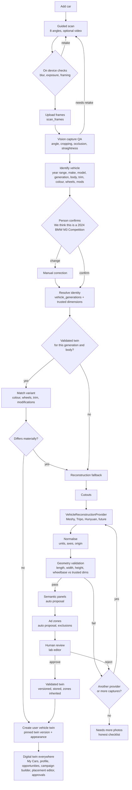
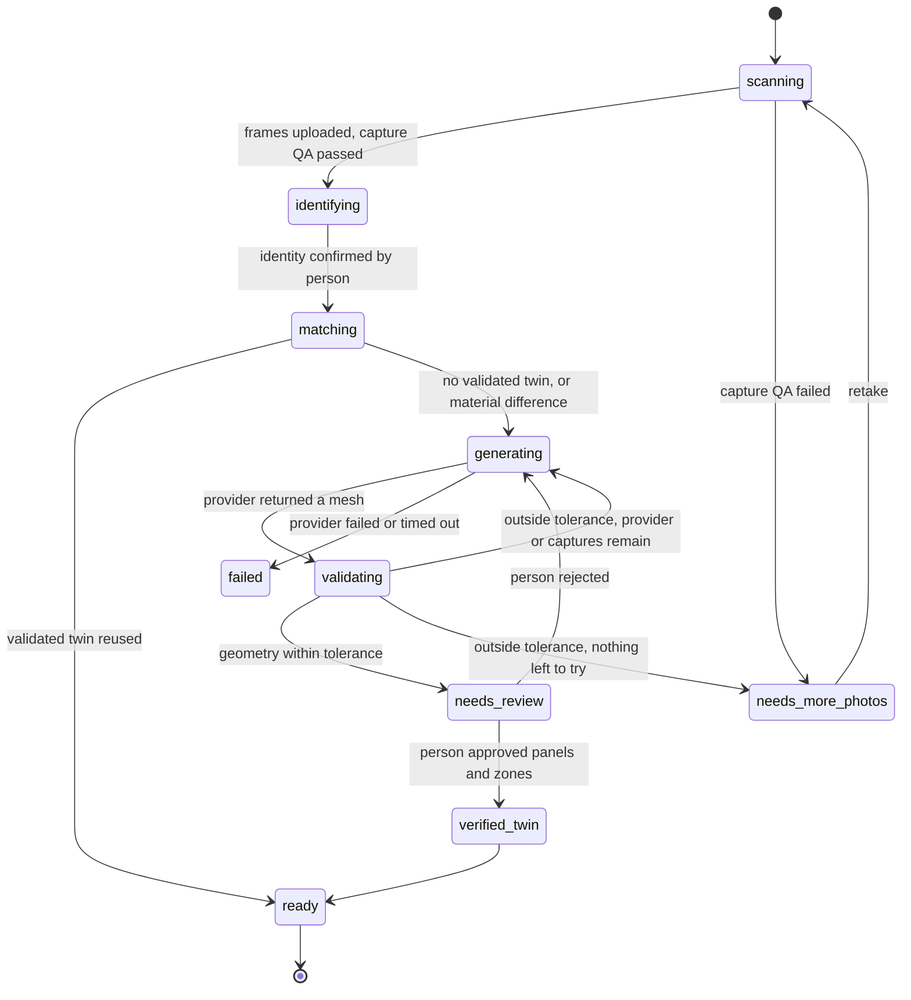
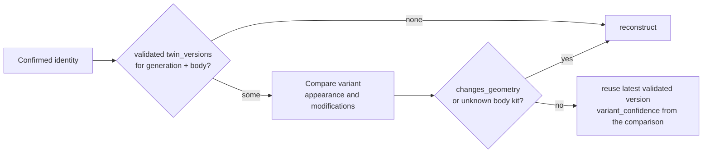

# TapMart Vehicle Digital Twin: technical architecture

Status: design only. Nothing in this document is implemented beyond what the
two labs already prove (`/labs/vehicle-placement` for the rendering and decal
engine, `/labs/ai-g80` for reference based reconstruction). It is written
against the code as it stands on 2026-09-23: Next.js 16 on Vercel, Postgres
through `src/lib/db.ts`, Supabase Auth and Storage, the durable `jobs` table
(`src/lib/jobs.ts`), the existing scan pipeline (`src/lib/vehicles/*`,
migration 0023), and the three.js engine in `src/vehicle/`.

## 1. What the experiment settled

`/labs/ai-g80` proved the chain that matters: photographs of a real car go
into a generative multi view reconstruction model, a real triangle mesh comes
back in GLB, three.js renders it, and THREE.DecalGeometry projects an
advertisement onto the generated door so it stays attached under rotation and
zoom. Four car park photographs, five minutes, thirty credits.

It also measured the weaknesses the production design has to absorb:

| Weakness observed | Consequence for the design |
| --- | --- |
| No straight side view in the inputs; two of three providers built a car a quarter too short | The capture flow requires both straight sides, and every mesh is measured against trusted dimensions before it is used |
| Surfaces the photos did not show were invented | Twins are reconstructed once from a complete capture and reused; a customer's partial scan never becomes geometry on its own |
| Every provider returns one mesh with no panels | TapMart keeps its own semantic surface layer on top of the mesh |
| Provider quality differed by axis (Meshy proportions, Tripo detail, Hunyuan surfaces) and cutouts improved results | The provider layer stays abstract, a cutout step precedes reconstruction, and the first twin of a generation may run more than one provider and keep the best by score |
| A mesh of a BMW design is still a BMW design | Rights are a field on the twin, reviewed by a person, never inferred |

## 2. System flow



Statuses a scan moves through, and who can move it:



`verified_twin` is set only by a person. No automatic path reaches it.

## 3. Data model

Postgres, in the existing style of migrations 0019 and 0023. New tables are
prefixed `twin_` where they belong to the library and `scan_` where they
belong to one capture. Existing tables are extended, not replaced.

### 3.1 Identity: `vehicle_generations`

The key every twin hangs off. One row per make, model, generation and body
style. `vehicle_catalog` (year, make, model, trim rows) gains a
`generation_id` so a catalog hit resolves to a generation.

| Column | Type | Notes |
| --- | --- | --- |
| id | uuid | |
| make, model | text | normalised lower case in a unique index with generation and body_style |
| generation | text | manufacturer code where one exists (G80, XV70); otherwise a year range label |
| body_style | text | Sedan, SUV, Truck, Coupe, Hatchback, Van, Wagon, Convertible |
| year_start, year_end | int | year_end null while in production |
| dims | jsonb | `{ length_mm, width_mm, width_mirrors_mm, height_mm, wheelbase_mm, track_front_mm, track_rear_mm }` |
| dims_source | text | where the numbers came from (manufacturer press specification, a licensed data provider) and when |
| dims_trust | text | `trusted`, `estimated`, `missing`; only trusted dims validate geometry |
| aliases | jsonb | alternative spellings and market names |

### 3.2 Library: `twin_versions`

One row per immutable version of a twin. A twin is identified by
`generation_id` plus `variant_key`; a version is a row.

| Column | Type | Notes |
| --- | --- | --- |
| id | uuid | |
| generation_id | uuid | references vehicle_generations |
| variant_key | text | `base` for the shared geometry; a slug for a body variant that changes geometry (wide body kit, different roof) |
| version | int | increments per generation and variant_key; the pair is unique |
| status | text | `processing`, `needs_review`, `validated`, `rejected`, `superseded` |
| supersedes_id | uuid | the version this one replaces |
| source_scan_id | uuid | the scan that produced it |
| provider | text | provider id and model, e.g. `meshy:multi-image-to-3d` |
| provider_job | jsonb | job id, parameters, submitted and finished timestamps, credits |
| provenance | jsonb | inputs (frame ids, cutout ids, order), what the provider generated, what was measured, what was hand adjusted |
| master_url | text | the provider's GLB as delivered (storage path) |
| web_url | text | optimised GLB for the viewer |
| lod_urls | jsonb | smaller variants, largest first |
| thumbnail_urls | jsonb | hero and four views, rendered by TapMart's own thumbnail engine |
| mesh_hash | text | sha256 of the web GLB's vertex buffer; panels and zones are bound to it |
| dims_measured | jsonb | bounding box and wheelbase measured after normalisation, in mm |
| validation | jsonb | the full report of section 7, including the score |
| geometry_confidence | numeric | 0 to 1 |
| asset_facts | jsonb | triangles, meshes, materials, textures, bytes |
| rights | jsonb | `{ status: "internal_only" \| "cleared", notes, reviewed_by, reviewed_at }` |
| created_by, validated_by | uuid | profiles; validated_by null until a person approves |
| created_at, validated_at | timestamptz | |

Rule: a user vehicle only ever points at a `validated` (or `superseded`)
version. `processing` and `needs_review` rows are visible only in the lab.

### 3.3 Semantic surfaces: `twin_panels`

| Column | Type | Notes |
| --- | --- | --- |
| id | uuid | |
| twin_version_id | uuid | |
| panel_key | text | `driver_front_door`, `driver_rear_door`, `passenger_front_door`, `passenger_rear_door`, `hood`, `roof`, `trunk`, `rear_bumper`, `front_bumper`, `driver_front_quarter`, `driver_rear_quarter`, `passenger_front_quarter`, `passenger_rear_quarter` |
| representation | jsonb | see section 8: triangle group (`{ kind: "triangles", mesh_hash, ranges: [[start, end], ...] }`) with a projection volume fallback (`{ kind: "volume", center, normal, up, size, units }`) |
| source | text | `template`, `vision`, `geometry`, `manual` |
| confidence | numeric | 0 to 1 |
| status | text | `proposed`, `approved`, `rejected` |
| reviewed_by, reviewed_at | | |

### 3.4 Advertising surfaces: `twin_ad_zones`

| Column | Type | Notes |
| --- | --- | --- |
| id | uuid | |
| twin_version_id | uuid | |
| panel_id | uuid | the panel it lives on |
| zone_key | text | the product key campaigns already store: `driver_door`, `passenger_door`, `driver_rear_door`, `passenger_rear_door`, `hood`, `rear_panel`, `full_side` |
| projector | jsonb | `{ center, normal, up, size: [w, h, depth], units: "m" }` in the vehicle frame (nose +X, up +Y, driver side +Z, ground y = 0), the shape `PlacementZone` already uses |
| safe | jsonb | insets as fractions of the projector: `{ panel: 0, safe: 0.06, recommended: 0.14 }` giving the red, yellow and green regions |
| exclusions | jsonb | triangle ranges or small volumes to subtract: handles, gills, trim, lights, plates |
| print_size_mm | jsonb | the largest printable rectangle, for the business and the printer |
| source, confidence, status, reviewed_by, reviewed_at | | as for panels |

Zones inherit: when a version is approved, every future user vehicle pinned
to it gets these rows without any per user work.

### 3.5 Captures: `vehicle_scans` (extended) and `scan_frames`

`vehicle_scans` keeps its columns and gains:

| Column | Notes |
| --- | --- |
| generation_id | resolved identity after confirmation |
| identification | jsonb, the structured answer of section 5 with per field confidence |
| identification_confidence | numeric |
| match | jsonb, which twin version was considered, the variant comparison, the decision and why |
| variant_confidence | numeric |
| twin_version_id | the version reused or created |
| status | the states of section 2 replace the 0023 list: `scanning`, `needs_more_photos`, `identifying`, `matching`, `generating`, `validating`, `needs_review`, `verified_twin`, `ready`, `failed` |

`scan_frames`, one row per accepted or rejected frame:

| Column | Notes |
| --- | --- |
| scan_id, angle | angle from the eight of section 4, or `video` for extracted frames, or `detail` |
| url, cutout_url | original and background removed |
| source | `photo`, `video_frame` (with the timestamp), `detail` |
| quality | jsonb: blur score, exposure, framing box, angle classification, straightness, occlusion, and the reason if rejected |
| accepted | boolean |
| order_in_capture | int |

### 3.6 The person's car: `vehicles` (extended)

| Column | Notes |
| --- | --- |
| twin_version_id | the validated version this car uses |
| appearance | jsonb: `{ paint: { hex, name, finish }, wheels: { style, size, colour }, trim, modifications: [...], condition_notes }` |
| twin_confidence | jsonb: `{ identification, geometry, variant, surfaces }`, copied from the scan at creation so the profile can show it |
| presentation | text: `twin` once a twin exists, else `photo`; the UI never shows a photo as the primary image when this says `twin` |

`vehicles.model_glb_url` from 0023 becomes a convenience copy of the version's
`web_url` and is removed once every caller reads through the version.

### 3.7 Jobs

The existing `jobs` table and worker run everything asynchronous. Kinds:

| Kind | Does |
| --- | --- |
| `scan.qa` | vision capture QA for one frame or one scan |
| `scan.identify` | identification across the accepted frames |
| `scan.match` | catalog and library matching after confirmation |
| `twin.cutout` | background removal for the reconstruction inputs |
| `twin.reconstruct` | submit to a provider; `twin.poll` follows it |
| `twin.normalise` | orientation, units, origin, web optimisation, thumbnails, mesh hash |
| `twin.validate` | measurement against trusted dims, score, decision |
| `twin.propose_panels` | panels and zones proposal |
| `twin.notify` | owner and operator notifications |

Every kind is idempotent on its payload, because the Vercel cron may run a
job twice.

## 4. Storage structure

Supabase Storage, one private bucket `twins` plus the existing public
`link-images` for anything a business sees. Paths are deterministic so a row
can be rebuilt from the tree:

```
scans/{scan_id}/original/{angle}.jpg          what the phone sent, never modified
scans/{scan_id}/video/walkaround.mp4          optional
scans/{scan_id}/frames/{angle}.jpg            resized to 2048 px, EXIF stripped
scans/{scan_id}/cutouts/{angle}.png           background removed
twins/{generation_slug}/{variant}/v{n}/master.glb          provider output as delivered
twins/{generation_slug}/{variant}/v{n}/web.glb             Draco, WebP or KTX2, 2048 px textures
twins/{generation_slug}/{variant}/v{n}/web-lod1.glb        phone tier
twins/{generation_slug}/{variant}/v{n}/panels.json         panel and zone representations, mesh_hash inside
twins/{generation_slug}/{variant}/v{n}/thumbs/{view}.webp  hero, front, driver, rear, passenger
twins/{generation_slug}/{variant}/v{n}/validation.json     the measurement report
```

Retention: originals and cutouts of a scan that produced a validated twin
are kept (they are the provenance); originals of scans that only matched a
twin are deleted after 30 days, frames after 90. Nothing customer facing
reads from `master.glb`.

Web files are served through a signed or public URL with a long cache
lifetime; the path contains the version, so a new version is a new URL and
no cache is ever stale.

## 5. Scan capture pipeline

### 5.1 The sequence

Eight stations, in walking order, each with a target silhouette drawn on the
camera view so the person knows where to stand and how large the car should
be in frame:

| Station | Key | What the guide shows | Why it matters |
| --- | --- | --- | --- |
| 1 | front | nose centred, both headlights level | identification, front panels |
| 2 | front_driver_34 | nose and driver side | body shape |
| 3 | driver_side | wheels as circles, car centred, level | proportions (the experiment's lesson) |
| 4 | rear_driver_34 | | body shape |
| 5 | rear | | identification, rear panel |
| 6 | rear_passenger_34 | | body shape |
| 7 | passenger_side | wheels as circles | proportions |
| 8 | front_passenger_34 | | body shape |

Optional: a slow walk around video. The phone extracts frames in the browser
(a `<video>` element seeked at 24 evenly spaced times, drawn to a canvas, no
server side ffmpeg, which Vercel functions do not have) and the same checks
score them; the best frame near each station fills a gap or adds a second
opinion. Detail shots (badges, wheels, damage) are optional and never used
for geometry.

The progress ring around a top down car icon fills station by station; the
next station is the one instruction on screen. This replaces the four by two
grid the current `ScanCapture.tsx` shows.

### 5.2 Checks, in two layers

On the device, before upload, instant and free:

| Check | How | Threshold to start with |
| --- | --- | --- |
| Blur | variance of a Laplacian on a 320 px greyscale copy | reject below a value calibrated on the first 50 scans; show "Hold still" |
| Exposure | mean and clipped fraction of luminance | reject when more than 5 percent of pixels clip or the mean is below 40 of 255; show "Too dark" or "Too bright" |
| Framing | a lightweight in browser detector (a small object detection model at 320 px) gives the car's box | reject if the box touches any edge ("Step back, the car is cut off") or fills less than 45 percent of the width ("Move closer") |
| Motion | frame to frame difference on video | drop frames captured while moving fast |

On the server, per accepted frame, a vision call with a strict JSON schema
(the `respond` helper in `src/lib/openai/client.ts`, a `capture_qa` job kind
in `src/lib/openai/models.ts`):

```
{ station_seen: one of the eight or "unknown",
  matches_requested_station: boolean,
  cropped: boolean, crop_side: [...],
  obstruction_pct: number,             people, other cars, pillars in front of the body
  straightness: number,                side stations only: 1 when the wheels are circles and the rocker is level
  lighting: "ok" | "dark" | "blown" | "mixed",
  reflections_severe: boolean,
  usable_for_geometry: boolean,
  reason: string }
```

Straightness is also computed from geometry, not only asked: the detector's
wheel boxes on a side frame should have width to height near 1.0 and their
centres level; an aspect under 0.85 or a slope over 3 degrees fails the side
station with "Stand square to the doors".

A station passes when the device checks pass and the vision answer says the
station matches, cropping is false, obstruction is under 15 percent and, for
sides, straightness is at least 0.85. A scan proceeds to identification with
six stations; it proceeds to reconstruction only with all eight, both sides
straight.

## 6. Vehicle identification

One vision call with the accepted frames (front, both three quarter fronts,
one side, rear; at most five images), strict schema:

```
{ make, model, generation, body_style, trim,
  year_min, year_max,
  colour: { name, hex_estimate, finish },
  wheels: { style_description, spoke_count, diameter_inch_estimate, colour },
  modifications: [ { kind, description, changes_geometry: boolean } ],
  evidence: [ strings, what was seen that supports the answer ],
  confidence: { make, model, generation, body_style, trim, year_range } }
```

Rules: nothing is asserted below 0.6 confidence; `trim` is shown only above
0.8; anything below threshold becomes a question ("Which trim is it?") with
catalog options. The answer is checked against `vehicle_catalog` and
`vehicle_generations`; an unknown generation for a known make and model is a
`needs_review` for an operator, never a silent new row.

The person always sees the result before anything else happens:
"We think this is a 2024 BMW M3 Competition." with Confirm and Change. The
confirmed identity, not the guess, is what the scan carries forward, and
`identification_confidence` records the model's confidence at the time so
the profile can say "identified from your photos, confirmed by you".

Trusted dimensions come from `vehicle_generations.dims`. The NHTSA vPIC
catalog already wired in `src/lib/vehicles/catalog.ts` has no dimensions, so
the generation table is seeded by hand from manufacturer specifications for
the first generations TapMart supports, each row with its source, and later
from a licensed specification provider. A generation without trusted dims
cannot validate geometry and therefore cannot produce a validated twin; the
scan stops at `needs_review` with the reason stated.

## 7. Catalog matching and the reuse decision



The comparison is cheap: the identification already lists wheels, colour,
trim and modifications with a `changes_geometry` flag. A wrap, a colour, a
wheel style or a badge never changes geometry; a body kit, a roof rack, a
lifted suspension, a spoiler, a different door count does. Ambiguous cases
go to `needs_review` with both possibilities shown to the operator.

Reuse creates the user vehicle immediately: the person sees their car in 3D
within a minute of confirming the identity, with their colour applied (see
section 13) and the approved zones already there.

## 8. Reconstruction provider abstraction

```ts
interface VehicleReconstructionProvider {
  id: string;                                   // "meshy", "tripo", "hunyuan"
  label: string;
  available(): boolean;                         // key present, region allowed
  capabilities(): { maxViews: number; orderedViews: boolean; pbr: boolean; cutoutsHelp: boolean; licence: string };
  estimateCost(input: CaptureInput): Promise<{ credits: number; usd: number }>;
  submitCapture(input: CaptureInput): Promise<{ jobId: string }>;
  getStatus(jobId: string): Promise<{ state: "queued" | "running" | "done" | "failed"; progress: number; error?: string }>;
  getResult(jobId: string): Promise<{ glbUrl: string; textures?: string[]; expiresAt?: string }>;
  cancel(jobId: string): Promise<void>;
}
```

`CaptureInput` is the eight stations with their cutout URLs, the trusted
dimensions (some providers accept a real world scale hint), and the
identity. Adapters:

| Adapter | Endpoint | Notes from the experiment |
| --- | --- | --- |
| `meshy` | Meshy OpenAPI multi image to 3D, 1 to 4 images, GLB with PBR | best proportions; cutouts improved it; 30 credits at 0.01 USD each |
| `tripo` | Tripo OpenAPI multiview to model, ordered front, left, back, right | best detail; needs true sides in its side slots or it shortens the car; 30 credits with texture |
| `hunyuan` | Tencent Cloud Hunyuan3D international API, front plus back, left, right | cleanest surfaces; invented a two door side without a straight side view; licence excludes some territories, checked in `available()` |
| `http` | the generic contract already in `src/lib/vehicles/reconstruction.ts` | any future service or a self hosted model |

Only a real key selects an adapter (env `TWIN_PROVIDERS=meshy,tripo`). The
Higgsfield account was the worker for the experiment; production talks to
providers directly under TapMart's own terms, so no adapter depends on
Higgsfield.

Two run modes:

- First twin of a generation: run every available adapter on the same
  inputs (a tournament), normalise each result, validate each, keep the best
  by score. Cost is two or three generations once per generation, which
  section 16 shows is negligible against reuse.
- Later reconstructions (a material variant): run the adapter that won for
  that generation first; fall back to the others on validation failure.

Normalisation after download, in `twin.normalise`: parse the GLB, find the
longest horizontal axis and turn it to +X, detect the nose (the end with the
larger frontal opening or, failing that, the end the front frame matched
when thumbnails are compared against the front photo), put the lowest point
on y = 0, centre x and z, scale so the wheelbase (not the length) matches
trusted dims when wheels can be found, otherwise the length. Then
gltf-transform: Draco, WebP (KTX2 when the viewer's decoder path is served
locally), 2048 px textures, a 1024 px LOD, thumbnails through the existing
`renderThumbnail`, the mesh hash.

## 9. Geometry validation

Measurements from the normalised mesh:

| Measure | Method |
| --- | --- |
| length, width, height | bounding box of the body without mirrors: width is taken at 55 percent of the height where mirrors do not reach, and separately with mirrors at the widest |
| wheelbase | the two clusters of vertices within 8 percent of the ground height, split by x; their x centres are the axle positions |
| ground clearance and stance | lowest body vertex above the wheel clusters |
| symmetry | mirror the mesh across z and measure the mean distance to the nearest vertex |

Tolerances, compared with `vehicle_generations.dims`:

| Ratio | Tolerance | Outcome beyond it |
| --- | --- | --- |
| length to width | 4 percent | fail |
| length to height | 6 percent | fail |
| wheelbase to length | 3 percent | fail |
| width to height | 6 percent | review |
| symmetry error | 1.5 percent of width | review |

Score: each ratio contributes `max(0, 1 - error / (2 * tolerance))`,
weighted 0.3 length to width, 0.25 wheelbase, 0.25 length to height, 0.1
width to height, 0.1 symmetry. `geometry_confidence` is the score; below
0.75 the version fails, between 0.75 and 0.9 it needs review, above 0.9 it
still needs review for panels but the geometry line reads PASS.

For the experiment's meshes this rule gives roughly: Meshy round three 0.88
(height 7 percent tall is the miss), Tripo round one about 0.2, Hunyuan
about 0.2. That is the behaviour wanted: the two shortened cars would never
have reached a customer.

Scaling: the whole mesh is scaled once, uniformly, by the wheelbase. No
axis is stretched to force a pass; a mesh that needs stretching is a failed
mesh.

## 10. Semantic panel mapping

The mesh is one surface, so TapMart records which triangles belong to which
panel. Representation, in order of preference:

1. Triangle groups: index ranges into the web GLB's index buffer, bound to
   `mesh_hash`. Exact, cheap to store, and what the decal targeting needs
   (DecalGeometry can be given only these triangles, so an ad cannot bleed
   onto a neighbouring panel).
2. Projection volume: the oriented box `PlacementZone` already uses, for the
   case where a twin was validated before its triangle groups existed. The
   lab has proved this is enough to place an ad; it cannot tell a door from
   a quarter panel.

How groups are proposed, cheapest first:

- Template transfer: for a generation that already has a validated version,
  a new version's panels are found by nearest surface transfer from the old
  one (each old panel triangle's centroid maps to the closest new triangle).
  This is the common case once the library exists.
- Photo segmentation projected onto the mesh: the straight side, front and
  rear cutouts are segmented into parts (a promptable segmentation model
  such as SAM with the prompts "front door", "rear door", "hood", plus the
  wheel and window masks). The camera for each station is fitted by
  rendering the mesh silhouette and matching it to the cutout silhouette;
  each mask then projects onto the visible triangles. Straight sides make
  this projection nearly orthographic, one more reason the capture insists
  on them.
- Geometry heuristics: door regions lie between the wheel arches, below the
  window line (a curvature discontinuity) and above the rocker; the hood is
  the upward facing surface between the windscreen base and the nose. These
  seed the proposal when segmentation is unavailable.

Everything proposed is `proposed` with a confidence until a person approves
it in the lab editor (section 12).

## 11. Ad zone representation

From an approved panel, the zone is the largest oriented rectangle that fits
the panel's triangles with the exclusions removed:

- Exclusions are subtracted as triangle groups (handles, gills, badges,
  lights, plate recess) or as small volumes around detected features.
- Curvature limit: triangles whose normal deviates more than 35 degrees from
  the panel's mean normal are excluded (decals stretch there, and vinyl does
  too).
- The projector box gets `size` from the rectangle, `normal` and `up` from
  the panel's mean normal and the world up projected onto the panel.
- Safe areas are insets: red is the panel edge, yellow the safe inset (60 mm
  in the vehicle's real scale), green the recommended inset (140 mm). The
  viewer draws them with the same clipped decal outline the lab draws today.
- `print_size_mm` is the green rectangle in millimetres, so a business and a
  printer see the same number.

Zones are stored once per twin version and inherited by every user vehicle
pinned to it. A person's placement (`Placement` in `src/vehicle/placement.ts`:
zone, artwork, scale, offsets, rotation) stays per campaign and is projected
at runtime; nothing is baked into the mesh or its textures.

## 12. Human validation

An operator lab (`/labs/twins`, sign in and admin role required) shows every
`needs_review` version with:

- the five thumbnails beside the five station photos;
- the validation report as the PASS and review lines of section 9;
- panels and zones drawn on the 3D twin, with per panel accept, reject and
  nudge (move the box, resize, add an exclusion), the same direct
  manipulation the placement lab already has;
- the rights checklist (source photos and licence, provider terms, design
  rights note) that must be ticked before approve;
- Approve, Reject with reason, Request more captures.

Approval writes `validated_by`, `validated_at`, sets status `validated`, marks
the previous version `superseded`, and enqueues `twin.notify` for every scan
waiting on this generation. Rejection writes the reason onto the scan so the
person sees why more photos are needed.

What stays human, by policy: approving a version, approving panels and
zones, anything about rights, adding a generation whose dimensions could not
be found, and any scan whose identification confidence is below threshold
after the person's own confirmation is contradicted by the catalog.

## 13. Three.js rendering

The engine in `src/vehicle/` stays. What changes is where a vehicle
definition comes from: today `VehicleModel` entries are hard coded in
`catalog.ts`; in production a `VehicleModel` is built from a twin version row
(asset url, dims, zones from `twin_ad_zones`, cameras from the generation's
body style preset) and registered at runtime, so the viewer, the editor and
the thumbnail renderer keep working unchanged.

Appearance without new geometry:

- Paint: the body triangle groups (every panel plus roof and bumpers) get a
  material override tinted to the user's `appearance.paint.hex` while glass,
  wheels and trim keep the provider texture. With the experiment's textures
  this is a multiply over a neutral base; a validated twin should be stored
  with a neutral, desaturated body texture so any colour reads right.
- Wheels: a wheel triangle group can be darkened or lightened; swapping wheel
  geometry is a later variant feature.
- Decals: unchanged, DecalGeometry against the zone's triangle group only.

Loading: `THREE.Cache`, Draco decoder served from `public/` rather than
gstatic so the viewer works offline in tests, KTX2 when the transcoder is
also served locally, one GLB per twin version cached by URL for the session.

## 14. Mobile performance

Budgets per web twin, enforced by `twin.normalise`, which fails the version if
it cannot meet them:

| Budget | Value |
| --- | --- |
| Triangles | 150,000 for `web.glb`, 60,000 for `web-lod1.glb` |
| Textures | 2048 px base colour, 1024 px normal and roughness, WebP or KTX2 |
| File | under 3 MB web, under 1.2 MB LOD |
| First frame | under 2.5 s on a mid range phone over 4G, measured in CI with Playwright on a throttled profile |

Viewer rules already in place and kept: demand frame loop, device pixel
ratio capped at 1.5, mount only when on screen, reflection off on phones when
the frame time is over 24 ms, thumbnails from the shared renderer for lists.
The phone gets `web-lod1.glb` first and swaps to `web.glb` when idle.

## 15. Confidence scoring and statuses

Four numbers, kept separately and never combined into one "verified":

| Score | Source | Shown as |
| --- | --- | --- |
| identification | vision confidence for make, model and generation, replaced by 1.0 with provenance `user` when the person confirms | "Identified from your photos, confirmed by you" |
| geometry | section 9 score of the twin version | "Geometry checked against BMW's published dimensions: 94 percent" |
| variant | the comparison of section 7 | "Matched to the verified M3 G80 twin; your colour and wheels applied" |
| surfaces | mean confidence of approved zones, 1.0 once a person approved them | "Ad surfaces approved by TapMart" |

Statuses seen by the person: Scanning, Identifying, Matching, Generating,
Validating, Needs review, Verified twin, Ready. "Verified" appears only after
`validated_by` is set. A car built on a validated twin shows "Verified digital
twin"; a car whose twin is still in review shows "Twin in review" and keeps
the person's front photo as a placeholder with the honest label.

## 16. Costs

Per vehicle, at today's list prices (Meshy and Tripo 0.01 USD per credit,
30 credits per generation; vision calls at roughly 0.01 to 0.03 USD per image
with a small vision model; background removal about 0.01 USD per image;
storage negligible):

| Path | Compute cost | People |
| --- | --- | --- |
| First twin of a generation (tournament of three providers, cutouts, QA, identification, validation, thumbnails) | about 1.20 USD | 15 to 30 minutes of operator review |
| Reconstruction of a material variant (one provider first) | about 0.45 USD | 10 minutes review |
| Reuse (QA on eight frames, identification, matching, appearance) | about 0.15 USD | none |

How the average falls: with one validated twin per generation and the
long tail of generations, the average compute cost per new vehicle is
`0.15 + 1.20 / vehicles_per_generation`. At 10 cars per generation it is
0.27 USD; at 100 it is 0.16 USD; the operator time falls the same way. The
library is therefore internal infrastructure whose value compounds; it is
not a marketplace of assets.

## 17. Versioning

- Twin versions are immutable. A change to geometry, panels or zones is a
  new version; the old one becomes `superseded` and stays readable.
- User vehicles pin `twin_version_id`. A superseded version keeps working;
  a background job offers the upgrade when the new version's zones map onto
  the old placements (template transfer in reverse), and a person's saved
  placement is re-projected and checked before the pin moves.
- Panels and zones are bound to `mesh_hash`; a mismatch is a bug that fails
  loudly rather than a decal in the wrong place.
- Migrations live in `supabase/migrations/` as today; the first one adds
  `vehicle_generations`, `twin_versions`, `twin_panels`, `twin_ad_zones`,
  `scan_frames` and the columns on `vehicle_scans` and `vehicles`.

## 18. What this means now

A. Buildable now, with what is in the repository: the guided eight station
capture with device side checks and video frame extraction; the
`scan_frames`, `vehicle_generations`, `twin_versions`, `twin_panels` and
`twin_ad_zones` tables; the provider interface with the Meshy, Tripo and
generic HTTP adapters; normalisation, web optimisation, thumbnails and the
mesh hash; geometry validation against seeded dimensions; runtime
registration of a twin into the existing viewer; the operator lab for review
and approval; zone inheritance and appearance tinting.

B. Needs external AI APIs and keys: identification and capture QA (OpenAI
vision, a key on the preview); reconstruction (Meshy, Tripo or Hunyuan keys
under TapMart's own terms); background cutouts (any of those providers or a
small hosted model); photo segmentation for panel proposals.

C. Needs experimentation before it is trusted: whether eight true angles with
straight sides fix the proportion errors for every provider; wheelbase
detection from the mesh; camera fitting of cutouts to the mesh for panel
projection; paint tinting over provider textures; the tolerance values.

D. Stays human reviewed: approving a twin version; approving panels and
zones; rights; adding a generation without trusted dimensions; any
identification the catalog contradicts.

E. The next single prototype: one controlled capture of one real car with
all eight stations and both straight sides, run through two providers,
normalised, measured against trusted dimensions with the score printed, and
shown in the existing lab with a hand approved driver door. It tests the two
unknowns that decide everything else (do straight sides fix proportions, and
does the validation rule pass a good mesh and fail a bad one) with no new
tables and no new UI.
